# CORDAL - Comprehensive Guide
## Configuration Orchestrated REST Dynamic API Layer

**Version:** 1.0
**Date:** 2025-03-05
**Author:** Mark Andrew Ray-Smith Cityline Ltd


## Table of Contents

1. [Project Overview](#project-overview)
2. [Architecture](#architecture)
3. [Quick Start](#quick-start)
4. [Configuration](#configuration)
5. [Deployment](#deployment)
6. [Metrics Collection](#metrics-collection)
7. [Database Integration](#database-integration)
8. [Testing](#testing)
9. [Scripts and Automation](#scripts-and-automation)
10. [Performance Dashboard](#performance-dashboard)
11. [Health Monitoring](#health-monitoring)
12. [Troubleshooting](#troubleshooting)
13. [Development Guide](#development-guide)

---

## Project Overview

### What is CORDAL?

CORDAL (Configuration Orchestrated REST Dynamic API Layer) is a sophisticated, configuration-driven REST API framework built on Java 21 and Javalin 6.1.3. It provides a highly modular, scalable solution for creating dynamic REST APIs through YAML configuration files rather than hardcoded endpoints.

**IMPORTANT**: CORDAL is a **generic framework** that can support any domain or use case. The stock trades functionality referenced in this documentation is **ONLY AN EXAMPLE IMPLEMENTATION** used for demonstration and integration testing. It is **NOT part of the core system**.

### Key Features

- **Configuration-Driven**: Define APIs, database queries, and connections through YAML files
- **Automatic Metrics Collection**: Zero-code integration for comprehensive API monitoring
- **Modular Architecture**: Separate modules for API service, metrics, and common utilities
- **Multi-Database Support**: H2 and PostgreSQL integration with connection pooling
- **Real-time Dashboard**: Performance monitoring with interactive charts
- **Comprehensive Validation**: Configuration validation with detailed error reporting
- **Production Ready**: Multiple deployment profiles, health checks, and monitoring
- **Extensive Testing**: Unit, integration, and performance test suites

### Project Structure

```
cordal/
├── cordal-api-service/          # Main API service module (CORE - Generic framework)
├── cordal-metrics-service/      # Metrics collection and monitoring (CORE)
├── cordal-common-library/       # Shared utilities and models (CORE)
├── cordal-integration-tests/    # Integration tests + EXAMPLE implementations (stock trades)
├── generic-config/              # Core configuration YAML files (GENERIC only)
├── data/                        # H2 database files
├── logs/                        # Application log files
├── scripts/                     # Build and deployment scripts (CORE only)
└── docs/                         # Comprehensive documentation
```

### Technology Stack

- **Java 21** - Latest LTS with modern language features
- **Javalin 6.1.3** - Lightweight web framework
- **Google Guice** - Dependency injection
- **HikariCP** - High-performance connection pooling
- **H2 Database** - Embedded database for development
- **PostgreSQL** - Production database support
- **Jackson** - JSON processing
- **SLF4J + Logback** - Logging framework
- **Maven** - Build and dependency management
- **Chart.js** - Dashboard visualizations

---

## Architecture

###  **IMPORTANT: Core vs. Example Architecture**

**CORDAL CORE SYSTEM** (Generic Framework):
- `cordal-api-service/` - Generic REST API framework
- `cordal-common-library/` - Shared utilities and models
- `cordal-metrics-service/` - Performance monitoring
- `generic-config/` - Core configuration files (generic only)
- `scripts/` - Build and deployment scripts

**EXAMPLE IMPLEMENTATIONS** (Domain-Specific):
- `cordal-integration-tests/src/test/java/dev/cordal/integration/examples/` - Stock trades example classes
- `cordal-integration-tests/src/test/resources/config/` - Stock trades example configurations
- `cordal-integration-tests/src/test/resources/sql/` - Stock trades example SQL scripts

**Key Principle**: The core system is completely generic and domain-agnostic. Stock trades functionality is purely an example to demonstrate how to implement a use case using the framework.

### System Architecture

CORDAL follows a layered, modular architecture designed for scalability and maintainability:

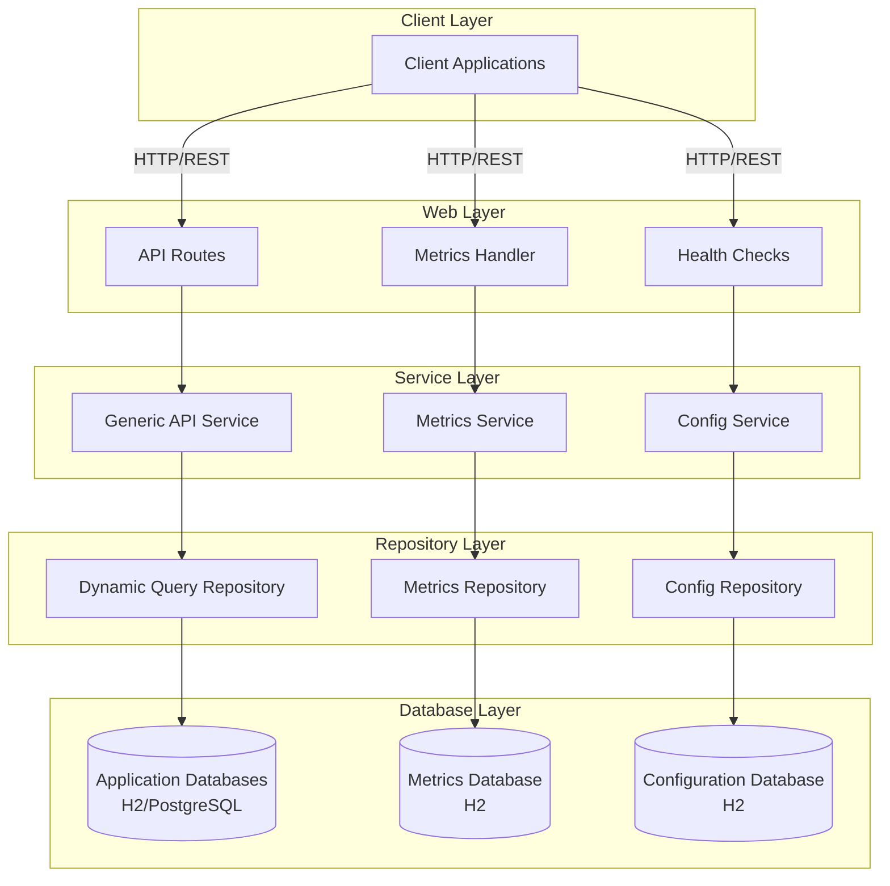

### Module Architecture

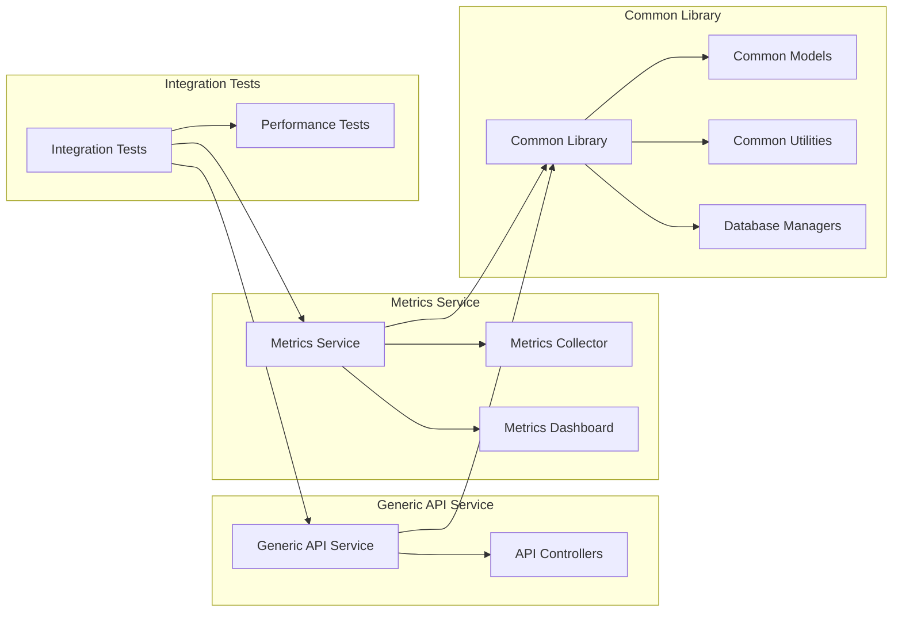

#### 1. Generic API Service
- **Purpose**: Main API service that dynamically creates REST endpoints
- **Configuration**: Reads from YAML files to define APIs, queries, and database connections
- **Features**: Dynamic endpoint creation, query execution, pagination, async support

#### 2. Metrics Service
- **Purpose**: Collects and stores performance metrics for all API requests
- **Features**: Automatic metrics collection, real-time aggregation, dashboard APIs
- **Storage**: Dedicated metrics database with comprehensive performance data

#### 3. Common Library
- **Purpose**: Shared utilities, models, and database management
- **Components**: Configuration loaders, database managers, common DTOs
- **Benefits**: Code reuse, consistent patterns, reduced duplication

### Configuration-Driven Design

The system uses a three-tier configuration approach:

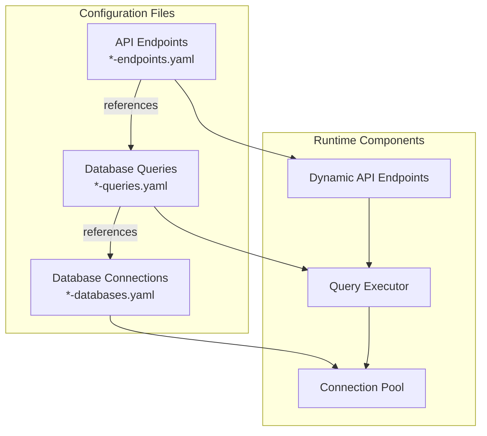

1. **API Endpoints** (`*-endpoints.yaml`): Define REST API structure
2. **Database Queries** (`*-queries.yaml`): Define SQL queries and parameters
3. **Database Connections** (`*-databases.yaml`): Define database connection details

This allows for complete API definition without writing Java code.

---

## **Example Implementations**

### Stock Trades Example (Integration Tests Only)

The stock trades functionality referenced throughout this documentation is **NOT part of the core CORDAL system**. It serves as a comprehensive example of how to implement a domain-specific use case using the CORDAL framework.

**Location**: All stock trades functionality is now properly located in:
- **Classes**: `cordal-integration-tests/src/test/java/dev/cordal/integration/examples/`
- **Configurations**: `cordal-integration-tests/src/test/resources/config/`
- **SQL Scripts**: `cordal-integration-tests/src/test/resources/sql/`

**Purpose**:
- Demonstrates how to configure databases, queries, and endpoints
- Shows best practices for implementing a complete use case
- Provides integration test examples
- Serves as a template for your own domain implementations

**Important**: When implementing your own use case, replace all stock trades references with your actual domain entities, tables, and business logic.

---

## Quick Start

### Prerequisites

- **Java 21+** (JDK required for building)
- **Maven 3.6.0+** for building
- **PostgreSQL** (optional, for production databases)

### 1. Clone and Build

```bash
# Clone the repository
git clone <repository-url>
cd cordal

# Build all modules
./scripts/build-executable-jars.sh
```

### 2. Start Services

```bash
# Start all services
./scripts/start-all-services.sh

# Or start individual services
./scripts/start-cordal-api-service.sh
./scripts/start-cordal-metrics-service.sh
```

### 3. Verify Installation

```bash
# Check API health
curl http://localhost:8080/api/health

# Check available endpoints (example - actual endpoints depend on your configuration)
curl http://localhost:8080/api/your-domain-endpoints

# View metrics dashboard
open http://localhost:8080/dashboard
```

### 4. Explore APIs

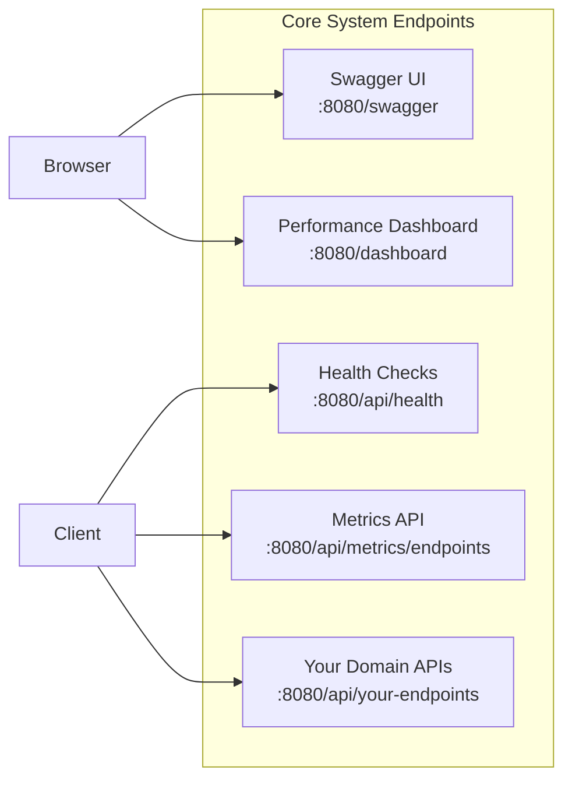

---

## Configuration

### Configuration File Structure

The system uses multiple YAML configuration files located in the `generic-config/` directory:

```
generic-config/
├── application.yaml              # Main application configuration
├── *-databases.yaml             # Database connection definitions
├── *-queries.yaml               # SQL query definitions
└── *-endpoints.yaml             # API endpoint definitions
```

### Application Configuration

**File**: `generic-config/application.yaml`

```yaml
# Server Configuration
server:
  port: 8080
  host: "0.0.0.0"

# Database Configuration
database:
  url: "jdbc:h2:./data/stocktrades;AUTO_SERVER=TRUE;DB_CLOSE_DELAY=-1"
  username: "sa"
  password: ""
  driver: "org.h2.Driver"
  pool:
    maximumPoolSize: 10
    minimumIdle: 2
    connectionTimeout: 30000

# Metrics Configuration
metrics:
  collection:
    enabled: true
    includeMemoryMetrics: true
    excludePaths:
      - "/dashboard"
      - "/metrics"
      - "/api/performance-metrics"
    samplingRate: 1.0
    asyncSave: true
  database:
    url: "jdbc:h2:./data/metrics;AUTO_SERVER=TRUE;DB_CLOSE_DELAY=-1"
    username: "sa"
    password: ""
    driver: "org.h2.Driver"

# Configuration Loading
configuration:
  paths:
    databases: "generic-config"
    queries: "generic-config"
    endpoints: "generic-config"
  patterns:
    databases: "*-databases.yaml"
    queries: "*-queries.yaml"
    endpoints: "*-endpoints.yaml"

# Validation Configuration
validation:
  runOnStartup: true
  validateOnly: false
  continueOnError: true
  maxErrorsToShow: 10

# Data Loading
data:
  loadSampleData: false
  initializeForTesting: false
```

### Database Configuration

**File**: `generic-config/stocktrades-databases.yaml`

```yaml
databases:
  stocktrades_db:
    name: "stocktrades_db"
    url: "jdbc:h2:./data/stocktrades;AUTO_SERVER=TRUE;DB_CLOSE_DELAY=-1"
    username: "sa"
    password: ""
    driver: "org.h2.Driver"
    pool:
      maximumPoolSize: 10
      minimumIdle: 2
      connectionTimeout: 30000
      idleTimeout: 600000
      maxLifetime: 1800000
    validation:
      testQuery: "SELECT 1"
      validateOnBorrow: true
```

### Query Configuration

**Example File**: `your-domain-queries.yaml` (replace with your actual domain)

```yaml
# EXAMPLE: This shows how to configure queries for any domain
# The stock trades example has been moved to cordal-integration-tests
queries:
  get_all_your_entities:
    database: "your_database"
    sql: "SELECT id, field1, field2, field3 FROM your_table ORDER BY created_date DESC LIMIT ? OFFSET ?"
    parameters:
      - name: "limit"
        type: "INTEGER"
        required: true
      - name: "offset"
        type: "INTEGER"
        required: true
    resultMapping:
      - column: "id"
        field: "id"
        type: "LONG"
      - column: "field1"
        field: "field1"
        type: "STRING"
      - column: "field2"
        field: "field2"
        type: "STRING"
```

**Note**: Stock trades configurations are now located in `cordal-integration-tests/src/test/resources/config/` as they are example implementations, not part of the core framework.

### API Endpoint Configuration

**Example File**: `your-domain-endpoints.yaml` (replace with your actual domain)

```yaml
# EXAMPLE: This shows how to configure endpoints for any domain
# The stock trades example has been moved to cordal-integration-tests
endpoints:
  get_your_entities:
    path: "/api/your-entities"
    method: "GET"
    query: "get_all_your_entities"
    pagination:
      enabled: true
      defaultPageSize: 20
      maxPageSize: 1000
    parameters:
      - name: "page"
        type: "INTEGER"
        required: false
        defaultValue: 0
      - name: "size"
        type: "INTEGER"
        required: false
        defaultValue: 20
    response:
      type: "PAGED"
      wrapper: "PagedResponse"
```

---

## Deployment

### JAR Profiles

The build system supports multiple JAR profiles for different deployment scenarios:

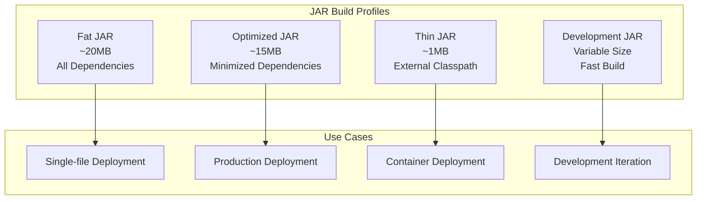

#### Fat JAR (Default)
- **Size**: ~20MB
- **Dependencies**: All included
- **Use Case**: Single-file deployment
- **Command**: `./scripts/build-executable-jars.sh --fat-jar`

#### Optimized JAR
- **Size**: ~15MB
- **Dependencies**: Minimized, unused classes removed
- **Use Case**: Production deployment
- **Command**: `./scripts/build-executable-jars.sh --optimized-jar`

#### Thin JAR
- **Size**: ~1MB
- **Dependencies**: External classpath required
- **Use Case**: Container deployment with shared dependencies
- **Command**: `./scripts/build-executable-jars.sh --thin-jar`

#### Development JAR
- **Size**: Variable
- **Dependencies**: Fast build, skip tests
- **Use Case**: Development iteration
- **Command**: `./scripts/build-executable-jars.sh --dev`

### Deployment Examples

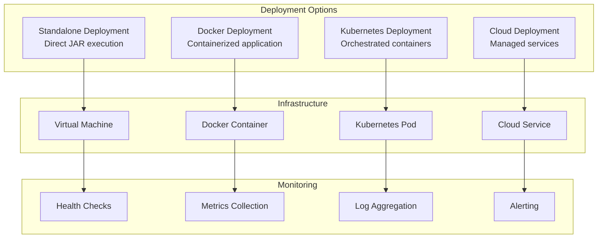

#### Standalone Deployment
```bash
# Build optimized JAR
./scripts/build-executable-jars.sh --optimized-jar

# Start services
java -jar cordal-api-service/target/cordal-api-service-1.0-SNAPSHOT-optimized.jar
java -jar cordal-metrics-service/target/cordal-metrics-service-1.0-SNAPSHOT-optimized.jar
```

#### Docker Deployment
```dockerfile
FROM openjdk:21-jre-slim

WORKDIR /app
COPY cordal-api-service/target/*-optimized.jar app.jar
COPY generic-config/ config/
COPY scripts/ scripts/

RUN chmod +x scripts/*.sh

EXPOSE 8080
CMD ["./scripts/start-cordal-api-service.sh"]
```

#### Kubernetes Deployment
```yaml
apiVersion: apps/v1
kind: Deployment
metadata:
  name: cordal
spec:
  replicas: 3
  selector:
    matchLabels:
      app: cordal
  template:
    metadata:
      labels:
        app: cordal
    spec:
      containers:
      - name: api-service
        image: cordal:latest
        ports:
        - containerPort: 8080
        env:
        - name: JAVA_OPTS
          value: "-Xmx1g -XX:+UseG1GC"
        livenessProbe:
          httpGet:
            path: /api/management/liveness
            port: 8080
          initialDelaySeconds: 30
          periodSeconds: 10
        readinessProbe:
          httpGet:
            path: /api/management/readiness
            port: 8080
          initialDelaySeconds: 5
          periodSeconds: 5
```

### Health Checks

The system provides comprehensive health monitoring:

#### Basic Health Check
```bash
curl http://localhost:8080/api/health
```

#### Management Health Endpoints
```bash
# Kubernetes liveness probe
curl http://localhost:8080/api/management/liveness

# Kubernetes readiness probe
curl http://localhost:8080/api/management/readiness

# Comprehensive health check
curl http://localhost:8080/api/management/health
```

#### Health Check Response
```json
{
  "status": "UP",
  "timestamp": "2025-08-14T10:30:00Z",
  "components": {
    "database": {
      "status": "UP",
      "details": {
        "connectionPool": "healthy",
        "activeConnections": 2,
        "totalConnections": 10
      }
    },
    "configuration": {
      "status": "UP",
      "details": {
        "endpointsLoaded": 5,
        "queriesLoaded": 8,
        "databasesLoaded": 2
      }
    },
    "metrics": {
      "status": "UP",
      "details": {
        "collectionEnabled": true,
        "metricsDatabase": "healthy"
      }
    }
  }
}
```

---

## Metrics Collection

### Overview

The metrics collection system provides automatic, zero-code monitoring of all API requests. It captures response times, success rates, memory usage, and other performance indicators without requiring any changes to existing controller code.

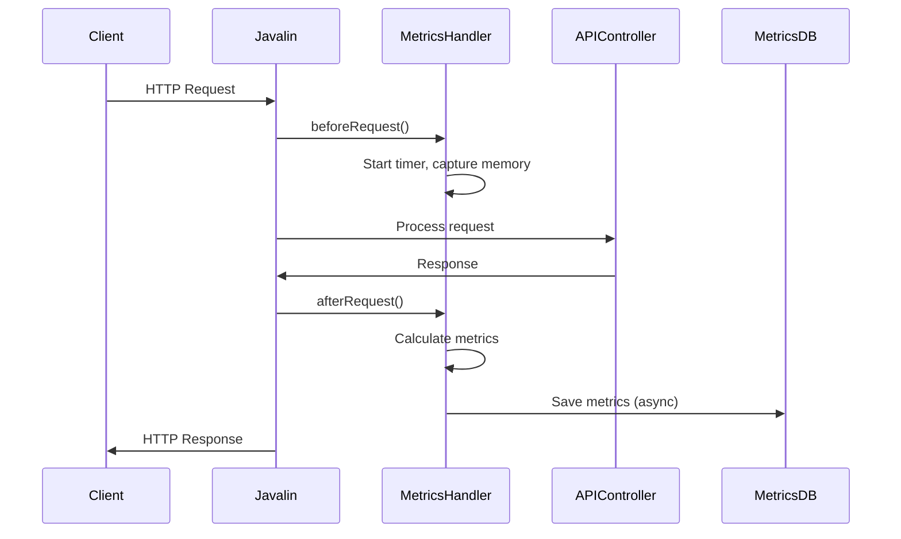

### Features

- **Automatic Collection**: Intercepts all HTTP requests/responses
- **Real-time Aggregation**: Live metrics available via REST API
- **Database Persistence**: Historical metrics stored for trend analysis
- **Configurable**: Fine-grained control over collection behavior
- **High Performance**: Minimal overhead with async processing
- **Path Exclusion**: Exclude specific paths from collection

### Configuration

```yaml
metrics:
  collection:
    enabled: true                    # Master switch
    includeMemoryMetrics: true       # Memory usage tracking
    excludePaths:                    # Paths to exclude
      - "/dashboard"
      - "/metrics"
      - "/api/performance-metrics"
    samplingRate: 1.0               # 0.0-1.0 (100% = all requests)
    asyncSave: true                 # Async database saves
```

### Environment-Specific Configurations

#### Development
```yaml
metrics:
  collection:
    enabled: true
    samplingRate: 1.0               # Full collection
    asyncSave: false                # Immediate persistence
    includeMemoryMetrics: true
```

#### Production
```yaml
metrics:
  collection:
    enabled: true
    samplingRate: 0.05              # 5% sampling
    includeMemoryMetrics: false     # Reduce overhead
    asyncSave: true                 # Async for performance
```

### Metrics APIs

#### Real-time Metrics
```bash
# Get all endpoint metrics
curl http://localhost:8080/api/metrics/endpoints

# Response format (example with your domain endpoints)
{
  "GET /api/your-entities": {
    "totalRequests": 150,
    "averageResponseTime": 45.2,
    "successRate": 98.7,
    "lastRequestTime": [2025,8,14,15,30,45,123456789]
  }
}
```

#### Reset Metrics
```bash
curl -X POST http://localhost:8080/api/metrics/reset
```

#### Historical Metrics
```bash
# Get historical performance data
curl http://localhost:8080/api/performance-metrics

# Get performance summary
curl http://localhost:8080/api/performance-metrics/summary

# Get trends for charts
curl "http://localhost:8080/api/performance-metrics/trends?days=7&testType=API_REQUEST"
```

### Implementation Details

The metrics collection system uses a handler-based approach:

1. **Before Request**: Captures start time, memory state, request details
2. **After Request**: Calculates response time, memory usage, updates aggregations
3. **Path Normalization**: Groups similar endpoints (e.g., `/api/stock-trades/{id}`)
4. **Thread Safety**: Uses ThreadLocal for request-scoped data and ConcurrentHashMap for aggregations
5. **Error Handling**: Graceful degradation if metrics collection fails

---

## Database Integration

### Supported Databases

#### H2 Database (Default)
- **Use Case**: Development, testing, embedded scenarios
- **Configuration**: File-based or in-memory
- **Features**: Zero-configuration, web console, SQL compatibility

#### PostgreSQL
- **Use Case**: Production deployments
- **Configuration**: External server connection
- **Features**: Full ACID compliance, advanced features, scalability

### Database Configuration Examples

#### H2 Configuration
```yaml
databases:
  stocktrades_db:
    name: "stocktrades_db"
    url: "jdbc:h2:./data/stocktrades;AUTO_SERVER=TRUE;DB_CLOSE_DELAY=-1"
    username: "sa"
    password: ""
    driver: "org.h2.Driver"
```

#### PostgreSQL Configuration
```yaml
databases:
  postgres_trades:
    name: "postgres_trades"
    url: "jdbc:postgresql://localhost:5432/trades_db_1?currentSchema=public"
    username: "testuser"
    password: "testpass"
    driver: "org.postgresql.Driver"
    pool:
      maximumPoolSize: 20
      minimumIdle: 5
      connectionTimeout: 30000
```

### Database Schema Management

The system automatically manages database schemas:

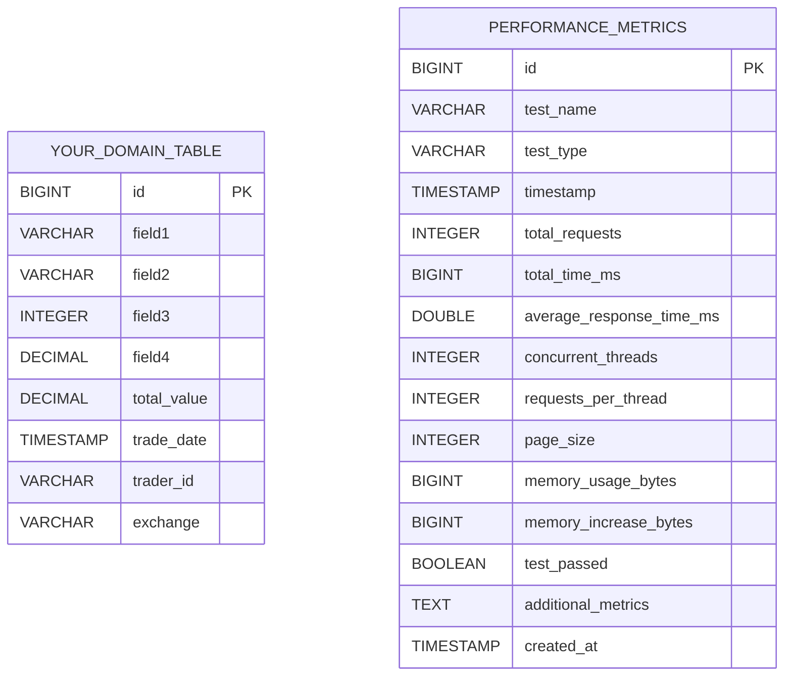

#### Example Domain Schema
```sql
-- EXAMPLE: Replace with your actual domain tables
-- Stock trades example moved to cordal-integration-tests
CREATE TABLE your_domain_table (
    id BIGINT AUTO_INCREMENT PRIMARY KEY,
    field1 VARCHAR(50) NOT NULL,
    field2 VARCHAR(50) NOT NULL,
    field3 INTEGER NOT NULL,
    field4 DECIMAL(10,2) NOT NULL,
    total_value DECIMAL(15,2) NOT NULL,
    created_date TIMESTAMP NOT NULL,
    field5 VARCHAR(50),
    field6 VARCHAR(20)
);

CREATE INDEX idx_your_table_field1 ON your_domain_table(field1);
CREATE INDEX idx_your_table_date ON your_domain_table(created_date);
```

#### Performance Metrics Schema
```sql
CREATE TABLE performance_metrics (
    id BIGINT AUTO_INCREMENT PRIMARY KEY,
    test_name VARCHAR(255) NOT NULL,
    test_type VARCHAR(100) NOT NULL,
    timestamp TIMESTAMP NOT NULL,
    total_requests INTEGER,
    total_time_ms BIGINT,
    average_response_time_ms DOUBLE,
    concurrent_threads INTEGER,
    requests_per_thread INTEGER,
    page_size INTEGER,
    memory_usage_bytes BIGINT,
    memory_increase_bytes BIGINT,
    test_passed BOOLEAN,
    additional_metrics TEXT,
    created_at TIMESTAMP DEFAULT CURRENT_TIMESTAMP
);
```

### H2 Server Mode

For multi-connection support, start H2 in server mode:

```bash
# Start H2 server
./scripts/start-h2-server.sh

# Access H2 console
./scripts/h2-console.sh
```

**Connection Details**:
- **TCP Port**: 9092
- **Web Console**: http://localhost:8082
- **Connection URL**: `jdbc:h2:tcp://localhost:9092/./data/{database-name}`

---

## Testing

### Test Categories

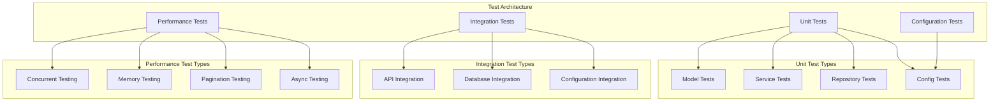

#### 1. Unit Tests
- **Model Tests**: Entity validation, DTO conversion
- **Service Tests**: Business logic, validation, error handling
- **Repository Tests**: Data access, SQL operations
- **Configuration Tests**: YAML loading, validation

#### 2. Integration Tests
- **API Integration**: End-to-end HTTP testing
- **Database Integration**: Multi-database scenarios
- **Configuration Integration**: Full configuration chain testing

#### 3. Performance Tests
- **Concurrent Testing**: Multi-threaded request handling
- **Memory Testing**: Memory usage validation
- **Pagination Testing**: Large dataset performance
- **Async Testing**: Asynchronous endpoint performance

### Running Tests

#### All Tests
```bash
mvn test
```

#### Specific Test Categories
```bash
# Unit tests only
mvn test -Dtest="dev.mars.model.*,dev.mars.service.*,dev.mars.repository.*"

# Integration tests only
mvn test -Dtest="dev.mars.integration.*"

# Configuration validation tests
mvn test -Dtest="ValidationConfigurationTest,ValidationStartupTest"

# Performance tests (disabled by default)
mvn test -Dtest="dev.mars.performance.*" -Dtest.performance.enabled=true
```

#### Module-Specific Tests
```bash
# Generic API Service tests
mvn test -pl cordal-api-service

# Metrics Service tests
mvn test -pl cordal-metrics-service

# Integration tests
mvn test -pl cordal-integration-tests
```

### Test Configuration

#### Test Application Configuration
**File**: `src/test/resources/application-test.yml`

```yaml
database:
  url: "jdbc:h2:mem:testdb;DB_CLOSE_DELAY=-1"
  username: "sa"
  password: ""
  driver: "org.h2.Driver"

data:
  loadSampleData: false
  initializeForTesting: true

logging:
  level:
    dev.mars: DEBUG
    org.h2: WARN
```

### Test Coverage

| Component | Coverage | Test Count |
|-----------|----------|------------|
| Model Layer | 100% | 25 |
| Repository Layer | 95% | 35 |
| Service Layer | 95% | 40 |
| Controller Layer | 90% | 30 |
| Configuration Layer | 85% | 20 |
| Integration | 80% | 15 |

---

## Scripts and Automation

### Build Scripts

#### Enhanced Build Script
```bash
# Default fat JAR build
./scripts/build-executable-jars.sh

# Build with options
./scripts/build-executable-jars.sh --optimized-jar --analyze --run-tests

# Fast development build
./scripts/build-executable-jars.sh --dev
```

**Available Options**:
- `--run-tests`: Run tests during build
- `--no-clean`: Skip clean phase
- `--fat-jar`: Self-contained JARs (default)
- `--thin-jar`: Minimal JARs
- `--optimized-jar`: Minimized fat JARs
- `--dev`: Fast development builds
- `--analyze`: Run JAR analysis after build

### Service Management Scripts

#### Start All Services
```bash
# Start both API and metrics services
./scripts/start-all-services.sh

# Start only API service
./scripts/start-all-services.sh --generic-api-only

# Validate configuration only
./scripts/start-all-services.sh --validate-only
```

#### Individual Service Scripts
```bash
# Start Generic API Service
./scripts/start-cordal-api-service.sh

# Start Metrics Service
./scripts/start-cordal-metrics-service.sh

# Validation mode
./scripts/start-cordal-api-service.sh --validate-only
```

### Analysis and Debugging Scripts

#### JAR Analysis
```bash
# Analyze all JARs
./scripts/analyze-jars.sh

# Show sizes only
./scripts/analyze-jars.sh --sizes

# Analyze specific module
./scripts/analyze-jars.sh --module cordal-api-service --profile optimized
```

#### Database Scripts
```bash
# Start H2 server
./scripts/start-h2-server.sh

# Start H2 web console
./scripts/h2-console.sh
```

#### Testing and Validation Scripts
```bash
# Run bootstrap demonstration
./scripts/run-bootstrap-demo.sh

# Test validation features
./scripts/test-validation-flags.sh
```

### Cross-Platform Support

All scripts have Windows equivalents:
- `build-executable-jars.bat`
- `start-all-services.bat`
- `start-cordal-api-service.bat`
- `start-cordal-metrics-service.bat`
- `analyze-jars.bat`
- `start-h2-server.bat`
- `h2-console.bat`
- `run-bootstrap-demo.bat`
- `test-validation-flags.bat`

---

## Performance Dashboard

### Overview

The performance dashboard provides real-time monitoring and visualization of API performance metrics through an interactive web interface.

### Dashboard Features

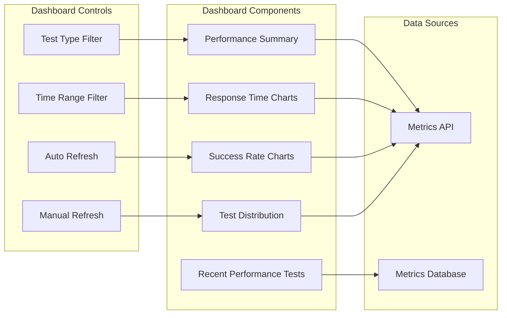

#### 1. Performance Summary
- Total number of tests executed
- Average response time across all tests
- Success rate percentage
- Last test execution time

#### 2. Interactive Charts
- **Response Time Trends**: Line chart showing average response times over time
- **Success Rate Trends**: Line chart showing test success rates over time
- **Test Type Distribution**: Overview of different types of performance tests

#### 3. Recent Performance Tests
- Table showing the most recent test executions
- Includes test name, type, response time, status, and timestamp

#### 4. Dashboard Controls
- **Test Type Filter**: Filter metrics by specific test types (CONCURRENT, SYNC, ASYNC, PAGINATION, MEMORY)
- **Time Range Filter**: View data for different time periods (24 hours, 7 days, 30 days, 90 days)
- **Auto-refresh**: Dashboard automatically refreshes every 30 seconds
- **Manual Refresh**: Button to manually refresh all data

### Accessing the Dashboard

- **Primary URL**: http://localhost:8080/dashboard
- **Alternative URL**: http://localhost:8080/dashboard/

### Dashboard API Endpoints

| Endpoint | Method | Description |
|----------|--------|-------------|
| `/api/performance-metrics` | GET | Get all performance metrics with pagination |
| `/api/performance-metrics/{id}` | GET | Get specific performance metrics by ID |
| `/api/performance-metrics/summary` | GET | Get performance summary statistics |
| `/api/performance-metrics/trends` | GET | Get performance trends for charts |
| `/api/performance-metrics/test-types` | GET | Get available test types |
| `/api/performance-metrics/test-type/{testType}` | GET | Get metrics by test type |
| `/api/performance-metrics/date-range` | GET | Get metrics within date range |

### Performance Test Types

#### 1. CONCURRENT Tests
- **Purpose**: Test concurrent request handling
- **Metrics**: Total requests, concurrent threads, requests per thread
- **Example**: 10 threads making 20 requests each (200 total requests)

#### 2. SYNC Tests
- **Purpose**: Test synchronous request performance
- **Metrics**: Sequential request processing times
- **Example**: 50 sequential requests measuring total time

#### 3. ASYNC Tests
- **Purpose**: Test asynchronous request performance
- **Metrics**: Asynchronous request processing times
- **Example**: 50 async requests comparing with sync performance

#### 4. PAGINATION Tests
- **Purpose**: Test pagination performance with different page sizes
- **Metrics**: Response times for various page sizes (10, 50, 100, 500, 1000)
- **Example**: Single requests with different page sizes

#### 5. MEMORY Tests
- **Purpose**: Test memory usage during request processing
- **Metrics**: Memory usage before/after, memory increase
- **Example**: 100 requests monitoring memory consumption

### Technology Stack

- **Backend**: Java 21, Javalin 6.1.3, Guice DI
- **Database**: H2 Database (file-based)
- **Frontend**: HTML5, CSS3, JavaScript (ES6+)
- **Charts**: Chart.js 4.x
- **HTTP Client**: OkHttp (for tests)

---

## Configuration Validation

### Overview

The configuration validation system ensures that all YAML configuration files are properly structured and that the relationships between endpoints, queries, and databases are valid.

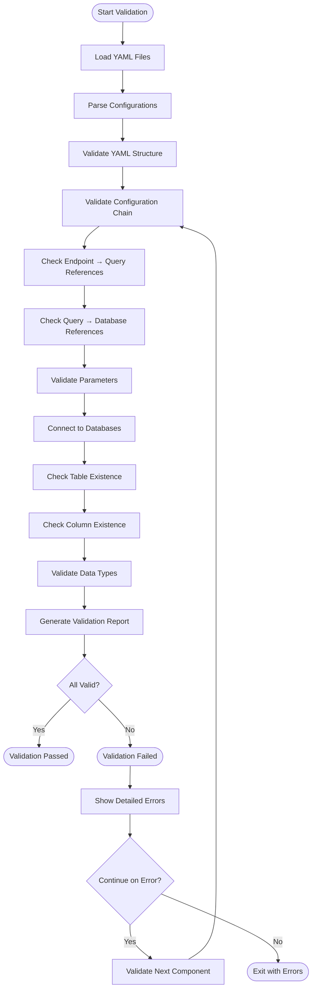

### Validation Features

#### 1. Configuration Chain Validation
- **Endpoints → Queries**: Verify that each endpoint references an existing query
- **Queries → Databases**: Verify that each query references an existing database
- **Cross-references**: Validate all configuration relationships

#### 2. Database Schema Validation
- **Table Existence**: Verify that referenced tables exist in the database
- **Column Validation**: Check that query columns exist in database tables
- **Data Type Compatibility**: Ensure query result types match API expectations

#### 3. Comprehensive Error Reporting
- **Detailed Errors**: Show specific validation failures with context
- **Error Limits**: Configurable maximum number of errors to display
- **ASCII Tables**: Formatted error reports for easy reading
- **Continue on Error**: Option to continue validation after encountering errors

### Validation Configuration

```yaml
validation:
  runOnStartup: true              # Run validation during normal startup
  validateOnly: false             # Run only validation and exit
  continueOnError: true           # Continue validation after errors
  maxErrorsToShow: 10            # Maximum errors to display
```

### Validation Modes

#### 1. Startup Validation
```yaml
validation:
  runOnStartup: true
```
Runs validation during normal application startup and logs any issues.

#### 2. Validation-Only Mode
```yaml
validation:
  validateOnly: true
```
Runs only validation and exits without starting the application.

#### 3. Command Line Override
```bash
# Override config and run validation only
java -jar app.jar --validate-only

# Short form
java -jar app.jar --validate
```

### Running Validation

#### Using Scripts
```bash
# Test validation features
./scripts/test-validation-flags.sh

# Validate configuration only
./scripts/start-all-services.sh --validate-only
```

#### Manual Validation
```bash
# Run validation only
java -jar cordal-api-service/target/cordal-api-service-*.jar --validate-only

# Run with startup validation enabled
java -jar cordal-api-service/target/cordal-api-service-*.jar
```

### Validation Output Example

```
Configuration Validation Results
================================

Configuration Chain Validation:
+------------------+--------+----------------------------------+
| Component        | Status | Details                          |
+------------------+--------+----------------------------------+
| Endpoints        | PASS   | 5 endpoints loaded successfully  |
| Queries          | PASS   | 8 queries loaded successfully    |
| Databases        | PASS   | 2 databases loaded successfully  |
| Cross-references | PASS   | All references valid             |
+------------------+--------+----------------------------------+

Database Schema Validation:
+------------------+--------+----------------------------------+
| Database         | Status | Details                          |
+------------------+--------+----------------------------------+
| stocktrades_db   | PASS   | All tables and columns valid     |
| metrics_db       | PASS   | Schema validation successful     |
+------------------+--------+----------------------------------+

Validation Summary:
- Total Errors: 0
- Total Warnings: 0
- Validation Status: PASSED
```

---

## Configuration Schema Reference

### Database Configuration Schema

```yaml
databases:
  {database_name}:                 # Unique database identifier
    name: string                   # Display name
    url: string                    # JDBC connection URL
    username: string               # Database username
    password: string               # Database password
    driver: string                 # JDBC driver class
    pool:                          # Connection pool settings
      maximumPoolSize: integer     # Maximum connections (default: 10)
      minimumIdle: integer         # Minimum idle connections (default: 2)
      connectionTimeout: integer   # Connection timeout ms (default: 30000)
      idleTimeout: integer         # Idle timeout ms (default: 600000)
      maxLifetime: integer         # Max connection lifetime ms (default: 1800000)
    validation:                    # Connection validation
      testQuery: string            # Validation query (default: "SELECT 1")
      validateOnBorrow: boolean    # Validate on borrow (default: true)
```

### Query Configuration Schema

```yaml
queries:
  {query_name}:                    # Unique query identifier
    database: string               # Reference to database name
    sql: string                    # SQL query with ? placeholders
    parameters:                    # Query parameters
      - name: string               # Parameter name
        type: string               # Parameter type (INTEGER, STRING, DECIMAL, etc.)
        required: boolean          # Whether parameter is required
        defaultValue: any          # Default value if not provided
    resultMapping:                 # Result column mapping
      - column: string             # Database column name
        field: string              # API response field name
        type: string               # Data type for conversion
    pagination:                    # Pagination support
      enabled: boolean             # Enable pagination for this query
      countQuery: string           # Optional custom count query
```

### Endpoint Configuration Schema

```yaml
endpoints:
  {endpoint_name}:                 # Unique endpoint identifier
    path: string                   # URL path (e.g., "/api/stock-trades")
    method: string                 # HTTP method (GET, POST, PUT, DELETE)
    query: string                  # Reference to query name
    pagination:                    # Pagination configuration
      enabled: boolean             # Enable pagination
      defaultPageSize: integer     # Default page size
      maxPageSize: integer         # Maximum allowed page size
    parameters:                    # Endpoint parameters
      - name: string               # Parameter name
        type: string               # Parameter type
        required: boolean          # Whether parameter is required
        defaultValue: any          # Default value
        source: string             # Parameter source (QUERY, PATH, BODY)
    response:                      # Response configuration
      type: string                 # Response type (SINGLE, LIST, PAGED)
      wrapper: string              # Response wrapper class
    security:                      # Security configuration
      authentication: boolean     # Require authentication
      roles: [string]              # Required roles
```

---

## Bootstrap Process

### Overview

The bootstrap process initializes the application by loading configurations, validating settings, setting up databases, and creating dynamic API endpoints.

### Bootstrap Sequence

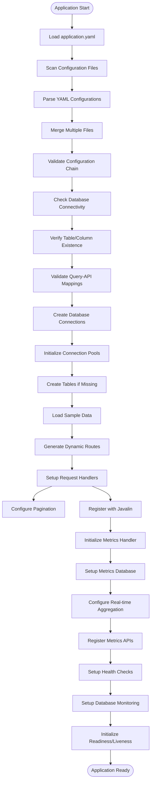

1. **Configuration Loading**
   - Load application.yaml
   - Scan for configuration files using patterns
   - Parse database, query, and endpoint configurations
   - Merge multiple configuration files

2. **Configuration Validation**
   - Validate configuration chain (endpoints → queries → databases)
   - Check database connectivity
   - Verify table and column existence
   - Validate query-to-API field mappings

3. **Database Initialization**
   - Create database connections
   - Initialize connection pools
   - Create tables if they don't exist
   - Load sample data (if configured)

4. **API Endpoint Creation**
   - Generate dynamic routes based on endpoint configurations
   - Set up request handlers
   - Configure pagination and parameter handling
   - Register endpoints with Javalin

5. **Metrics System Initialization**
   - Initialize metrics collection handler
   - Set up metrics database
   - Configure real-time aggregation
   - Register metrics APIs

6. **Health Check Setup**
   - Configure health check endpoints
   - Set up database health monitoring
   - Initialize readiness and liveness probes

### Bootstrap Demonstration

Run the bootstrap demo to see the process in action:

```bash
./scripts/run-bootstrap-demo.sh
```

This script will:
1. Build the project
2. Start the application with detailed logging
3. Show configuration loading process
4. Demonstrate API endpoint creation
5. Test the created endpoints
6. Display metrics collection

### Bootstrap Configuration

Control bootstrap behavior through application.yaml:

```yaml
# Bootstrap Configuration
bootstrap:
  validateOnStartup: true          # Run validation during bootstrap
  failOnValidationError: false    # Continue despite validation errors
  createTablesIfMissing: true     # Auto-create missing database tables
  loadSampleData: false           # Load sample data during bootstrap

# Data Loading Configuration
data:
  loadSampleData: false           # Load sample data
  initializeForTesting: false     # Initialize test data
```

---

## Endpoint Validation

### Overview

Endpoint validation ensures that all dynamically created API endpoints are properly configured and functional.

### Validation Process

#### 1. Configuration Validation
- **Endpoint Definition**: Verify endpoint YAML structure
- **Query Reference**: Ensure referenced query exists
- **Parameter Mapping**: Validate parameter definitions
- **Response Configuration**: Check response type and wrapper settings

#### 2. Database Validation
- **Query Execution**: Test query execution with sample parameters
- **Result Mapping**: Verify column-to-field mappings
- **Data Types**: Ensure type compatibility
- **Pagination**: Test pagination queries if enabled

#### 3. Runtime Validation
- **Endpoint Registration**: Verify endpoints are registered with Javalin
- **Request Handling**: Test request parameter parsing
- **Response Generation**: Validate response formatting
- **Error Handling**: Test error scenarios

### Validation Commands

#### Comprehensive Validation
```bash
# Run full validation
./scripts/start-cordal-api-service.sh --validate-only
```

#### Specific Validation Tests
```bash
# Test validation flags
./scripts/test-validation-flags.sh

# Run validation tests
mvn test -Dtest="ValidationConfigurationTest,ValidationStartupTest"
```

### Validation Output

The validation system provides detailed reports:

```
Endpoint Validation Results
===========================

Endpoint: GET /api/your-entities (example)
+------------------+--------+----------------------------------+
| Validation Type  | Status | Details                          |
+------------------+--------+----------------------------------+
| Configuration    | PASS   | Endpoint definition valid        |
| Query Reference  | PASS   | Query 'get_all_your_entities' found |
| Database Schema  | PASS   | All columns exist                |
| Parameter Mapping| PASS   | All parameters mapped correctly  |
| Response Format  | PASS   | PagedResponse wrapper valid      |
+------------------+--------+----------------------------------+

Validation Summary:
- Total Endpoints: 5
- Passed: 5
- Failed: 0
- Warnings: 0
```

---

## IDE Setup

### IntelliJ IDEA Setup

#### 1. Project Import
1. Open IntelliJ IDEA
2. Select "Open or Import"
3. Navigate to the project root directory
4. Select the `pom.xml` file
5. Choose "Open as Project"
6. Wait for Maven import to complete

#### 2. Java Configuration
1. Go to File → Project Structure
2. Set Project SDK to Java 21
3. Set Project language level to 21
4. Configure module dependencies

#### 3. Maven Configuration
1. Go to File → Settings → Build → Build Tools → Maven
2. Set Maven home directory
3. Set User settings file (if custom)
4. Enable "Import Maven projects automatically"

#### 4. Code Style
1. Go to File → Settings → Editor → Code Style → Java
2. Import code style from `ide-config/intellij-code-style.xml` (if available)
3. Set tab size to 4 spaces
4. Enable "Use tab character" = false

#### 5. Run Configurations

**Generic API Service**:
- Main class: `dev.cordal.generic.GenericApiApplication`
- VM options: `-Xmx1g -Xms512m`
- Working directory: `$MODULE_WORKING_DIR$`
- Environment variables: `JAVA_OPTS=-XX:+UseG1GC`

**Metrics Service**:
- Main class: `dev.cordal.metrics.MetricsApplication`
- VM options: `-Xmx512m -Xms256m`
- Working directory: `$MODULE_WORKING_DIR$`

#### 6. Database Configuration
1. Go to View → Tool Windows → Database
2. Add H2 database connection:
   - URL: `jdbc:h2:./data/stocktrades`
   - Username: `sa`
   - Password: (empty)
3. Add PostgreSQL connection (if used):
   - URL: `jdbc:postgresql://localhost:5432/trades_db_1`
   - Username: `testuser`
   - Password: `testpass`

### VS Code Setup

#### 1. Extensions
Install the following extensions:
- Extension Pack for Java
- Spring Boot Extension Pack
- YAML Support
- Maven for Java
- Debugger for Java

#### 2. Settings Configuration
Create `.vscode/settings.json`:

```json
{
  "java.home": "/path/to/java21",
  "java.configuration.runtimes": [
    {
      "name": "JavaSE-21",
      "path": "/path/to/java21"
    }
  ],
  "maven.executable.path": "/path/to/maven/bin/mvn",
  "java.test.config": {
    "workingDirectory": "${workspaceFolder}"
  }
}
```

#### 3. Launch Configuration
Create `.vscode/launch.json`:

```json
{
  "version": "0.2.0",
  "configurations": [
    {
      "type": "java",
      "name": "Launch Generic API Service",
      "request": "launch",
      "mainClass": "dev.cordal.generic.GenericApiApplication",
      "projectName": "cordal-api-service",
      "vmArgs": "-Xmx1g -Xms512m",
      "cwd": "${workspaceFolder}"
    },
    {
      "type": "java",
      "name": "Launch Metrics Service",
      "request": "launch",
      "mainClass": "dev.cordal.metrics.MetricsApplication",
      "projectName": "cordal-metrics-service",
      "vmArgs": "-Xmx512m -Xms256m",
      "cwd": "${workspaceFolder}"
    }
  ]
}
```

### Eclipse Setup

#### 1. Project Import
1. File → Import → Existing Maven Projects
2. Browse to project root directory
3. Select all modules
4. Click Finish

#### 2. Java Build Path
1. Right-click project → Properties
2. Java Build Path → Libraries
3. Add JRE System Library (Java 21)
4. Configure Maven Dependencies

#### 3. Run Configurations
1. Run → Run Configurations
2. Create new Java Application
3. Set main class and VM arguments as above

---

## PostgreSQL Integration

### Setup Guide

#### 1. Install PostgreSQL

**Windows**:
```bash
# Using Chocolatey
choco install postgresql

# Or download from https://www.postgresql.org/download/windows/
```

**macOS**:
```bash
# Using Homebrew
brew install postgresql
brew services start postgresql
```

**Linux (Ubuntu/Debian)**:
```bash
sudo apt update
sudo apt install postgresql postgresql-contrib
sudo systemctl start postgresql
sudo systemctl enable postgresql
```

#### 2. Configure PostgreSQL

```bash
# Connect as postgres user
sudo -u postgres psql

# Set password
ALTER USER postgres PASSWORD 'postgres';

# Create test user
CREATE USER testuser WITH PASSWORD 'testpass';
ALTER USER testuser CREATEDB;

# Exit
\q
```

#### 3. Create Test Databases

```sql
-- Create test databases
CREATE DATABASE trades_db_1 OWNER testuser;
CREATE DATABASE trades_db_2 OWNER testuser;
```

### Dual PostgreSQL Integration

The system supports connecting to multiple PostgreSQL databases simultaneously:

#### Configuration Example

**File**: `generic-config/postgres-databases.yaml`

```yaml
databases:
  postgres_trades_1:
    name: "postgres_trades_1"
    url: "jdbc:postgresql://localhost:5432/trades_db_1?currentSchema=public"
    username: "testuser"
    password: "testpass"
    driver: "org.postgresql.Driver"
    pool:
      maximumPoolSize: 20
      minimumIdle: 5
      connectionTimeout: 30000

  postgres_trades_2:
    name: "postgres_trades_2"
    url: "jdbc:postgresql://localhost:5432/trades_db_2?currentSchema=public"
    username: "testuser"
    password: "testpass"
    driver: "org.postgresql.Driver"
    pool:
      maximumPoolSize: 20
      minimumIdle: 5
      connectionTimeout: 30000
```

#### Query Configuration for PostgreSQL

**File**: `generic-config/postgres-queries.yaml`

```yaml
queries:
  get_postgres_trades_db1:
    database: "postgres_trades_1"
    sql: "SELECT id, symbol, trade_type, quantity, price, total_value, trade_date, trader_id, exchange FROM stock_trades ORDER BY trade_date DESC LIMIT ? OFFSET ?"
    parameters:
      - name: "limit"
        type: "INTEGER"
        required: true
      - name: "offset"
        type: "INTEGER"
        required: true

  get_postgres_trades_db2:
    database: "postgres_trades_2"
    sql: "SELECT id, symbol, trade_type, quantity, price, total_value, trade_date, trader_id, exchange FROM stock_trades ORDER BY trade_date DESC LIMIT ? OFFSET ?"
    parameters:
      - name: "limit"
        type: "INTEGER"
        required: true
      - name: "offset"
        type: "INTEGER"
        required: true
```

#### API Endpoints for PostgreSQL

**File**: `generic-config/postgres-endpoints.yaml`

```yaml
endpoints:
  get_postgres_trades_db1:
    path: "/api/postgres/trades-db1"
    method: "GET"
    query: "get_postgres_trades_db1"
    pagination:
      enabled: true
      defaultPageSize: 20
      maxPageSize: 1000

  get_postgres_trades_db2:
    path: "/api/postgres/trades-db2"
    method: "GET"
    query: "get_postgres_trades_db2"
    pagination:
      enabled: true
      defaultPageSize: 20
      maxPageSize: 1000
```

### Integration Testing

Run the dual PostgreSQL integration test:

```bash
# Automatic setup and testing
mvn test -pl cordal-integration-tests -Dtest=DualPostgreSQLNativeIntegrationTest

# Manual setup (if preferred)
cd cordal-integration-tests
psql -h localhost -U postgres -f src/test/resources/sql/setup-dual-postgresql-databases.sql
mvn test -Dtest=DualPostgreSQLNativeIntegrationTest
```

The integration test:
1. Creates test databases and user
2. Sets up schemas and sample data
3. Starts API service with PostgreSQL configuration
4. Tests all endpoints
5. Cleans up databases

---

## Troubleshooting

### Common Issues and Solutions

#### 1. Application Won't Start

**Symptoms**: Application fails to start or exits immediately

**Solutions**:
```bash
# Check Java version
java -version  # Should be 21+

# Verify JAR exists
ls -la */target/*.jar

# Check configuration files
ls -la generic-config/*.yaml

# Run with debug logging
java -Dlogging.level.dev.mars=DEBUG -jar app.jar

# Validate configuration
./scripts/start-all-services.sh --validate-only
```

#### 2. Database Connection Issues

**Symptoms**: Database connection errors, SQL exceptions

**Solutions**:
```bash
# Check H2 server status
./scripts/start-h2-server.sh

# Test database connectivity
curl http://localhost:8080/api/health

# Check database files
ls -la data/*.db

# Verify database configuration
grep -A 10 "database:" generic-config/application.yaml
```

#### 3. Configuration Validation Errors

**Symptoms**: Validation failures, missing references

**Solutions**:
```bash
# Run comprehensive validation
./scripts/test-validation-flags.sh

# Check configuration file syntax
yamllint generic-config/*.yaml

# Verify file naming patterns
ls -la generic-config/*-databases.yaml
ls -la generic-config/*-queries.yaml
ls -la generic-config/*-endpoints.yaml
```

#### 4. Port Conflicts

**Symptoms**: "Port already in use" errors

**Solutions**:
```bash
# Check what's using the port
netstat -an | grep :8080

# Kill existing processes
pkill -f "java.*Application"

# Use different port
java -Dserver.port=8081 -jar app.jar
```

#### 5. Metrics Not Collecting

**Symptoms**: No metrics data, empty dashboard

**Solutions**:
```bash
# Check metrics configuration
grep -A 10 "metrics:" generic-config/application.yaml

# Verify metrics are enabled
curl http://localhost:8080/api/metrics/endpoints

# Check metrics database
curl http://localhost:8080/api/performance-metrics

# Generate test traffic
for i in {1..10}; do curl http://localhost:8080/api/stock-trades; done
```

#### 6. Test Failures

**Symptoms**: Tests fail during build or execution

**Solutions**:
```bash
# Clean and rebuild
mvn clean install

# Run tests with debug output
mvn test -X

# Run specific failing test
mvn test -Dtest="SpecificTestClass"

# Check test configuration
cat src/test/resources/application-test.yml
```

#### 7. Memory Issues

**Symptoms**: OutOfMemoryError, high memory usage

**Solutions**:
```bash
# Increase heap size
export JAVA_OPTS="-Xmx2g -Xms1g"

# Disable memory metrics collection
# In application.yaml:
metrics:
  collection:
    includeMemoryMetrics: false

# Monitor memory usage
curl http://localhost:8080/api/management/health
```

#### 8. Performance Issues

**Symptoms**: Slow response times, high CPU usage

**Solutions**:
```bash
# Reduce metrics sampling
# In application.yaml:
metrics:
  collection:
    samplingRate: 0.1  # 10% sampling

# Optimize JVM settings
export JAVA_OPTS="-XX:+UseG1GC -XX:+TieredCompilation"

# Check database performance
curl http://localhost:8080/api/health
```

### Debug Mode

Enable comprehensive debug logging:

```yaml
# In application.yaml
logging:
  level:
    dev.mars: DEBUG
    org.h2: DEBUG
    com.zaxxer.hikari: DEBUG
    io.javalin: DEBUG
```

Or via command line:
```bash
java -Dlogging.level.dev.mars=DEBUG -jar app.jar
```

### Log Analysis

Monitor application logs for issues:

```bash
# Watch application logs
tail -f logs/application.log

# Search for errors
grep -i "error\|exception" logs/application.log

# Monitor metrics collection
grep "MetricsCollectionHandler" logs/application.log

# Check configuration loading
grep "ConfigurationLoader" logs/application.log
```

---

## Development Guide

### Setting Up Development Environment

#### 1. Prerequisites
- Java 21+ JDK
- Maven 3.6.0+
- Git
- IDE (IntelliJ IDEA recommended)
- PostgreSQL (optional)

#### 2. Clone and Setup
```bash
git clone <repository-url>
cd cordal
mvn clean install
```

#### 3. IDE Configuration
Follow the [IDE Setup](#ide-setup) section for your preferred IDE.

### Development Workflow

#### 1. Configuration-First Development
1. **Define API Requirements**: Identify what endpoints you need
2. **Create Database Schema**: Design tables and relationships
3. **Write Queries**: Create SQL queries in YAML configuration
4. **Define Endpoints**: Configure API endpoints in YAML
5. **Test and Validate**: Use validation tools to verify configuration

#### 2. Code Development (When Needed)
1. **Business Logic**: Add custom business logic in service layer
2. **Custom Controllers**: Create specialized controllers for complex operations
3. **Data Models**: Define custom DTOs and entities
4. **Validation Rules**: Add custom validation logic

#### 3. Testing Strategy
1. **Unit Tests**: Test individual components
2. **Integration Tests**: Test module interactions
3. **Configuration Tests**: Validate YAML configurations
4. **Performance Tests**: Measure and optimize performance

### Adding New Features

#### 1. Adding a New API Endpoint

**Step 1**: Define the database query
```yaml
# In generic-config/new-feature-queries.yaml
queries:
  get_user_profiles:
    database: "main_db"
    sql: "SELECT id, username, email, created_date FROM user_profiles WHERE active = true ORDER BY username LIMIT ? OFFSET ?"
    parameters:
      - name: "limit"
        type: "INTEGER"
        required: true
      - name: "offset"
        type: "INTEGER"
        required: true
```

**Step 2**: Define the API endpoint
```yaml
# In generic-config/new-feature-endpoints.yaml
endpoints:
  get_user_profiles:
    path: "/api/users"
    method: "GET"
    query: "get_user_profiles"
    pagination:
      enabled: true
      defaultPageSize: 20
      maxPageSize: 100
```

**Step 3**: Validate and test
```bash
# Validate configuration
./scripts/start-cordal-api-service.sh --validate-only

# Start service and test
./scripts/start-cordal-api-service.sh
curl http://localhost:8080/api/users
```

#### 2. Adding Custom Business Logic

When YAML configuration isn't sufficient, add custom Java code:

**Step 1**: Create service class
```java
@Singleton
public class UserProfileService {

    @Inject
    private UserProfileRepository repository;

    public CompletableFuture<List<UserProfile>> getActiveUsers() {
        return CompletableFuture.supplyAsync(() -> {
            // Custom business logic here
            return repository.findActiveUsers();
        });
    }
}
```

**Step 2**: Create controller
```java
public class UserProfileController {

    @Inject
    private UserProfileService service;

    public void configureRoutes(Javalin app) {
        app.get("/api/users/active", ctx -> {
            service.getActiveUsers()
                .thenAccept(users -> ctx.json(users))
                .exceptionally(throwable -> {
                    ctx.status(500).json(Map.of("error", throwable.getMessage()));
                    return null;
                });
        });
    }
}
```

**Step 3**: Register with Guice
```java
// In GuiceModule.java
@Provides
@Singleton
public UserProfileController provideUserProfileController(UserProfileService service) {
    return new UserProfileController(service);
}
```

### Best Practices

#### 1. Configuration Management
- Use descriptive names for databases, queries, and endpoints
- Group related configurations in the same files
- Follow naming conventions (`*-databases.yaml`, `*-queries.yaml`, `*-endpoints.yaml`)
- Validate configurations before deployment

#### 2. Database Design
- Use appropriate indexes for query performance
- Follow consistent naming conventions
- Include audit fields (created_at, updated_at)
- Use appropriate data types

#### 3. Error Handling
- Implement comprehensive error handling in custom code
- Use appropriate HTTP status codes
- Provide meaningful error messages
- Log errors with sufficient context

#### 4. Testing
- Write tests for all custom code
- Use configuration validation tests
- Include integration tests for new features
- Test with realistic data volumes

#### 5. Performance
- Monitor metrics collection overhead
- Use appropriate sampling rates for production
- Optimize database queries
- Consider async processing for heavy operations

### Code Style Guidelines

#### 1. Java Code Style
- Use 4 spaces for indentation
- Follow standard Java naming conventions
- Use meaningful variable and method names
- Include comprehensive JavaDoc for public APIs

#### 2. Configuration Style
- Use consistent YAML formatting
- Include comments for complex configurations
- Group related settings together
- Use descriptive names for all identifiers

#### 3. Documentation
- Update documentation when adding features
- Include examples in documentation
- Document configuration options
- Provide troubleshooting guidance

---

## Advanced Features

### Configuration Management APIs

The system provides comprehensive APIs for managing and inspecting configurations:

#### Configuration Introspection
```bash
# View all loaded configurations
curl http://localhost:8080/api/management/config

# View specific configuration type
curl http://localhost:8080/api/management/config/endpoints
curl http://localhost:8080/api/management/config/queries
curl http://localhost:8080/api/management/config/databases

# View configuration file paths and contents
curl http://localhost:8080/api/management/config/files

# View configuration load timestamps
curl http://localhost:8080/api/management/config/metadata
```

#### Configuration Validation APIs
```bash
# Validate configuration chain
curl http://localhost:8080/api/management/validation/chain

# Validate database schemas
curl http://localhost:8080/api/management/validation/schemas

# Get validation summary
curl http://localhost:8080/api/management/validation/summary
```

### Metrics Collection Architecture

The metrics collection system is designed as a cross-cutting concern that automatically intercepts all HTTP requests:

#### Implementation Details

1. **Handler Registration**: Metrics handlers are registered as Javalin before/after handlers
2. **Request Interception**: Captures request start time, path, method, and memory state
3. **Response Processing**: Calculates response time, memory usage, and updates aggregations
4. **Path Normalization**: Groups similar endpoints for better aggregation
5. **Thread Safety**: Uses ThreadLocal for request data and ConcurrentHashMap for aggregations
6. **Async Processing**: Supports async database saves to minimize request overhead

#### Metrics Data Model

```java
public class PerformanceMetrics {
    private Long id;
    private String testName;           // Endpoint identifier
    private String testType;           // "API_REQUEST"
    private LocalDateTime timestamp;   // Request timestamp
    private Integer totalRequests;     // Always 1 for individual requests
    private Long totalTimeMs;          // Response time in milliseconds
    private Double averageResponseTimeMs; // Same as totalTimeMs for individual requests
    private Boolean testPassed;        // Success/failure status
    private String additionalMetrics;  // JSON with extra data
}
```

### Dashboard Configuration

The performance dashboard can be customized through configuration:

```yaml
dashboard:
  enabled: true
  autoRefresh: true
  refreshInterval: 30000          # 30 seconds
  defaultTimeRange: "24h"         # 24 hours, 7d, 30d, 90d
  chartsEnabled: true
  maxDataPoints: 1000
  theme: "light"                  # light, dark, auto
```

### Security Configuration

```yaml
security:
  authentication:
    enabled: false                # Enable authentication
    type: "basic"                 # basic, jwt, oauth2
  authorization:
    enabled: false                # Enable role-based access
    defaultRole: "user"
  cors:
    enabled: true
    allowedOrigins: ["*"]
    allowedMethods: ["GET", "POST", "PUT", "DELETE"]
    allowedHeaders: ["*"]
```

---

## Production Deployment

### Deployment Checklist

#### Pre-Deployment
- [ ] Run full test suite: `mvn test`
- [ ] Validate all configurations: `./scripts/start-all-services.sh --validate-only`
- [ ] Build optimized JARs: `./scripts/build-executable-jars.sh --optimized-jar`
- [ ] Analyze JAR dependencies: `./scripts/analyze-jars.sh`
- [ ] Review security settings
- [ ] Configure production database connections
- [ ] Set up monitoring and alerting

#### Deployment
- [ ] Deploy JAR files to target environment
- [ ] Copy configuration files
- [ ] Set up database connections
- [ ] Configure environment variables
- [ ] Start services with production settings
- [ ] Verify health checks
- [ ] Test critical endpoints

#### Post-Deployment
- [ ] Monitor application logs
- [ ] Check metrics collection
- [ ] Verify dashboard functionality
- [ ] Test database connectivity
- [ ] Monitor resource usage
- [ ] Set up backup procedures

### Production Configuration

#### Application Configuration
```yaml
# Production application.yaml
server:
  port: 8080
  host: "0.0.0.0"

metrics:
  collection:
    enabled: true
    samplingRate: 0.05              # 5% sampling for production
    includeMemoryMetrics: false     # Reduce overhead
    asyncSave: true

logging:
  level:
    root: INFO
    dev.mars: INFO
  file:
    name: "logs/application.log"
    max-size: "100MB"
    max-history: 30
```

#### Database Configuration
```yaml
# Production database settings
database:
  url: "jdbc:postgresql://prod-db-server:5432/production_db"
  username: "${DB_USERNAME}"       # Environment variable
  password: "${DB_PASSWORD}"       # Environment variable
  driver: "org.postgresql.Driver"
  pool:
    maximumPoolSize: 50
    minimumIdle: 10
    connectionTimeout: 30000
    idleTimeout: 300000
    maxLifetime: 900000
```

### Monitoring and Alerting

#### Health Check Monitoring
```bash
# Set up health check monitoring
curl -f http://localhost:8080/api/management/health || alert_system

# Monitor specific components
curl http://localhost:8080/api/management/health | jq '.components.database.status'
```

#### Metrics Monitoring
```bash
# Monitor response times
curl http://localhost:8080/api/metrics/endpoints | jq 'to_entries[] | select(.value.averageResponseTime > 1000)'

# Monitor error rates
curl http://localhost:8080/api/metrics/endpoints | jq 'to_entries[] | select(.value.successRate < 95)'
```

#### Log Monitoring
```bash
# Monitor error logs
tail -f logs/application.log | grep -i "error\|exception"

# Monitor metrics collection
tail -f logs/application.log | grep "MetricsCollectionHandler"
```

---

## Conclusion

The CORDAL provides a comprehensive, production-ready solution for building configuration-driven REST APIs with automatic metrics collection and monitoring. Its modular architecture, extensive testing, and comprehensive documentation make it suitable for both development and production environments.

### Key Benefits

- **Rapid Development**: Create APIs through configuration, not code
- **Automatic Monitoring**: Zero-code metrics collection and dashboards
- **Production Ready**: Comprehensive health checks, monitoring, and deployment options
- **Highly Configurable**: Fine-grained control over all aspects of the system
- **Extensible**: Easy to add custom business logic when needed
- **Well Tested**: Comprehensive test suite with high coverage

### Next Steps

1. **Explore the System**: Use the quick start guide to get familiar with the features
2. **Configure Your APIs**: Create your own endpoint, query, and database configurations
3. **Monitor Performance**: Use the dashboard and metrics APIs to monitor your APIs
4. **Customize as Needed**: Add custom business logic where configuration isn't sufficient
5. **Deploy to Production**: Use the deployment guides and scripts for production deployment

For additional help and support, refer to the troubleshooting section or examine the extensive test suite for examples of how to use each feature.

