# CORDAL - Complete Developer Guide
## Configuration Orchestrated REST Dynamic API Layer

**Version:** 1.0
**Date:** 2025-03-16
**Author:** Mark Andrew Ray-Smith Cityline Ltd

---

## Welcome to CORDAL

**CORDAL** is a revolutionary framework that lets you create powerful REST APIs using only YAML configuration files - **no Java coding required!** This guide will take you from your first "Hello World" API to building complex, production-ready systems.

### What You'll Learn

This guide follows a **gentle learning curve** with hands-on examples:

1. **Getting Started** - Your first API in 5 minutes
2. **Simple Examples** - Basic CRUD operations
3. **Intermediate Features** - Caching, validation, pagination
4. **Advanced Scenarios** - Multi-database, performance optimization
5. **Production Deployment** - Monitoring, scaling, best practices

### Why CORDAL?

- **Zero Code APIs** - Define REST endpoints with YAML only
- **Hot Reload** - Change configurations without restart
- **Built-in Monitoring** - Automatic metrics and dashboards
- **Type Safety** - Compile-time validation for all configurations
- **Production Ready** - Health checks, caching, connection pooling

---

## Table of Contents

### **Getting Started**
1. [Your First API in 5 Minutes](#your-first-api-in-5-minutes)
2. [Understanding the Magic](#understanding-the-magic)
3. [Quick Setup Guide](#quick-setup-guide)

### **Simple Examples**
4. [Example 1: Hello World API](#example-1-hello-world-api)
5. [Example 2: Simple Database Query](#example-2-simple-database-query)
6. [Example 3: Basic CRUD Operations](#example-3-basic-crud-operations)

### **Intermediate Features**
7. [Example 4: Adding Pagination](#example-4-adding-pagination)
8. [Example 5: Query Parameters](#example-5-query-parameters)
9. [Example 6: Caching for Performance](#example-6-caching-for-performance)

### **Advanced Scenarios**
10. [Example 7: Multi-Database Setup](#example-7-multi-database-setup)
11. [Example 8: Complex Queries & Joins](#example-8-complex-queries--joins)
12. [Example 9: Real-time Monitoring](#example-9-real-time-monitoring)

### **Production Deployment**
13. [Production Configuration](#production-configuration)
14. [Performance Optimization](#performance-optimization)
15. [Monitoring & Troubleshooting](#monitoring--troubleshooting)
16. [Advanced Architecture](#advanced-architecture)

---

## Your First API in 5 Minutes

Let's start with the most basic example - creating a simple "Hello World" API that returns a greeting message.

### What We'll Build

A REST API that responds to `GET /api/hello` with a personalized greeting. This will demonstrate the core CORDAL concept: **APIs defined by configuration, not code**.

### Step 1: Prerequisites

```bash
# You need Java 21+ and Maven 3.6+
java --version   # Should show Java 21+
mvn --version    # Should show Maven 3.6+
```

### Step 2: Clone and Build

```bash
# Clone the repository
git clone <repository-url>
cd cordal

# Build the system (takes 2-3 minutes)
./scripts/build-executable-jars.sh
```

### Step 3: Create Application Configuration

First, create the main application configuration file:

**File: `application.yaml`**
```yaml
server:
  port: 8080

logging:
  level:
    root: INFO
    dev.cordal: DEBUG
  file:
    name: "logs/cordal-api-service.log"

# Configuration file discovery
cordal:
  config:
    directory: "generic-config"
    patterns:
      databases: "*-databases.yml"
      queries: "*-queries.yml"
      endpoints: "*-endpoints.yml"
```

### Step 4: Create Your First Configuration

Now create a simple database table and API endpoint:

**File: `generic-config/hello-databases.yml`**
```yaml
databases:
  hello_db:
    name: "hello_db"
    url: "jdbc:h2:./data/hello;AUTO_SERVER=TRUE;DB_CLOSE_DELAY=-1"
    username: "sa"
    password: ""
    driver: "org.h2.Driver"
```

**File: `generic-config/hello-queries.yml`**
```yaml
queries:
  get_greeting:
    name: "get_greeting"
    database: "hello_db"
    sql: "SELECT 'Hello, World!' as message, CURRENT_TIMESTAMP as timestamp"
    parameters: []
```

**File: `generic-config/hello-endpoints.yml`**
```yaml
endpoints:
  hello_world:
    path: "/api/hello"
    method: "GET"
    query: "get_greeting"
    description: "Simple hello world endpoint"
```

### Step 5: Start the Service

```bash
# Start CORDAL
./scripts/start-cordal-api-service.sh
```

### Step 6: Test Your API

```bash
# Test your new API
curl http://localhost:8080/api/hello

# Expected response:
{
  "type": "SIMPLE",
  "data": [
    {
      "message": "Hello, World!",
      "timestamp": "2025-08-16T10:30:45.123"
    }
  ],
  "timestamp": 1755358245123
}
```

### Congratulations!

You just created a REST API without writing a single line of Java code! Let's understand what happened.

---

## Understanding the Magic

### The Three-Layer Architecture

CORDAL uses a simple three-layer configuration system:

```mermaid
graph LR
    A[📄 Endpoints<br/>*-endpoints.yml] --> B[🔍 Queries<br/>*-queries.yml]
    B --> C[🗄️ Databases<br/>*-databases.yml]

    A2["/api/hello"] --> B2["SELECT 'Hello'"]
    B2 --> C2["H2 Database"]
```



1. **Endpoints** define the REST API structure (URL, HTTP method)
2. **Queries** define what data to fetch (SQL queries)
3. **Databases** define where to get the data (connection details)

### Configuration Discovery

CORDAL automatically finds your configuration files:

```
generic-config/
├── hello-databases.yml    ← Found by pattern "*-databases.yml"
├── hello-queries.yml      ← Found by pattern "*-queries.yml"
└── hello-endpoints.yml    ← Found by pattern "*-endpoints.yml"
```

### Runtime Process

When you call `GET /api/hello`:

1. **Route Matching**: CORDAL finds the endpoint configuration
2. **Query Lookup**: Finds the associated SQL query
3. **Database Connection**: Connects to the specified database
4. **Query Execution**: Runs the SQL and gets results
5. **JSON Response**: Automatically formats the response

---

## Quick Setup Guide

### System Requirements

- **Java 21+** (JDK for building, JRE for running)
- **Maven 3.6+** (for building)
- **4GB RAM** (minimum for development)
- **PostgreSQL** (optional, for production)

### Project Structure Overview

```
cordal/
├── 🏗️ cordal-api-service/          # Main API framework
├── 📊 cordal-metrics-service/      # Performance monitoring
├── 📚 cordal-common-library/       # Shared utilities
├── 🧪 cordal-integration-tests/    # Example implementations
├── ⚙️ generic-config/              # Your configuration files
├── 💾 data/                        # Database files
├── 📝 logs/                        # Application logs
└── 🚀 scripts/                     # Build and run scripts
```

### Essential Scripts

```bash
# Build everything
./scripts/build-executable-jars.sh

# Start API service
./scripts/start-cordal-api-service.sh

# Start metrics service (optional)
./scripts/start-cordal-metrics-service.sh

# Stop all services
./scripts/stop-all-services.sh

# View logs
tail -f logs/cordal-api-service.log
```

### Key URLs

- **API Base**: http://localhost:8080/api/
- **Health Check**: http://localhost:8080/api/health
- **Swagger UI**: http://localhost:8080/swagger
- **Metrics Dashboard**: http://localhost:8080/dashboard
- **H2 Console**: http://localhost:8082 (when H2 server is running)

---

## Example 2: Simple Database Query

Let's create a more realistic example with actual data storage.

### Step 1: Update Application Configuration

First, ensure your `application.yaml` is configured to discover the new configuration files:

**File: `application.yaml`**
```yaml
server:
  port: 8080

logging:
  level:
    root: INFO
    dev.cordal: DEBUG
  file:
    name: "logs/cordal-api-service.log"

# Configuration file discovery
cordal:
  config:
    directory: "generic-config"
    patterns:
      databases: "*-databases.yml"
      queries: "*-queries.yml"
      endpoints: "*-endpoints.yml"
```

### Step 2: Create a Simple Table

**File: `generic-config/users-databases.yml`**
```yaml
databases:
  users_db:
    name: "users_db"
    url: "jdbc:h2:./data/users;AUTO_SERVER=TRUE;DB_CLOSE_DELAY=-1"
    username: "sa"
    password: ""
    driver: "org.h2.Driver"
    initialization:
      schema: |
        CREATE TABLE IF NOT EXISTS users (
          id BIGINT AUTO_INCREMENT PRIMARY KEY,
          name VARCHAR(100) NOT NULL,
          email VARCHAR(150) NOT NULL,
          created_at TIMESTAMP DEFAULT CURRENT_TIMESTAMP
        );

        -- Insert sample data
        MERGE INTO users (id, name, email) VALUES
        (1, 'Alice Johnson', 'alice@example.com'),
        (2, 'Bob Smith', 'bob@example.com'),
        (3, 'Carol Davis', 'carol@example.com');
```

### Step 3: Create Queries

**File: `generic-config/users-queries.yml`**
```yaml
queries:
  get_all_users:
    name: "get_all_users"
    database: "users_db"
    sql: "SELECT id, name, email, created_at FROM users ORDER BY name"
    description: "Get all users"

  get_user_by_id:
    name: "get_user_by_id"
    database: "users_db"
    sql: "SELECT id, name, email, created_at FROM users WHERE id = ?"
    parameters:
      - name: "id"
        type: "LONG"
        required: true
    description: "Get user by ID"
```

### Step 4: Create Endpoints

**File: `generic-config/users-endpoints.yml`**
```yaml
endpoints:
  list_users:
    path: "/api/users"
    method: "GET"
    query: "get_all_users"
    description: "List all users"

  get_user:
    path: "/api/users/{id}"
    method: "GET"
    query: "get_user_by_id"
    description: "Get specific user"
    parameters:
      - name: "id"
        type: "LONG"
        required: true
        source: "PATH"  # Extract from URL path
```

### Step 5: Test Your User API

```bash
# Get all users
curl http://localhost:8080/api/users

# Get specific user
curl http://localhost:8080/api/users/1

# Expected response:
{
  "type": "SIMPLE",
  "data": [
    {
      "id": 1,
      "name": "Alice Johnson",
      "email": "alice@example.com",
      "created_at": "2025-08-16T10:30:45.123"
    }
  ],
  "timestamp": 1755358245123
}
```

### What You Learned

- **Database Initialization**: Creating tables and sample data
- **Path Parameters**: Using `{id}` in URLs
- **Multiple Endpoints**: Creating related API endpoints
- **Data Types**: Using LONG, STRING, and other types
- **Real Data**: Working with actual database records

---

## Example 3: Basic CRUD Operations

Now let's add Create, Update, and Delete operations to complete our user management API.

### Step 1: Ensure Application Configuration

Make sure your `application.yaml` is properly configured:

**File: `application.yaml`**
```yaml
server:
  port: 8080

logging:
  level:
    root: INFO
    dev.cordal: DEBUG
  file:
    name: "logs/cordal-api-service.log"

# Configuration file discovery
cordal:
  config:
    directory: "generic-config"
    patterns:
      databases: "*-databases.yml"
      queries: "*-queries.yml"
      endpoints: "*-endpoints.yml"
```

### Step 2: Add CRUD Queries

**Update: `generic-config/users-queries.yml`**
```yaml
queries:
  # ... existing queries ...

  create_user:
    name: "create_user"
    database: "users_db"
    sql: "INSERT INTO users (name, email) VALUES (?, ?) RETURNING id, name, email, created_at"
    parameters:
      - name: "name"
        type: "STRING"
        required: true
      - name: "email"
        type: "STRING"
        required: true
    description: "Create a new user"

  update_user:
    name: "update_user"
    database: "users_db"
    sql: "UPDATE users SET name = ?, email = ? WHERE id = ? RETURNING id, name, email, created_at"
    parameters:
      - name: "name"
        type: "STRING"
        required: true
      - name: "email"
        type: "STRING"
        required: true
      - name: "id"
        type: "LONG"
        required: true
    description: "Update an existing user"

  delete_user:
    name: "delete_user"
    database: "users_db"
    sql: "DELETE FROM users WHERE id = ?"
    parameters:
      - name: "id"
        type: "LONG"
        required: true
    description: "Delete a user"
```

### Step 3: Add CRUD Endpoints

**Update: `generic-config/users-endpoints.yml`**
```yaml
endpoints:
  # ... existing endpoints ...

  create_user:
    path: "/api/users"
    method: "POST"
    query: "create_user"
    description: "Create a new user"
    requestBody:
      required: true
      schema:
        type: "object"
        properties:
          name:
            type: "string"
          email:
            type: "string"

  update_user:
    path: "/api/users/{id}"
    method: "PUT"
    query: "update_user"
    description: "Update an existing user"
    parameters:
      - name: "id"
        type: "LONG"
        required: true
        source: "PATH"
    requestBody:
      required: true
      schema:
        type: "object"
        properties:
          name:
            type: "string"
          email:
            type: "string"

  delete_user:
    path: "/api/users/{id}"
    method: "DELETE"
    query: "delete_user"
    description: "Delete a user"
    parameters:
      - name: "id"
        type: "LONG"
        required: true
        source: "PATH"
```

### Step 4: Test CRUD Operations

```bash
# Create a new user
curl -X POST http://localhost:8080/api/users \
  -H "Content-Type: application/json" \
  -d '{"name": "David Wilson", "email": "david@example.com"}'

# Update user with ID 1
curl -X PUT http://localhost:8080/api/users/1 \
  -H "Content-Type: application/json" \
  -d '{"name": "Alice Smith", "email": "alice.smith@example.com"}'

# Delete user with ID 3
curl -X DELETE http://localhost:8080/api/users/3

# Verify changes
curl http://localhost:8080/api/users
```

### What You Learned

- **POST Requests**: Creating resources with JSON body
- **PUT Requests**: Updating existing resources
- **DELETE Requests**: Removing resources
- **Request Body Validation**: Schema-based validation
- **Complete CRUD**: Full Create, Read, Update, Delete operations

---

## Example 4: Adding Pagination

Large datasets need pagination. Let's add it to our users API.

### Step 1: Ensure Application Configuration

Make sure your `application.yaml` is properly configured:

**File: `application.yaml`**
```yaml
server:
  port: 8080

logging:
  level:
    root: INFO
    dev.cordal: DEBUG
  file:
    name: "logs/cordal-api-service.log"

# Configuration file discovery
cordal:
  config:
    directory: "generic-config"
    patterns:
      databases: "*-databases.yml"
      queries: "*-queries.yml"
      endpoints: "*-endpoints.yml"
```

### Step 2: Add Paginated Query

**Update: `generic-config/users-queries.yml`**
```yaml
queries:
  # ... existing queries ...

  get_users_paginated:
    name: "get_users_paginated"
    database: "users_db"
    sql: "SELECT id, name, email, created_at FROM users ORDER BY name LIMIT ? OFFSET ?"
    parameters:
      - name: "limit"
        type: "INTEGER"
        required: true
      - name: "offset"
        type: "INTEGER"
        required: true
    description: "Get users with pagination"

  count_users:
    name: "count_users"
    database: "users_db"
    sql: "SELECT COUNT(*) as total FROM users"
    description: "Count total users for pagination"
```

### Step 3: Add Paginated Endpoint

**Update: `generic-config/users-endpoints.yml`**
```yaml
endpoints:
  # ... existing endpoints ...

  list_users_paginated:
    path: "/api/users/paginated"
    method: "GET"
    query: "get_users_paginated"
    countQuery: "count_users"  # For total count
    description: "List users with pagination"
    pagination:
      enabled: true
      defaultPageSize: 10
      maxPageSize: 100
    parameters:
      - name: "page"
        type: "INTEGER"
        required: false
        defaultValue: 0
        description: "Page number (0-based)"
      - name: "size"
        type: "INTEGER"
        required: false
        defaultValue: 10
        description: "Page size"
```

### Step 4: Test Pagination

```bash
# Get first page (default size 10)
curl "http://localhost:8080/api/users/paginated"

# Get second page with size 5
curl "http://localhost:8080/api/users/paginated?page=1&size=5"

# Expected response:
{
  "type": "PAGED",
  "data": [
    {"id": 1, "name": "Alice Johnson", ...},
    {"id": 2, "name": "Bob Smith", ...}
  ],
  "pagination": {
    "page": 0,
    "size": 10,
    "totalElements": 25,
    "totalPages": 3,
    "first": true,
    "last": false
  },
  "timestamp": 1755358245123
}
```

### What You Learned

- ✅ **Pagination Configuration**: Setting up page size limits
- ✅ **Count Queries**: Getting total record counts
- ✅ **Page Parameters**: Using page and size parameters
- ✅ **Pagination Metadata**: Rich pagination information in responses

---

## Example 5: Query Parameters & Filtering

Let's add search and filtering capabilities to our API.

### Step 1: Ensure Application Configuration

Make sure your `application.yaml` is properly configured:

**File: `application.yaml`**
```yaml
server:
  port: 8080

logging:
  level:
    root: INFO
    dev.cordal: DEBUG
  file:
    name: "logs/cordal-api-service.log"

# Configuration file discovery
cordal:
  config:
    directory: "generic-config"
    patterns:
      databases: "*-databases.yml"
      queries: "*-queries.yml"
      endpoints: "*-endpoints.yml"
```

### Step 2: Add Search Queries

**Update: `generic-config/users-queries.yml`**
```yaml
queries:
  # ... existing queries ...

  search_users:
    name: "search_users"
    database: "users_db"
    sql: |
      SELECT id, name, email, created_at
      FROM users
      WHERE (? IS NULL OR LOWER(name) LIKE LOWER(CONCAT('%', ?, '%')))
        AND (? IS NULL OR LOWER(email) LIKE LOWER(CONCAT('%', ?, '%')))
      ORDER BY name
      LIMIT ? OFFSET ?
    parameters:
      - name: "name_filter"
        type: "STRING"
        required: false
      - name: "name_filter_dup"  # H2 requires duplicate for LIKE
        type: "STRING"
        required: false
      - name: "email_filter"
        type: "STRING"
        required: false
      - name: "email_filter_dup"
        type: "STRING"
        required: false
      - name: "limit"
        type: "INTEGER"
        required: true
      - name: "offset"
        type: "INTEGER"
        required: true
    description: "Search users by name or email"
```

### Step 3: Add Search Endpoint

**Update: `generic-config/users-endpoints.yml`**
```yaml
endpoints:
  # ... existing endpoints ...

  search_users:
    path: "/api/users/search"
    method: "GET"
    query: "search_users"
    description: "Search users by name or email"
    parameters:
      - name: "name"
        type: "STRING"
        required: false
        description: "Filter by name (partial match)"
      - name: "email"
        type: "STRING"
        required: false
        description: "Filter by email (partial match)"
      - name: "page"
        type: "INTEGER"
        required: false
        defaultValue: 0
      - name: "size"
        type: "INTEGER"
        required: false
        defaultValue: 10
```

### Step 4: Test Search & Filtering

```bash
# Search by name
curl "http://localhost:8080/api/users/search?name=alice"

# Search by email domain
curl "http://localhost:8080/api/users/search?email=example.com"

# Combined search with pagination
curl "http://localhost:8080/api/users/search?name=smith&page=0&size=5"
```

### What You Learned

- ✅ **Search Parameters**: Adding optional filter parameters
- ✅ **SQL LIKE Queries**: Partial text matching
- ✅ **Parameter Mapping**: Mapping URL parameters to SQL parameters
- ✅ **Combined Filtering**: Multiple search criteria

---

## Example 6: Caching for Performance

Let's add caching to improve performance for frequently accessed data.

### Step 1: Ensure Application Configuration

Make sure your `application.yaml` is properly configured:

**File: `application.yaml`**
```yaml
server:
  port: 8080

logging:
  level:
    root: INFO
    dev.cordal: DEBUG
  file:
    name: "logs/cordal-api-service.log"

# Configuration file discovery
cordal:
  config:
    directory: "generic-config"
    patterns:
      databases: "*-databases.yml"
      queries: "*-queries.yml"
      endpoints: "*-endpoints.yml"
```

### Step 2: Enable Caching in Queries

**Update: `generic-config/users-queries.yml`**
```yaml
queries:
  get_all_users:
    name: "get_all_users"
    database: "users_db"
    sql: "SELECT id, name, email, created_at FROM users ORDER BY name"
    description: "Get all users"
    cache:
      enabled: true
      ttl: 300  # 5 minutes

  get_user_by_id:
    name: "get_user_by_id"
    database: "users_db"
    sql: "SELECT id, name, email, created_at FROM users WHERE id = ?"
    parameters:
      - name: "id"
        type: "LONG"
        required: true
    description: "Get user by ID"
    cache:
      enabled: true
      ttl: 600  # 10 minutes
```

### Step 3: Test Caching Performance

```bash
# First request (cache miss - slower)
time curl http://localhost:8080/api/users/1

# Second request (cache hit - faster)
time curl http://localhost:8080/api/users/1

# Check cache statistics
curl http://localhost:8080/api/cache/stats
```

### Step 4: Cache Management

```bash
# View cache contents
curl http://localhost:8080/api/cache/keys

# Clear specific cache
curl -X POST http://localhost:8080/api/cache/clear \
  -H "Content-Type: application/json" \
  -d '{"cacheName": "query-results"}'

# Clear all caches
curl -X POST http://localhost:8080/api/cache/clear-all
```

### What You Learned

- ✅ **Query-Level Caching**: Enabling cache per query
- ✅ **TTL Configuration**: Setting cache expiration times
- ✅ **Cache Statistics**: Monitoring cache performance
- ✅ **Cache Management**: Clearing and managing cache contents

---

## Example 7: Multi-Database Setup

Let's create a more complex scenario with multiple databases.

### Step 1: Ensure Application Configuration

Make sure your `application.yaml` is properly configured:

**File: `application.yaml`**
```yaml
server:
  port: 8080

logging:
  level:
    root: INFO
    dev.cordal: DEBUG
  file:
    name: "logs/cordal-api-service.log"

# Configuration file discovery
cordal:
  config:
    directory: "generic-config"
    patterns:
      databases: "*-databases.yml"
      queries: "*-queries.yml"
      endpoints: "*-endpoints.yml"
```

### Step 2: Define Multiple Databases

**File: `generic-config/multi-databases.yml`**
```yaml
databases:
  users_db:
    name: "users_db"
    url: "jdbc:h2:./data/users;AUTO_SERVER=TRUE;DB_CLOSE_DELAY=-1"
    username: "sa"
    password: ""
    driver: "org.h2.Driver"
    pool:
      maximumPoolSize: 10
      minimumIdle: 2

  orders_db:
    name: "orders_db"
    url: "jdbc:h2:./data/orders;AUTO_SERVER=TRUE;DB_CLOSE_DELAY=-1"
    username: "sa"
    password: ""
    driver: "org.h2.Driver"
    pool:
      maximumPoolSize: 15
      minimumIdle: 3
    initialization:
      schema: |
        CREATE TABLE IF NOT EXISTS orders (
          id BIGINT AUTO_INCREMENT PRIMARY KEY,
          user_id BIGINT NOT NULL,
          product_name VARCHAR(200) NOT NULL,
          quantity INTEGER NOT NULL,
          price DECIMAL(10,2) NOT NULL,
          order_date TIMESTAMP DEFAULT CURRENT_TIMESTAMP
        );

        MERGE INTO orders (id, user_id, product_name, quantity, price) VALUES
        (1, 1, 'Laptop', 1, 999.99),
        (2, 1, 'Mouse', 2, 25.50),
        (3, 2, 'Keyboard', 1, 75.00);
```

### Step 3: Cross-Database Queries

**File: `generic-config/multi-queries.yml`**
```yaml
queries:
  get_user_orders:
    name: "get_user_orders"
    database: "orders_db"
    sql: "SELECT id, user_id, product_name, quantity, price, order_date FROM orders WHERE user_id = ? ORDER BY order_date DESC"
    parameters:
      - name: "user_id"
        type: "LONG"
        required: true
    description: "Get orders for a specific user"
    cache:
      enabled: true
      ttl: 180

  get_order_summary:
    name: "get_order_summary"
    database: "orders_db"
    sql: |
      SELECT
        COUNT(*) as total_orders,
        SUM(quantity * price) as total_value,
        AVG(quantity * price) as avg_order_value,
        MIN(order_date) as first_order,
        MAX(order_date) as last_order
      FROM orders
      WHERE user_id = ?
    parameters:
      - name: "user_id"
        type: "LONG"
        required: true
    description: "Get order summary for a user"
```

### Step 4: Multi-Database Endpoints

**File: `generic-config/multi-endpoints.yml`**
```yaml
endpoints:
  get_user_orders:
    path: "/api/users/{user_id}/orders"
    method: "GET"
    query: "get_user_orders"
    description: "Get all orders for a user"
    parameters:
      - name: "user_id"
        type: "LONG"
        required: true
        source: "PATH"

  get_user_order_summary:
    path: "/api/users/{user_id}/orders/summary"
    method: "GET"
    query: "get_order_summary"
    description: "Get order summary for a user"
    parameters:
      - name: "user_id"
        type: "LONG"
        required: true
        source: "PATH"
```

### Step 5: Test Multi-Database Operations

```bash
# Get user orders (from orders_db)
curl http://localhost:8080/api/users/1/orders

# Get user order summary (from orders_db)
curl http://localhost:8080/api/users/1/orders/summary

# Get user details (from users_db)
curl http://localhost:8080/api/users/1
```

### What You Learned

- ✅ **Multiple Databases**: Configuring separate database connections
- ✅ **Connection Pooling**: Different pool settings per database
- ✅ **Cross-Database Queries**: Queries spanning different databases
- ✅ **Resource Isolation**: Separating concerns across databases

---

## Example 8: Complex Queries & Joins

Let's create more sophisticated queries with joins and aggregations.

### Step 1: Ensure Application Configuration

Make sure your `application.yaml` is properly configured:

**File: `application.yaml`**
```yaml
server:
  port: 8080

logging:
  level:
    root: INFO
    dev.cordal: DEBUG
  file:
    name: "logs/cordal-api-service.log"

# Configuration file discovery
cordal:
  config:
    directory: "generic-config"
    patterns:
      databases: "*-databases.yml"
      queries: "*-queries.yml"
      endpoints: "*-endpoints.yml"
```

### Step 2: Enhanced Schema with Relationships

**Update: `generic-config/multi-databases.yml`**
```yaml
databases:
  # ... existing databases ...

  ecommerce_db:
    name: "ecommerce_db"
    url: "jdbc:h2:./data/ecommerce;AUTO_SERVER=TRUE;DB_CLOSE_DELAY=-1"
    username: "sa"
    password: ""
    driver: "org.h2.Driver"
    initialization:
      schema: |
        CREATE TABLE IF NOT EXISTS customers (
          id BIGINT AUTO_INCREMENT PRIMARY KEY,
          name VARCHAR(100) NOT NULL,
          email VARCHAR(150) NOT NULL,
          city VARCHAR(50),
          country VARCHAR(50),
          created_at TIMESTAMP DEFAULT CURRENT_TIMESTAMP
        );

        CREATE TABLE IF NOT EXISTS products (
          id BIGINT AUTO_INCREMENT PRIMARY KEY,
          name VARCHAR(200) NOT NULL,
          category VARCHAR(100),
          price DECIMAL(10,2) NOT NULL,
          stock_quantity INTEGER DEFAULT 0
        );

        CREATE TABLE IF NOT EXISTS orders (
          id BIGINT AUTO_INCREMENT PRIMARY KEY,
          customer_id BIGINT NOT NULL,
          order_date TIMESTAMP DEFAULT CURRENT_TIMESTAMP,
          status VARCHAR(20) DEFAULT 'PENDING',
          total_amount DECIMAL(10,2),
          FOREIGN KEY (customer_id) REFERENCES customers(id)
        );

        CREATE TABLE IF NOT EXISTS order_items (
          id BIGINT AUTO_INCREMENT PRIMARY KEY,
          order_id BIGINT NOT NULL,
          product_id BIGINT NOT NULL,
          quantity INTEGER NOT NULL,
          unit_price DECIMAL(10,2) NOT NULL,
          FOREIGN KEY (order_id) REFERENCES orders(id),
          FOREIGN KEY (product_id) REFERENCES products(id)
        );

        -- Sample data
        INSERT INTO customers (name, email, city, country) VALUES
        ('John Doe', 'john@example.com', 'New York', 'USA'),
        ('Jane Smith', 'jane@example.com', 'London', 'UK'),
        ('Bob Johnson', 'bob@example.com', 'Toronto', 'Canada');

        INSERT INTO products (name, category, price, stock_quantity) VALUES
        ('Laptop Pro', 'Electronics', 1299.99, 50),
        ('Wireless Mouse', 'Electronics', 29.99, 200),
        ('Office Chair', 'Furniture', 199.99, 25),
        ('Coffee Mug', 'Kitchen', 12.99, 100);

        INSERT INTO orders (customer_id, status, total_amount) VALUES
        (1, 'COMPLETED', 1329.98),
        (2, 'PENDING', 199.99),
        (1, 'SHIPPED', 42.98);

        INSERT INTO order_items (order_id, product_id, quantity, unit_price) VALUES
        (1, 1, 1, 1299.99),
        (1, 2, 1, 29.99),
        (2, 3, 1, 199.99),
        (3, 2, 1, 29.99),
        (3, 4, 1, 12.99);
```

### Step 3: Complex Join Queries

**File: `generic-config/complex-queries.yml`**
```yaml
queries:
  get_customer_orders_with_details:
    name: "get_customer_orders_with_details"
    database: "ecommerce_db"
    sql: |
      SELECT
        c.id as customer_id,
        c.name as customer_name,
        c.email as customer_email,
        o.id as order_id,
        o.order_date,
        o.status,
        o.total_amount,
        COUNT(oi.id) as item_count
      FROM customers c
      JOIN orders o ON c.id = o.customer_id
      LEFT JOIN order_items oi ON o.id = oi.order_id
      WHERE c.id = ?
      GROUP BY c.id, c.name, c.email, o.id, o.order_date, o.status, o.total_amount
      ORDER BY o.order_date DESC
    parameters:
      - name: "customer_id"
        type: "LONG"
        required: true
    description: "Get customer orders with item counts"
    cache:
      enabled: true
      ttl: 300

  get_order_details_with_products:
    name: "get_order_details_with_products"
    database: "ecommerce_db"
    sql: |
      SELECT
        o.id as order_id,
        o.order_date,
        o.status,
        o.total_amount,
        c.name as customer_name,
        c.email as customer_email,
        p.name as product_name,
        p.category as product_category,
        oi.quantity,
        oi.unit_price,
        (oi.quantity * oi.unit_price) as line_total
      FROM orders o
      JOIN customers c ON o.customer_id = c.id
      JOIN order_items oi ON o.id = oi.order_id
      JOIN products p ON oi.product_id = p.id
      WHERE o.id = ?
      ORDER BY p.name
    parameters:
      - name: "order_id"
        type: "LONG"
        required: true
    description: "Get complete order details with products"

  get_sales_analytics:
    name: "get_sales_analytics"
    database: "ecommerce_db"
    sql: |
      SELECT
        p.category,
        COUNT(DISTINCT o.id) as order_count,
        SUM(oi.quantity) as total_quantity_sold,
        SUM(oi.quantity * oi.unit_price) as total_revenue,
        AVG(oi.unit_price) as avg_unit_price,
        MIN(o.order_date) as first_sale,
        MAX(o.order_date) as last_sale
      FROM products p
      JOIN order_items oi ON p.id = oi.product_id
      JOIN orders o ON oi.order_id = o.id
      WHERE o.status = 'COMPLETED'
        AND (? IS NULL OR p.category = ?)
      GROUP BY p.category
      ORDER BY total_revenue DESC
    parameters:
      - name: "category_filter"
        type: "STRING"
        required: false
      - name: "category_filter_dup"
        type: "STRING"
        required: false
    description: "Get sales analytics by product category"
```

### Step 4: Complex Endpoints

**File: `generic-config/complex-endpoints.yml`**
```yaml
endpoints:
  get_customer_orders:
    path: "/api/customers/{customer_id}/orders"
    method: "GET"
    query: "get_customer_orders_with_details"
    description: "Get customer orders with details"
    parameters:
      - name: "customer_id"
        type: "LONG"
        required: true
        source: "PATH"

  get_order_details:
    path: "/api/orders/{order_id}/details"
    method: "GET"
    query: "get_order_details_with_products"
    description: "Get complete order details"
    parameters:
      - name: "order_id"
        type: "LONG"
        required: true
        source: "PATH"

  get_sales_analytics:
    path: "/api/analytics/sales"
    method: "GET"
    query: "get_sales_analytics"
    description: "Get sales analytics by category"
    parameters:
      - name: "category"
        type: "STRING"
        required: false
        description: "Filter by product category"
```

### Step 5: Test Complex Queries

```bash
# Get customer orders with details
curl http://localhost:8080/api/customers/1/orders

# Get complete order details
curl http://localhost:8080/api/orders/1/details

# Get sales analytics (all categories)
curl http://localhost:8080/api/analytics/sales

# Get sales analytics for specific category
curl "http://localhost:8080/api/analytics/sales?category=Electronics"
```

### What You Learned

- ✅ **Complex Joins**: Multi-table JOIN operations
- ✅ **Aggregations**: COUNT, SUM, AVG functions
- ✅ **Grouping**: GROUP BY with multiple columns
- ✅ **Analytics Queries**: Business intelligence style queries
- ✅ **Optional Filters**: Conditional WHERE clauses

---

## Example 9: Real-time Monitoring

Let's set up comprehensive monitoring and observability.

### Step 1: Ensure Application Configuration

Make sure your `application.yaml` is properly configured:

**File: `application.yaml`**
```yaml
server:
  port: 8080

logging:
  level:
    root: INFO
    dev.cordal: DEBUG
  file:
    name: "logs/cordal-api-service.log"

# Configuration file discovery
cordal:
  config:
    directory: "generic-config"
    patterns:
      databases: "*-databases.yml"
      queries: "*-queries.yml"
      endpoints: "*-endpoints.yml"
```

### Step 2: Enable Metrics Collection

**File: `generic-config/monitoring-endpoints.yml`**
```yaml
endpoints:
  get_system_health:
    path: "/api/system/health"
    method: "GET"
    query: "get_system_health"
    description: "Get comprehensive system health"

  get_api_metrics:
    path: "/api/system/metrics"
    method: "GET"
    query: "get_api_metrics"
    description: "Get API performance metrics"

  get_cache_stats:
    path: "/api/system/cache"
    method: "GET"
    query: "get_cache_statistics"
    description: "Get cache performance statistics"
```

### Step 3: Start Metrics Service

```bash
# Start the metrics service
./scripts/start-cordal-metrics-service.sh

# Verify metrics service is running
curl http://localhost:8081/api/metrics/health
```

### Step 4: View Performance Dashboard

Open your browser to: http://localhost:8080/dashboard

The dashboard shows:
- **Request Rate**: Requests per second over time
- **Response Times**: Average, P95, P99 response times
- **Error Rates**: Success vs error percentages
- **Cache Performance**: Hit rates and miss rates
- **Database Connections**: Pool usage and health

### Step 5: Monitor API Performance

```bash
# Generate some load
for i in {1..100}; do
  curl http://localhost:8080/api/users &
done

# Check metrics
curl http://localhost:8080/api/system/metrics

# View cache statistics
curl http://localhost:8080/api/system/cache
```

### What You Learned

- ✅ **Health Monitoring**: System health endpoints
- ✅ **Performance Metrics**: Request rates and response times
- ✅ **Cache Monitoring**: Cache hit rates and performance
- ✅ **Real-time Dashboard**: Visual performance monitoring
- ✅ **Load Testing**: Generating load for testing

---

## Production Configuration

Now let's configure CORDAL for production deployment.

### Step 1: Production Database Setup

**File: `generic-config/production-databases.yml`**
```yaml
databases:
  primary_db:
    name: "primary_db"
    url: "${DB_URL:jdbc:postgresql://localhost:5432/cordal_prod}"
    username: "${DB_USERNAME:cordal_user}"
    password: "${DB_PASSWORD:secure_password}"
    driver: "org.postgresql.Driver"
    pool:
      maximumPoolSize: 20
      minimumIdle: 5
      connectionTimeout: 30000
      idleTimeout: 600000
      maxLifetime: 1800000
      leakDetectionThreshold: 60000
    validation:
      validationQuery: "SELECT 1"
      testOnBorrow: true
      testWhileIdle: true

  readonly_db:
    name: "readonly_db"
    url: "${READONLY_DB_URL:jdbc:postgresql://readonly-replica:5432/cordal_prod}"
    username: "${READONLY_DB_USERNAME:cordal_readonly}"
    password: "${READONLY_DB_PASSWORD:readonly_password}"
    driver: "org.postgresql.Driver"
    pool:
      maximumPoolSize: 15
      minimumIdle: 3
      connectionTimeout: 30000
      readOnly: true
```

### Step 2: Production Caching Strategy

**Update production queries with optimized caching:**
```yaml
queries:
  get_user_profile:
    name: "get_user_profile"
    database: "readonly_db"  # Use read replica
    sql: "SELECT id, name, email, created_at FROM users WHERE id = ?"
    parameters:
      - name: "id"
        type: "LONG"
        required: true
    cache:
      enabled: true
      ttl: 3600  # 1 hour for user profiles

  get_product_catalog:
    name: "get_product_catalog"
    database: "readonly_db"
    sql: "SELECT id, name, category, price FROM products WHERE active = true ORDER BY name"
    cache:
      enabled: true
      ttl: 1800  # 30 minutes for product catalog
```

### Step 3: Production Environment Variables

**File: `.env.production`**
```bash
# Database Configuration
DB_URL=jdbc:postgresql://prod-db-cluster:5432/cordal_prod
DB_USERNAME=cordal_user
DB_PASSWORD=your_secure_password
READONLY_DB_URL=jdbc:postgresql://prod-readonly:5432/cordal_prod
READONLY_DB_USERNAME=cordal_readonly
READONLY_DB_PASSWORD=readonly_password

# Application Configuration
SERVER_PORT=8080
METRICS_PORT=8081
LOG_LEVEL=INFO
CACHE_SIZE=1000
CACHE_TTL_DEFAULT=300

# Security Configuration
JWT_SECRET=your_jwt_secret_key
API_KEY_REQUIRED=true
CORS_ENABLED=true
CORS_ORIGINS=https://yourdomain.com,https://app.yourdomain.com

# Monitoring Configuration
METRICS_ENABLED=true
HEALTH_CHECK_ENABLED=true
PERFORMANCE_LOGGING=true
```

### Step 4: Production Deployment

```bash
# Build production JARs
./scripts/build-executable-jars.sh

# Deploy with production configuration
java -jar -Dspring.profiles.active=production \
  -Xmx2g -Xms1g \
  cordal-api-service/target/cordal-api-service-1.0-SNAPSHOT-jar-with-dependencies.jar

# Deploy metrics service
java -jar -Dspring.profiles.active=production \
  -Xmx1g -Xms512m \
  cordal-metrics-service/target/cordal-metrics-service-1.0-SNAPSHOT-jar-with-dependencies.jar
```

---

## Performance Optimization

### Database Optimization

1. **Connection Pooling**:
   ```yaml
   pool:
     maximumPoolSize: 20      # Adjust based on load
     minimumIdle: 5           # Keep connections warm
     connectionTimeout: 30000  # 30 seconds
     leakDetectionThreshold: 60000  # Detect connection leaks
   ```

2. **Query Optimization**:
   - Add database indexes for frequently queried columns
   - Use LIMIT clauses for large result sets
   - Implement pagination for list endpoints
   - Use read replicas for read-heavy workloads

3. **Caching Strategy**:
   ```yaml
   cache:
     enabled: true
     ttl: 300                 # 5 minutes default
     # Longer TTL for static data
     # Shorter TTL for frequently changing data
   ```

### Application Optimization

1. **JVM Tuning**:
   ```bash
   -Xmx4g -Xms2g           # Heap size
   -XX:+UseG1GC            # G1 garbage collector
   -XX:MaxGCPauseMillis=200 # GC pause target
   ```

2. **Thread Pool Configuration**:
   ```yaml
   server:
     threadPool:
       minThreads: 10
       maxThreads: 200
       idleTimeout: 60000
   ```

---

## Monitoring & Troubleshooting

### Health Checks

```bash
# Application health
curl http://localhost:8080/api/health

# Database connectivity
curl http://localhost:8080/api/health/database

# Cache health
curl http://localhost:8080/api/health/cache
```

### Log Analysis

```bash
# View application logs
tail -f logs/cordal-api-service.log

# Filter for errors
grep ERROR logs/cordal-api-service.log

# Monitor performance
grep "Response time" logs/cordal-api-service.log
```

### Common Issues & Solutions

1. **Database Connection Issues**:
   - Check connection pool settings
   - Verify database credentials
   - Monitor connection leaks

2. **Performance Issues**:
   - Enable query caching
   - Add database indexes
   - Optimize SQL queries
   - Monitor JVM memory usage

3. **Configuration Issues**:
   - Validate YAML syntax
   - Check parameter mappings
   - Verify database references

---

## Advanced Architecture

### System Architecture Overview


### Module Architecture


#### 1. Generic API Service
- **Purpose**: Main API service that dynamically creates REST endpoints
- **Configuration**: Reads from YAML files to define APIs, queries, and database connections
- **Features**: Dynamic endpoint creation, query execution, pagination, async support

#### 2. Metrics Service
- **Purpose**: Collects and stores performance metrics for all API requests
- **Features**: Automatic metrics collection, real-time aggregation, dashboard APIs
- **Storage**: Dedicated metrics database with comprehensive performance data

#### 3. Common Library
- **Purpose**: Shared utilities, models, and database management
- **Components**: Configuration loaders, database managers, common DTOs
- **Benefits**: Code reuse, consistent patterns, reduced duplication

### Configuration-Driven Design

The system uses a three-tier configuration approach:


1. **API Endpoints** (`*-endpoints.yaml`): Define REST API structure
2. **Database Queries** (`*-queries.yaml`): Define SQL queries and parameters
3. **Database Connections** (`*-databases.yaml`): Define database connection details

This allows for complete API definition without writing Java code.

---

## **Example Implementations**

### Stock Trades Example (Integration Tests Only)

The stock trades functionality referenced throughout this documentation is **NOT part of the core CORDAL system**. It serves as a comprehensive example of how to implement a domain-specific use case using the CORDAL framework.

**Location**: All stock trades functionality is now properly located in:
- **Classes**: `cordal-integration-tests/src/test/java/dev/cordal/integration/examples/`
- **Configurations**: `cordal-integration-tests/src/test/resources/config/`
- **SQL Scripts**: `cordal-integration-tests/src/test/resources/sql/`

**Purpose**:
- Demonstrates how to configure databases, queries, and endpoints
- Shows best practices for implementing a complete use case
- Provides integration test examples
- Serves as a template for your own domain implementations

**Important**: When implementing your own use case, replace all stock trades references with your actual domain entities, tables, and business logic.

---

## Quick Start

### Prerequisites

- **Java 21+** (JDK required for building)
- **Maven 3.6.0+** for building
- **PostgreSQL** (optional, for production databases)

### 1. Clone and Build

```bash
# Clone the repository
git clone <repository-url>
cd cordal

# Build all modules
./scripts/build-executable-jars.sh
```

### 2. Start Services

```bash
# Start all services
./scripts/start-all-services.sh

# Or start individual services
./scripts/start-cordal-api-service.sh
./scripts/start-cordal-metrics-service.sh
```

### 3. Verify Installation

```bash
# Check API health
curl http://localhost:8080/api/health

# Check available endpoints (example - actual endpoints depend on your configuration)
curl http://localhost:8080/api/your-domain-endpoints

# View metrics dashboard
open http://localhost:8080/dashboard
```

### 4. Explore APIs


---

## System Architecture & Configuration

### System Startup Process

CORDAL follows a sophisticated startup sequence that loads configurations hierarchically:

#### 1. Application Entry Point
```java
// cordal-api-service/src/main/java/dev/cordal/generic/GenericApiApplication.java
public static void main(String[] args) {
    GenericApiApplication application = new GenericApiApplication();

    // Check for validation-only mode
    boolean validateOnly = Arrays.stream(args).anyMatch("--validate-only"::equals);

    // Initialize dependency injection and load main configuration
    application.initializeDependencyInjection();
    GenericApiConfig config = application.injector.getInstance(GenericApiConfig.class);

    if (validateOnly || config.isValidationValidateOnly()) {
        application.runValidationOnly();
        return;
    }

    // Normal startup
    application.start();
}
```

#### 2. Main Configuration Loading
The system loads the **primary configuration file** from the classpath:

**File**: `cordal-api-service/src/main/resources/application.yml`

This file serves as the **configuration entry point** and controls all system behavior.

#### 3. Configuration Discovery Process
```
Step 1: Load application.yml from classpath
Step 2: Read config.directories to determine scan locations
Step 3: Use config.patterns.* to find domain configuration files
Step 4: Load and parse all matching YAML files
Step 5: Validate configuration chain (endpoints → queries → databases)
Step 6: Initialize database connections and HTTP server
```

### Configuration File Structure

CORDAL uses a **hierarchical configuration system**:

```
cordal-api-service/src/main/resources/
└── application.yml                    # PRIMARY ENTRY POINT

generic-config/                        # Domain configurations (discovered via application.yml)
├── *-databases.yml                   # Database connection definitions
├── *-queries.yml                     # SQL query definitions
└── *-endpoints.yml                   # API endpoint definitions
```

### Primary Application Configuration

**File**: `cordal-api-service/src/main/resources/application.yml`

This is the **master configuration file** that controls the entire system. Here's a complete, production-ready example:

```yaml
# =============================================================================
# CORDAL API Service - Complete Configuration Reference
# This file serves as the PRIMARY ENTRY POINT for the entire system
# =============================================================================

# Application Identity
application:
  name: cordal-api-service

# HTTP Server Configuration
server:
  host: localhost                    # Use 0.0.0.0 for external access
  port: 8080                        # Main API port

  # CORS Configuration (uncomment for web frontend development)
  # cors:
  #   enabled: true
  #   allowedOrigins: ["http://localhost:3000", "http://localhost:8080"]
  #   allowedMethods: ["GET", "POST", "PUT", "DELETE", "OPTIONS"]
  #   allowedHeaders: ["*"]

  # Development Settings (uncomment for debugging)
  # dev:
  #   logging: true                  # Enable request/response logging
  #   requestLogging: true           # Log all incoming requests

# System Database Configuration (CORDAL's internal database)
# This is separate from your domain databases defined in generic-config/
database:
  # Development: H2 file-based database
  url: jdbc:h2:../data/api-service-config;AUTO_SERVER=TRUE;DB_CLOSE_DELAY=-1

  # Production: PostgreSQL example
  # url: jdbc:postgresql://localhost:5432/cordal_config
  # url: ${DATABASE_URL}             # Use environment variable

  username: sa
  password: ""
  # password: ${DATABASE_PASSWORD}   # Use environment variable for production

  driver: org.h2.Driver
  # driver: org.postgresql.Driver    # For PostgreSQL

  createIfMissing: true              # Create database if it doesn't exist

  # Connection Pool Configuration (HikariCP)
  pool:
    maximumPoolSize: 10              # Maximum connections in pool
    minimumIdle: 2                   # Minimum idle connections
    connectionTimeout: 30000         # Connection timeout (ms)
    idleTimeout: 600000             # Idle timeout (ms)
    maxLifetime: 1800000            # Maximum connection lifetime (ms)
    leakDetectionThreshold: 60000   # Connection leak detection (ms)
    connectionTestQuery: "SELECT 1" # Health check query

# API Documentation (Swagger/OpenAPI)
swagger:
  enabled: true                      # Enable Swagger UI
  path: /swagger                     # Access at http://localhost:8080/swagger

# Intelligent Caching System
cache:
  enabled: true                      # Enable query result caching
  defaultTtlSeconds: 300            # 5 minutes default TTL
  maxSize: 1000                     # Maximum entries per cache
  cleanupIntervalSeconds: 60        # Cache cleanup interval

  # Production settings example:
  # defaultTtlSeconds: 1800          # 30 minutes for production
  # maxSize: 10000                   # Larger cache for production

# =============================================================================
# CONFIGURATION DISCOVERY SYSTEM
# This section controls how CORDAL finds and loads your domain configurations
# =============================================================================
config:
  source: yaml                      # Options: yaml, database
  loadFromYaml: false              # Set true to populate database from YAML files

  # Configuration Directory Scanning
  directories:
    - "generic-config"              # For IDE execution from project root
    - "../generic-config"           # For command-line execution from service directory
    # Additional directories can be added:
    # - "/etc/cordal/config"        # System-wide configuration
    # - "./custom-config"           # Custom configuration directory
    # - "${CONFIG_DIR}"             # Environment variable

  # File Pattern Matching (glob patterns)
  patterns:
    databases: ["*-database.yml", "*-databases.yml"]
    queries: ["*-query.yml", "*-queries.yml"]
    endpoints: ["*-endpoint.yml", "*-endpoints.yml", "*-api.yml"]
    # Custom patterns example:
    # databases: ["*-db.yml", "*-databases.yml", "database-*.yml"]

  # Hot Reload Configuration (Advanced Feature)
  hotReload:
    enabled: false                  # Set true to enable dynamic config updates
    watchDirectories: true          # Monitor configuration directories for changes
    debounceMs: 300                # Delay before applying changes (ms)
    maxReloadAttempts: 3           # Maximum retry attempts for failed reloads
    rollbackOnFailure: true        # Automatically rollback on validation failure
    validateBeforeApply: true      # Validate configuration before applying changes

  # File System Monitoring
  fileWatcher:
    enabled: true                   # Enable file system monitoring
    pollInterval: 1000             # Fallback polling interval (ms)
    includeSubdirectories: false   # Monitor subdirectories (not recommended)

# =============================================================================
# CONFIGURATION VALIDATION SYSTEM
# Multi-stage validation pipeline for configuration integrity
# =============================================================================
validation:
  # Startup Validation
  runOnStartup: true               # Validate configurations on every startup

  # Validation-Only Mode (for CI/CD pipelines)
  validateOnly: false              # Set true to run validation checks and exit

  # Endpoint Connectivity Testing
  validateEndpoints: false         # Set true to test HTTP endpoint accessibility
                                  # Note: Enables slower but more thorough validation

# =============================================================================
# LOGGING CONFIGURATION (for debugging and monitoring)
# =============================================================================
# Uncomment and modify these sections as needed

# logging:
#   level:
#     root: INFO                     # Global log level
#     dev.cordal: DEBUG              # CORDAL framework debug logging
#     dev.cordal.config: TRACE       # Detailed configuration loading logs
#     dev.cordal.generic: DEBUG      # Generic API service debug logs
#     dev.cordal.cache: DEBUG        # Cache operation logs
#     dev.cordal.validation: DEBUG   # Validation process logs
#     org.h2: WARN                   # Reduce H2 database noise
#     com.zaxxer.hikari: INFO        # Connection pool logs

# =============================================================================
# ENVIRONMENT-SPECIFIC CONFIGURATION EXAMPLES
# =============================================================================

# Development Environment Example:
# server:
#   host: localhost
#   port: 8080
#   dev:
#     logging: true
# validation:
#   runOnStartup: true
#   validateEndpoints: true          # Full validation in development

# Production Environment Example:
# server:
#   host: 0.0.0.0
#   port: ${SERVER_PORT:8080}
# database:
#   url: ${DATABASE_URL}
#   username: ${DATABASE_USERNAME}
#   password: ${DATABASE_PASSWORD}
#   pool:
#     maximumPoolSize: 20
# cache:
#   defaultTtlSeconds: 1800
#   maxSize: 10000
# validation:
#   runOnStartup: true
#   validateEndpoints: false         # Skip HTTP testing for faster startup

# Testing Environment Example:
# server:
#   port: 18080                      # Different port for testing
# database:
#   url: jdbc:h2:mem:testdb;DB_CLOSE_DELAY=-1;DB_CLOSE_ON_EXIT=FALSE
# validation:
#   runOnStartup: false              # Controlled validation in tests
```

#### Key Configuration Sections Explained

1. **Application Identity**: Basic service identification
2. **Server Configuration**: HTTP server settings, CORS, development options
3. **Database Configuration**: CORDAL's internal database (separate from domain databases)
4. **API Documentation**: Swagger/OpenAPI settings
5. **Caching System**: Query result caching configuration
6. **Configuration Discovery**: How CORDAL finds domain configuration files
7. **Validation System**: Multi-stage validation pipeline settings
8. **Environment Examples**: Development, production, and testing configurations

### Configuration Override Hierarchy

CORDAL supports multiple configuration override mechanisms (highest to lowest priority):

#### 1. System Properties (Highest Priority)
```bash
# Override main configuration file
-Dgeneric.config.file=custom-application.yml

# Override configuration directories
-Dconfig.directories=custom-config,../custom-config

# Override file patterns
-Ddatabase.patterns=*-db.yml,*-databases.yml
```

#### 2. Application.yml Settings (Medium Priority)
```yaml
config:
  directories: ["custom-config", "../custom-config"]
  patterns:
    databases: ["*-db.yml", "*-databases.yml"]
```

#### 3. Built-in Defaults (Lowest Priority)
- Directories: `["generic-config", "../generic-config"]`
- Database patterns: `["*-database.yml", "*-databases.yml"]`
- Query patterns: `["*-query.yml", "*-queries.yml"]`
- Endpoint patterns: `["*-endpoint.yml", "*-endpoints.yml", "*-api.yml"]`
  patterns:
    databases: "*-databases.yaml"
    queries: "*-queries.yaml"
    endpoints: "*-endpoints.yaml"

# Validation Configuration
validation:
  runOnStartup: true
  validateOnly: false
  continueOnError: true
  maxErrorsToShow: 10

# Data Loading
data:
  loadSampleData: false
  initializeForTesting: false
```

### Configuration Validation System

CORDAL includes a comprehensive **multi-stage validation pipeline** that ensures configuration integrity:

#### Validation Stages

1. **Syntax and Schema Validation**
   - YAML syntax correctness
   - Required fields presence
   - Data type validation
   - Structure compliance

2. **Dependency Validation**
   - Endpoints reference valid queries
   - Queries reference valid databases
   - Parameter compatibility between layers
   - Circular dependency detection

3. **Database Schema Validation**
   - SQL query syntax validation
   - Table and column existence verification
   - Data type compatibility
   - Query parameter validation

4. **Connectivity Validation**
   - Database connection testing
   - HTTP endpoint accessibility
   - Response format validation
   - Performance baseline establishment

#### Validation Modes

**Startup Validation** (Recommended for Production)
```yaml
validation:
  runOnStartup: true        # Validate on every startup
  validateEndpoints: false  # Skip HTTP testing for faster startup
```

**Validation-Only Mode** (For CI/CD Pipelines)
```bash
# Command line flag
./scripts/start-generic-api-service.sh --validate-only

# Or via configuration
validation:
  validateOnly: true        # Run validation and exit
```

**Full Validation** (For Development)
```yaml
validation:
  runOnStartup: true
  validateOnly: false
  validateEndpoints: true   # Test actual HTTP connectivity
```

#### Validation Error Handling

The system provides detailed error reporting with **intentional test error markers**:

```
=== INTENTIONAL TEST SCENARIO ===
TESTING ERROR HANDLING: No database configuration files found (THIS IS EXPECTED IN TEST)
  Test directories scanned: [generic-config, ../generic-config]
  Test patterns searched: [*-database.yml, *-databases.yml]
  Purpose: Validating application error handling for missing configurations
=== END INTENTIONAL TEST SCENARIO ===
```

#### Configuration State Management

CORDAL maintains configuration state and supports:
- **Hot Reload**: Dynamic configuration updates without restart
- **Rollback**: Automatic reversion on validation failures
- **State Tracking**: Configuration change history and audit trail
- **Dependency Tracking**: Impact analysis for configuration changes

### Domain Configuration Files

After the main `application.yml` is loaded, CORDAL discovers and loads domain-specific configurations:

### Configuration Loading Process

CORDAL's configuration loading follows a sophisticated discovery and validation process:

#### 1. Directory Scanning
```java
// ConfigurationLoader scans directories defined in application.yml
for (String directory : genericApiConfig.getConfigDirectories()) {
    logger.info("Scanning directory '{}' for configuration files with patterns: {}",
                directory, patterns);

    Path dirPath = Paths.get(directory).toAbsolutePath().normalize();

    // Scan for files matching patterns
    List<Path> directoryMatches = Files.list(dirPath)
        .filter(Files::isRegularFile)
        .filter(file -> matchesAnyPattern(file.getFileName().toString(), patterns))
        .sorted()
        .collect(Collectors.toList());
}
```

#### 2. File Pattern Matching
The system uses glob patterns to discover configuration files:

```yaml
# From application.yml
config:
  patterns:
    databases: ["*-database.yml", "*-databases.yml"]    # Matches: my-database.yml, prod-databases.yml
    queries: ["*-query.yml", "*-queries.yml"]           # Matches: user-queries.yml, api-query.yml
    endpoints: ["*-endpoint.yml", "*-endpoints.yml"]    # Matches: rest-endpoints.yml, api-endpoint.yml
```

#### 3. Configuration Merging
Multiple files of the same type are merged:
```
generic-config/
├── user-databases.yml      ← Merged into single database configuration
├── admin-databases.yml     ←
├── user-queries.yml        ← Merged into single query configuration
├── admin-queries.yml       ←
├── user-endpoints.yml      ← Merged into single endpoint configuration
└── admin-endpoints.yml     ←
```

#### 4. Dependency Resolution
The system validates the configuration chain:
```
Endpoints → Queries → Databases
    ↓           ↓         ↓
  Validates  Validates  Tests
 query refs  database  connection
            refs
```

#### 5. Error Handling and Fallbacks
```java
// Graceful degradation with detailed error reporting
if (databaseFiles.isEmpty()) {
    if (isTestScenario) {
        logger.error("=== INTENTIONAL TEST SCENARIO ===");
        logger.error("TESTING ERROR HANDLING: No database configuration files found");
        logger.error("=== END INTENTIONAL TEST SCENARIO ===");
    } else {
        logger.error("FATAL CONFIGURATION ERROR: No database configuration files found");
        logger.error("  Directories scanned: {}", genericApiConfig.getConfigDirectories());
        logger.error("  Patterns searched: {}", genericApiConfig.getDatabasePatterns());
    }
}
```

### Database Configuration

**File Pattern**: `generic-config/*-databases.yml`

**Example File**: `generic-config/stocktrades-databases.yml`

```yaml
databases:
  stocktrades_db:
    name: "stocktrades_db"
    url: "jdbc:h2:./data/stocktrades;AUTO_SERVER=TRUE;DB_CLOSE_DELAY=-1"
    username: "sa"
    password: ""
    driver: "org.h2.Driver"
    pool:
      maximumPoolSize: 10
      minimumIdle: 2
      connectionTimeout: 30000
      idleTimeout: 600000
      maxLifetime: 1800000
    validation:
      testQuery: "SELECT 1"
      validateOnBorrow: true
```

### Query Configuration

**Example File**: `your-domain-queries.yaml` (replace with your actual domain)

```yaml
# EXAMPLE: This shows how to configure queries for any domain
# The stock trades example has been moved to cordal-integration-tests
queries:
  get_all_your_entities:
    database: "your_database"
    sql: "SELECT id, field1, field2, field3 FROM your_table ORDER BY created_date DESC LIMIT ? OFFSET ?"
    parameters:
      - name: "limit"
        type: "INTEGER"
        required: true
      - name: "offset"
        type: "INTEGER"
        required: true
    resultMapping:
      - column: "id"
        field: "id"
        type: "LONG"
      - column: "field1"
        field: "field1"
        type: "STRING"
      - column: "field2"
        field: "field2"
        type: "STRING"
```

**Note**: Stock trades configurations are now located in `cordal-integration-tests/src/test/resources/config/` as they are example implementations, not part of the core framework.

### API Endpoint Configuration

**Example File**: `your-domain-endpoints.yaml` (replace with your actual domain)

```yaml
# EXAMPLE: This shows how to configure endpoints for any domain
# The stock trades example has been moved to cordal-integration-tests
endpoints:
  get_your_entities:
    path: "/api/your-entities"
    method: "GET"
    query: "get_all_your_entities"
    pagination:
      enabled: true
      defaultPageSize: 20
      maxPageSize: 1000
    parameters:
      - name: "page"
        type: "INTEGER"
        required: false
        defaultValue: 0
      - name: "size"
        type: "INTEGER"
        required: false
        defaultValue: 20
    response:
      type: "PAGED"
      wrapper: "PagedResponse"
```

---

## Caching System

### Overview

CORDAL includes a sophisticated caching system that provides automatic query result caching with configurable TTL (Time-To-Live), cache invalidation strategies, and comprehensive cache management APIs. The caching system can dramatically improve API performance, with cache hits typically being 25x faster than database queries.

### Key Features

- **Automatic Query Caching**: Zero-code integration through YAML configuration
- **Configurable TTL**: Set custom cache expiration times per query
- **Cache Management APIs**: Monitor, invalidate, and manage cache entries
- **Performance Optimization**: Significant response time improvements
- **Memory Efficient**: Configurable cache size limits and eviction policies
- **Thread Safe**: Concurrent access support for high-throughput scenarios

### Architecture


### Configuration

#### Application-Level Cache Configuration

**File**: `application.yml`

```yaml
# Cache Configuration
cache:
  enabled: true                    # Master cache switch
  provider: "in-memory"           # Cache provider type
  defaultTtl: 300                 # Default TTL in seconds (5 minutes)
  maxSize: 1000                   # Maximum cache entries
  evictionPolicy: "LRU"           # Eviction policy (LRU, LFU, FIFO)

  # Advanced settings
  settings:
    recordStats: true             # Enable cache statistics
    refreshAfterWrite: false      # Refresh cache entries after write
    expireAfterAccess: false      # Reset TTL on access

  # Memory management
  memory:
    maxMemoryPercent: 10          # Maximum memory usage percentage
    cleanupInterval: 60           # Cleanup interval in seconds
```

#### Query-Level Cache Configuration

**File**: `*-queries.yml`

```yaml
queries:
  get_stock_trades_by_symbol:
    name: "get_stock_trades_by_symbol"
    description: "Get stock trades by symbol with caching"
    database: "stocktrades_db"
    sql: "SELECT * FROM stock_trades WHERE symbol = ? ORDER BY trade_date DESC LIMIT ?"

    # Cache configuration for this specific query
    cache:
      enabled: true               # Enable caching for this query
      ttl: 300                   # Cache for 5 minutes
      maxSize: 500               # Max entries for this query
      keyPattern: "trades:{symbol}:{limit}"  # Custom cache key pattern

    parameters:
      - name: "symbol"
        type: "STRING"
        required: true
      - name: "limit"
        type: "INTEGER"
        required: true

  get_market_summary:
    name: "get_market_summary"
    description: "Get market summary with long-term caching"
    database: "stocktrades_db"
    sql: "SELECT symbol, COUNT(*) as trade_count, AVG(price) as avg_price FROM stock_trades GROUP BY symbol"

    # Long-term caching for aggregated data
    cache:
      enabled: true
      ttl: 900                   # Cache for 15 minutes
      keyPattern: "market_summary"

    parameters: []

  get_real_time_price:
    name: "get_real_time_price"
    description: "Get real-time price with short-term caching"
    database: "stocktrades_db"
    sql: "SELECT symbol, price, trade_date FROM stock_trades WHERE symbol = ? ORDER BY trade_date DESC LIMIT 1"

    # Short-term caching for real-time data
    cache:
      enabled: true
      ttl: 30                    # Cache for 30 seconds only
      keyPattern: "price:{symbol}"

    parameters:
      - name: "symbol"
        type: "STRING"
        required: true
```

### Cache Management APIs

The caching system provides comprehensive REST APIs for monitoring and managing cache state:

#### Cache Statistics

```bash
# Get overall cache statistics
curl "http://localhost:8080/api/cache/stats"

# Response format
{
  "cacheStats": {
    "hitCount": 1250,
    "missCount": 180,
    "hitRate": 0.874,
    "evictionCount": 15,
    "totalLoadTime": 45000,
    "averageLoadTime": 250.0
  },
  "cacheSize": 892,
  "maxSize": 1000,
  "memoryUsage": {
    "usedMemoryMB": 45.2,
    "maxMemoryMB": 512.0,
    "usagePercent": 8.8
  }
}

# Get cache statistics for specific query
curl "http://localhost:8080/api/cache/stats?query=get_stock_trades_by_symbol"
```

#### Cache Invalidation

```bash
# Clear all cache entries
curl -X DELETE "http://localhost:8080/api/cache/clear-all"

# Clear cache entries by pattern
curl -X DELETE "http://localhost:8080/api/cache/clear?pattern=trades:*"

# Clear specific cache entry
curl -X DELETE "http://localhost:8080/api/cache/clear?key=trades:AAPL:10"

# Clear cache for specific query
curl -X DELETE "http://localhost:8080/api/cache/clear?query=get_stock_trades_by_symbol"
```

#### Cache Monitoring

```bash
# List all cache keys
curl "http://localhost:8080/api/cache/keys"

# Get cache entry details
curl "http://localhost:8080/api/cache/entry?key=trades:AAPL:10"

# Response format
{
  "key": "trades:AAPL:10",
  "value": {...},
  "createdAt": "2025-08-16T10:30:45.123Z",
  "expiresAt": "2025-08-16T10:35:45.123Z",
  "accessCount": 15,
  "lastAccessTime": "2025-08-16T10:34:20.456Z",
  "size": 2048
}

# Get cache health status
curl "http://localhost:8080/api/cache/health"
```

### Performance Benefits

The caching system provides significant performance improvements:

#### Benchmark Results

| Scenario | Without Cache | With Cache | Improvement |
|----------|---------------|------------|-------------|
| Simple Query | 50ms | 2ms | **25x faster** |
| Complex Aggregation | 150ms | 5ms | **30x faster** |
| Large Result Set | 300ms | 8ms | **37x faster** |
| High Concurrency | 200ms avg | 3ms avg | **66x faster** |

#### Cache Hit Rates

Typical cache hit rates by query type:
- **Reference Data**: 95-99% (rarely changes)
- **Aggregated Reports**: 80-90% (periodic updates)
- **User-Specific Data**: 60-75% (varies by user activity)
- **Real-time Data**: 40-60% (frequent updates)

### Best Practices

#### Cache Key Design

```yaml
# Good: Specific and hierarchical
keyPattern: "trades:{symbol}:{date}:{limit}"

# Good: Include version for schema changes
keyPattern: "user_portfolio:v2:{user_id}"

# Avoid: Too generic
keyPattern: "data"

# Avoid: Including timestamps
keyPattern: "trades:{symbol}:{current_time}"
```

#### TTL Configuration

```yaml
# Real-time data: Short TTL
cache:
  ttl: 30  # 30 seconds

# Reference data: Long TTL
cache:
  ttl: 3600  # 1 hour

# Aggregated reports: Medium TTL
cache:
  ttl: 900  # 15 minutes

# Static configuration: Very long TTL
cache:
  ttl: 86400  # 24 hours
```

#### Memory Management

```yaml
# Configure appropriate cache sizes
cache:
  maxSize: 1000        # Adjust based on available memory
  maxMemoryPercent: 10 # Don't exceed 10% of heap

# Monitor memory usage
# Use cache statistics to tune sizes
# Implement cache warming for critical data
```

### Troubleshooting

#### Common Issues

1. **Low Cache Hit Rate**
   - Check TTL settings (too short?)
   - Verify cache key patterns
   - Monitor cache evictions

2. **Memory Issues**
   - Reduce cache size limits
   - Implement more aggressive eviction
   - Monitor memory usage patterns

3. **Stale Data**
   - Implement cache invalidation strategies
   - Use appropriate TTL values
   - Consider cache warming

#### Monitoring Commands

```bash
# Monitor cache performance
watch -n 5 'curl -s http://localhost:8080/api/cache/stats | jq'

# Check memory usage
curl "http://localhost:8080/api/cache/stats" | jq '.memoryUsage'

# Monitor hit rates
curl "http://localhost:8080/api/cache/stats" | jq '.cacheStats.hitRate'
```

---

## Deployment

### JAR Profiles

The build system supports multiple JAR profiles for different deployment scenarios:


#### Fat JAR (Default)
- **Size**: ~20MB
- **Dependencies**: All included
- **Use Case**: Single-file deployment
- **Command**: `./scripts/build-executable-jars.sh --fat-jar`

#### Optimized JAR
- **Size**: ~15MB
- **Dependencies**: Minimized, unused classes removed
- **Use Case**: Production deployment
- **Command**: `./scripts/build-executable-jars.sh --optimized-jar`

#### Thin JAR
- **Size**: ~1MB
- **Dependencies**: External classpath required
- **Use Case**: Container deployment with shared dependencies
- **Command**: `./scripts/build-executable-jars.sh --thin-jar`

#### Development JAR
- **Size**: Variable
- **Dependencies**: Fast build, skip tests
- **Use Case**: Development iteration
- **Command**: `./scripts/build-executable-jars.sh --dev`

### Deployment Examples


#### Standalone Deployment
```bash
# Build optimized JAR
./scripts/build-executable-jars.sh --optimized-jar

# Start services
java -jar cordal-api-service/target/cordal-api-service-1.0-SNAPSHOT-optimized.jar
java -jar cordal-metrics-service/target/cordal-metrics-service-1.0-SNAPSHOT-optimized.jar
```

#### Docker Deployment
```dockerfile
FROM openjdk:21-jre-slim

WORKDIR /app
COPY cordal-api-service/target/*-optimized.jar app.jar
COPY generic-config/ config/
COPY scripts/ scripts/

RUN chmod +x scripts/*.sh

EXPOSE 8080
CMD ["./scripts/start-cordal-api-service.sh"]
```

#### Kubernetes Deployment
```yaml
apiVersion: apps/v1
kind: Deployment
metadata:
  name: cordal
spec:
  replicas: 3
  selector:
    matchLabels:
      app: cordal
  template:
    metadata:
      labels:
        app: cordal
    spec:
      containers:
      - name: api-service
        image: cordal:latest
        ports:
        - containerPort: 8080
        env:
        - name: JAVA_OPTS
          value: "-Xmx1g -XX:+UseG1GC"
        livenessProbe:
          httpGet:
            path: /api/management/liveness
            port: 8080
          initialDelaySeconds: 30
          periodSeconds: 10
        readinessProbe:
          httpGet:
            path: /api/management/readiness
            port: 8080
          initialDelaySeconds: 5
          periodSeconds: 5
```

### Health Checks

The system provides comprehensive health monitoring:

#### Basic Health Check
```bash
curl http://localhost:8080/api/health
```

#### Management Health Endpoints
```bash
# Kubernetes liveness probe
curl http://localhost:8080/api/management/liveness

# Kubernetes readiness probe
curl http://localhost:8080/api/management/readiness

# Comprehensive health check
curl http://localhost:8080/api/management/health
```

#### Health Check Response
```json
{
  "status": "UP",
  "timestamp": "2025-08-14T10:30:00Z",
  "components": {
    "database": {
      "status": "UP",
      "details": {
        "connectionPool": "healthy",
        "activeConnections": 2,
        "totalConnections": 10
      }
    },
    "configuration": {
      "status": "UP",
      "details": {
        "endpointsLoaded": 5,
        "queriesLoaded": 8,
        "databasesLoaded": 2
      }
    },
    "metrics": {
      "status": "UP",
      "details": {
        "collectionEnabled": true,
        "metricsDatabase": "healthy"
      }
    }
  }
}
```

---

## Metrics Collection

### Overview

The metrics collection system provides automatic, zero-code monitoring of all API requests. It captures response times, success rates, memory usage, and other performance indicators without requiring any changes to existing controller code.


### Features

- **Automatic Collection**: Intercepts all HTTP requests/responses
- **Real-time Aggregation**: Live metrics available via REST API
- **Database Persistence**: Historical metrics stored for trend analysis
- **Configurable**: Fine-grained control over collection behavior
- **High Performance**: Minimal overhead with async processing
- **Path Exclusion**: Exclude specific paths from collection

### Configuration

```yaml
metrics:
  collection:
    enabled: true                    # Master switch
    includeMemoryMetrics: true       # Memory usage tracking
    excludePaths:                    # Paths to exclude
      - "/dashboard"
      - "/metrics"
      - "/api/performance-metrics"
    samplingRate: 1.0               # 0.0-1.0 (100% = all requests)
    asyncSave: true                 # Async database saves
```

### Environment-Specific Configurations

#### Development
```yaml
metrics:
  collection:
    enabled: true
    samplingRate: 1.0               # Full collection
    asyncSave: false                # Immediate persistence
    includeMemoryMetrics: true
```

#### Production
```yaml
metrics:
  collection:
    enabled: true
    samplingRate: 0.05              # 5% sampling
    includeMemoryMetrics: false     # Reduce overhead
    asyncSave: true                 # Async for performance
```

### Metrics APIs

#### Real-time Metrics
```bash
# Get all endpoint metrics
curl http://localhost:8080/api/metrics/endpoints

# Response format (example with your domain endpoints)
{
  "GET /api/your-entities": {
    "totalRequests": 150,
    "averageResponseTime": 45.2,
    "successRate": 98.7,
    "lastRequestTime": [2025,8,14,15,30,45,123456789]
  }
}
```

#### Reset Metrics
```bash
curl -X POST http://localhost:8080/api/metrics/reset
```

#### Historical Metrics
```bash
# Get historical performance data
curl http://localhost:8080/api/performance-metrics

# Get performance summary
curl http://localhost:8080/api/performance-metrics/summary

# Get trends for charts
curl "http://localhost:8080/api/performance-metrics/trends?days=7&testType=API_REQUEST"
```

### Implementation Details

The metrics collection system uses a handler-based approach:

1. **Before Request**: Captures start time, memory state, request details
2. **After Request**: Calculates response time, memory usage, updates aggregations
3. **Path Normalization**: Groups similar endpoints (e.g., `/api/stock-trades/{id}`)
4. **Thread Safety**: Uses ThreadLocal for request-scoped data and ConcurrentHashMap for aggregations
5. **Error Handling**: Graceful degradation if metrics collection fails

---

## Database Integration

### Supported Databases

#### H2 Database (Default)
- **Use Case**: Development, testing, embedded scenarios
- **Configuration**: File-based or in-memory
- **Features**: Zero-configuration, web console, SQL compatibility

#### PostgreSQL
- **Use Case**: Production deployments
- **Configuration**: External server connection
- **Features**: Full ACID compliance, advanced features, scalability

### Database Configuration Examples

#### H2 Configuration
```yaml
databases:
  stocktrades_db:
    name: "stocktrades_db"
    url: "jdbc:h2:./data/stocktrades;AUTO_SERVER=TRUE;DB_CLOSE_DELAY=-1"
    username: "sa"
    password: ""
    driver: "org.h2.Driver"
```

#### PostgreSQL Configuration
```yaml
databases:
  postgres_trades:
    name: "postgres_trades"
    url: "jdbc:postgresql://localhost:5432/trades_db_1?currentSchema=public"
    username: "testuser"
    password: "testpass"
    driver: "org.postgresql.Driver"
    pool:
      maximumPoolSize: 20
      minimumIdle: 5
      connectionTimeout: 30000
```

### Database Schema Management

The system automatically manages database schemas:


#### Example Domain Schema
```sql
-- EXAMPLE: Replace with your actual domain tables
-- Stock trades example moved to cordal-integration-tests
CREATE TABLE your_domain_table (
    id BIGINT AUTO_INCREMENT PRIMARY KEY,
    field1 VARCHAR(50) NOT NULL,
    field2 VARCHAR(50) NOT NULL,
    field3 INTEGER NOT NULL,
    field4 DECIMAL(10,2) NOT NULL,
    total_value DECIMAL(15,2) NOT NULL,
    created_date TIMESTAMP NOT NULL,
    field5 VARCHAR(50),
    field6 VARCHAR(20)
);

CREATE INDEX idx_your_table_field1 ON your_domain_table(field1);
CREATE INDEX idx_your_table_date ON your_domain_table(created_date);
```

#### Performance Metrics Schema
```sql
CREATE TABLE performance_metrics (
    id BIGINT AUTO_INCREMENT PRIMARY KEY,
    test_name VARCHAR(255) NOT NULL,
    test_type VARCHAR(100) NOT NULL,
    timestamp TIMESTAMP NOT NULL,
    total_requests INTEGER,
    total_time_ms BIGINT,
    average_response_time_ms DOUBLE,
    concurrent_threads INTEGER,
    requests_per_thread INTEGER,
    page_size INTEGER,
    memory_usage_bytes BIGINT,
    memory_increase_bytes BIGINT,
    test_passed BOOLEAN,
    additional_metrics TEXT,
    created_at TIMESTAMP DEFAULT CURRENT_TIMESTAMP
);
```

### H2 Server Mode

For multi-connection support, start H2 in server mode:

```bash
# Start H2 server
./scripts/start-h2-server.sh

# Access H2 console
./scripts/h2-console.sh
```

**Connection Details**:
- **TCP Port**: 9092
- **Web Console**: http://localhost:8082
- **Connection URL**: `jdbc:h2:tcp://localhost:9092/./data/{database-name}`

---

## Testing

### Test Categories


#### 1. Unit Tests
- **Model Tests**: Entity validation, DTO conversion
- **Service Tests**: Business logic, validation, error handling
- **Repository Tests**: Data access, SQL operations
- **Configuration Tests**: YAML loading, validation

#### 2. Integration Tests
- **API Integration**: End-to-end HTTP testing
- **Database Integration**: Multi-database scenarios
- **Configuration Integration**: Full configuration chain testing

#### 3. Performance Tests
- **Concurrent Testing**: Multi-threaded request handling
- **Memory Testing**: Memory usage validation
- **Pagination Testing**: Large dataset performance
- **Async Testing**: Asynchronous endpoint performance

### Running Tests

#### All Tests
```bash
mvn test
```

#### Specific Test Categories
```bash
# Unit tests only
mvn test -Dtest="dev.mars.model.*,dev.mars.service.*,dev.mars.repository.*"

# Integration tests only
mvn test -Dtest="dev.mars.integration.*"

# Configuration validation tests
mvn test -Dtest="ValidationConfigurationTest,ValidationStartupTest"

# Performance tests (disabled by default)
mvn test -Dtest="dev.mars.performance.*" -Dtest.performance.enabled=true
```

#### Module-Specific Tests
```bash
# Generic API Service tests
mvn test -pl cordal-api-service

# Metrics Service tests
mvn test -pl cordal-metrics-service

# Integration tests
mvn test -pl cordal-integration-tests
```

### Test Configuration

#### Test Application Configuration
**File**: `src/test/resources/application-test.yml`

```yaml
database:
  url: "jdbc:h2:mem:testdb;DB_CLOSE_DELAY=-1"
  username: "sa"
  password: ""
  driver: "org.h2.Driver"

data:
  loadSampleData: false
  initializeForTesting: true

logging:
  level:
    dev.mars: DEBUG
    org.h2: WARN
```

### Test Coverage

| Component | Coverage | Test Count |
|-----------|----------|------------|
| Model Layer | 100% | 25 |
| Repository Layer | 95% | 35 |
| Service Layer | 95% | 40 |
| Controller Layer | 90% | 30 |
| Configuration Layer | 85% | 20 |
| Integration | 80% | 15 |

---

## Scripts and Automation

### Build Scripts

#### Enhanced Build Script
```bash
# Default fat JAR build
./scripts/build-executable-jars.sh

# Build with options
./scripts/build-executable-jars.sh --optimized-jar --analyze --run-tests

# Fast development build
./scripts/build-executable-jars.sh --dev
```

**Available Options**:
- `--run-tests`: Run tests during build
- `--no-clean`: Skip clean phase
- `--fat-jar`: Self-contained JARs (default)
- `--thin-jar`: Minimal JARs
- `--optimized-jar`: Minimized fat JARs
- `--dev`: Fast development builds
- `--analyze`: Run JAR analysis after build

### Service Management Scripts

#### Start All Services
```bash
# Start both API and metrics services
./scripts/start-all-services.sh

# Start only API service
./scripts/start-all-services.sh --generic-api-only

# Validate configuration only
./scripts/start-all-services.sh --validate-only
```

#### Individual Service Scripts
```bash
# Start Generic API Service
./scripts/start-cordal-api-service.sh

# Start Metrics Service
./scripts/start-cordal-metrics-service.sh

# Validation mode
./scripts/start-cordal-api-service.sh --validate-only
```

### Analysis and Debugging Scripts

#### JAR Analysis
```bash
# Analyze all JARs
./scripts/analyze-jars.sh

# Show sizes only
./scripts/analyze-jars.sh --sizes

# Analyze specific module
./scripts/analyze-jars.sh --module cordal-api-service --profile optimized
```

#### Database Scripts
```bash
# Start H2 server
./scripts/start-h2-server.sh

# Start H2 web console
./scripts/h2-console.sh
```

#### Testing and Validation Scripts
```bash
# Run bootstrap demonstration
./scripts/run-bootstrap-demo.sh

# Test validation features
./scripts/test-validation-flags.sh
```

### Cross-Platform Support

All scripts have Windows equivalents:
- `build-executable-jars.bat`
- `start-all-services.bat`
- `start-cordal-api-service.bat`
- `start-cordal-metrics-service.bat`
- `analyze-jars.bat`
- `start-h2-server.bat`
- `h2-console.bat`
- `run-bootstrap-demo.bat`
- `test-validation-flags.bat`

---

## Performance Dashboard

### Overview

The performance dashboard provides real-time monitoring and visualization of API performance metrics through an interactive web interface.

### Dashboard Features


#### 1. Performance Summary
- Total number of tests executed
- Average response time across all tests
- Success rate percentage
- Last test execution time

#### 2. Interactive Charts
- **Response Time Trends**: Line chart showing average response times over time
- **Success Rate Trends**: Line chart showing test success rates over time
- **Test Type Distribution**: Overview of different types of performance tests

#### 3. Recent Performance Tests
- Table showing the most recent test executions
- Includes test name, type, response time, status, and timestamp

#### 4. Dashboard Controls
- **Test Type Filter**: Filter metrics by specific test types (CONCURRENT, SYNC, ASYNC, PAGINATION, MEMORY)
- **Time Range Filter**: View data for different time periods (24 hours, 7 days, 30 days, 90 days)
- **Auto-refresh**: Dashboard automatically refreshes every 30 seconds
- **Manual Refresh**: Button to manually refresh all data

### Accessing the Dashboard

- **Primary URL**: http://localhost:8080/dashboard
- **Alternative URL**: http://localhost:8080/dashboard/

### Dashboard API Endpoints

| Endpoint | Method | Description |
|----------|--------|-------------|
| `/api/performance-metrics` | GET | Get all performance metrics with pagination |
| `/api/performance-metrics/{id}` | GET | Get specific performance metrics by ID |
| `/api/performance-metrics/summary` | GET | Get performance summary statistics |
| `/api/performance-metrics/trends` | GET | Get performance trends for charts |
| `/api/performance-metrics/test-types` | GET | Get available test types |
| `/api/performance-metrics/test-type/{testType}` | GET | Get metrics by test type |
| `/api/performance-metrics/date-range` | GET | Get metrics within date range |

### Performance Test Types

#### 1. CONCURRENT Tests
- **Purpose**: Test concurrent request handling
- **Metrics**: Total requests, concurrent threads, requests per thread
- **Example**: 10 threads making 20 requests each (200 total requests)

#### 2. SYNC Tests
- **Purpose**: Test synchronous request performance
- **Metrics**: Sequential request processing times
- **Example**: 50 sequential requests measuring total time

#### 3. ASYNC Tests
- **Purpose**: Test asynchronous request performance
- **Metrics**: Asynchronous request processing times
- **Example**: 50 async requests comparing with sync performance

#### 4. PAGINATION Tests
- **Purpose**: Test pagination performance with different page sizes
- **Metrics**: Response times for various page sizes (10, 50, 100, 500, 1000)
- **Example**: Single requests with different page sizes

#### 5. MEMORY Tests
- **Purpose**: Test memory usage during request processing
- **Metrics**: Memory usage before/after, memory increase
- **Example**: 100 requests monitoring memory consumption

### Technology Stack

- **Backend**: Java 21, Javalin 6.1.3, Guice DI
- **Database**: H2 Database (file-based)
- **Frontend**: HTML5, CSS3, JavaScript (ES6+)
- **Charts**: Chart.js 4.x
- **HTTP Client**: OkHttp (for tests)

---

## Configuration Validation

### Overview

The configuration validation system ensures that all YAML configuration files are properly structured and that the relationships between endpoints, queries, and databases are valid.


### Validation Features

#### 1. Configuration Chain Validation
- **Endpoints → Queries**: Verify that each endpoint references an existing query
- **Queries → Databases**: Verify that each query references an existing database
- **Cross-references**: Validate all configuration relationships

#### 2. Database Schema Validation
- **Table Existence**: Verify that referenced tables exist in the database
- **Column Validation**: Check that query columns exist in database tables
- **Data Type Compatibility**: Ensure query result types match API expectations

#### 3. Comprehensive Error Reporting
- **Detailed Errors**: Show specific validation failures with context
- **Error Limits**: Configurable maximum number of errors to display
- **ASCII Tables**: Formatted error reports for easy reading
- **Continue on Error**: Option to continue validation after encountering errors

### Validation Configuration

```yaml
validation:
  runOnStartup: true              # Run validation during normal startup
  validateOnly: false             # Run only validation and exit
  continueOnError: true           # Continue validation after errors
  maxErrorsToShow: 10            # Maximum errors to display
```

### Validation Modes

#### 1. Startup Validation
```yaml
validation:
  runOnStartup: true
```
Runs validation during normal application startup and logs any issues.

#### 2. Validation-Only Mode
```yaml
validation:
  validateOnly: true
```
Runs only validation and exits without starting the application.

#### 3. Command Line Override
```bash
# Override config and run validation only
java -jar app.jar --validate-only

# Short form
java -jar app.jar --validate
```

### Running Validation

#### Using Scripts
```bash
# Test validation features
./scripts/test-validation-flags.sh

# Validate configuration only
./scripts/start-all-services.sh --validate-only
```

#### Manual Validation
```bash
# Run validation only
java -jar cordal-api-service/target/cordal-api-service-*.jar --validate-only

# Run with startup validation enabled
java -jar cordal-api-service/target/cordal-api-service-*.jar
```

### Validation Output Example

```
Configuration Validation Results
================================

Configuration Chain Validation:
+------------------+--------+----------------------------------+
| Component        | Status | Details                          |
+------------------+--------+----------------------------------+
| Endpoints        | PASS   | 5 endpoints loaded successfully  |
| Queries          | PASS   | 8 queries loaded successfully    |
| Databases        | PASS   | 2 databases loaded successfully  |
| Cross-references | PASS   | All references valid             |
+------------------+--------+----------------------------------+

Database Schema Validation:
+------------------+--------+----------------------------------+
| Database         | Status | Details                          |
+------------------+--------+----------------------------------+
| stocktrades_db   | PASS   | All tables and columns valid     |
| metrics_db       | PASS   | Schema validation successful     |
+------------------+--------+----------------------------------+

Validation Summary:
- Total Errors: 0
- Total Warnings: 0
- Validation Status: PASSED
```

---

## Configuration Schema Reference

### Database Configuration Schema

```yaml
databases:
  {database_name}:                 # Unique database identifier
    name: string                   # Display name
    url: string                    # JDBC connection URL
    username: string               # Database username
    password: string               # Database password
    driver: string                 # JDBC driver class
    pool:                          # Connection pool settings
      maximumPoolSize: integer     # Maximum connections (default: 10)
      minimumIdle: integer         # Minimum idle connections (default: 2)
      connectionTimeout: integer   # Connection timeout ms (default: 30000)
      idleTimeout: integer         # Idle timeout ms (default: 600000)
      maxLifetime: integer         # Max connection lifetime ms (default: 1800000)
    validation:                    # Connection validation
      testQuery: string            # Validation query (default: "SELECT 1")
      validateOnBorrow: boolean    # Validate on borrow (default: true)
```

### Query Configuration Schema

```yaml
queries:
  {query_name}:                    # Unique query identifier
    name: string                   # Display name for the query
    description: string            # Query description
    database: string               # Reference to database name
    sql: string                    # SQL query with ? placeholders
    parameters:                    # Query parameters
      - name: string               # Parameter name
        type: string               # Parameter type (INTEGER, STRING, DECIMAL, etc.)
        required: boolean          # Whether parameter is required
        defaultValue: any          # Default value if not provided
    resultMapping:                 # Result column mapping
      - column: string             # Database column name
        field: string              # API response field name
        type: string               # Data type for conversion
    pagination:                    # Pagination support
      enabled: boolean             # Enable pagination for this query
      countQuery: string           # Optional custom count query
    cache:                         # Cache configuration (NEW)
      enabled: boolean             # Enable caching for this query
      ttl: integer                 # Time-to-live in seconds
      maxSize: integer             # Maximum cache entries for this query
      keyPattern: string           # Cache key pattern with placeholders
      evictionPolicy: string       # LRU, LFU, FIFO (optional)
```

### Endpoint Configuration Schema

```yaml
endpoints:
  {endpoint_name}:                 # Unique endpoint identifier
    path: string                   # URL path (e.g., "/api/stock-trades")
    method: string                 # HTTP method (GET, POST, PUT, DELETE)
    query: string                  # Reference to query name
    pagination:                    # Pagination configuration
      enabled: boolean             # Enable pagination
      defaultPageSize: integer     # Default page size
      maxPageSize: integer         # Maximum allowed page size
    parameters:                    # Endpoint parameters
      - name: string               # Parameter name
        type: string               # Parameter type
        required: boolean          # Whether parameter is required
        defaultValue: any          # Default value
        source: string             # Parameter source (QUERY, PATH, BODY)
    response:                      # Response configuration
      type: string                 # Response type (SINGLE, LIST, PAGED)
      wrapper: string              # Response wrapper class
    security:                      # Security configuration
      authentication: boolean     # Require authentication
      roles: [string]              # Required roles
```

---

## Bootstrap Process

### Overview

The bootstrap process initializes the application by loading configurations, validating settings, setting up databases, and creating dynamic API endpoints.

### Bootstrap Sequence


1. **Configuration Loading**
   - Load application.yaml
   - Scan for configuration files using patterns
   - Parse database, query, and endpoint configurations
   - Merge multiple configuration files

2. **Configuration Validation**
   - Validate configuration chain (endpoints → queries → databases)
   - Check database connectivity
   - Verify table and column existence
   - Validate query-to-API field mappings

3. **Database Initialization**
   - Create database connections
   - Initialize connection pools
   - Create tables if they don't exist
   - Load sample data (if configured)

4. **API Endpoint Creation**
   - Generate dynamic routes based on endpoint configurations
   - Set up request handlers
   - Configure pagination and parameter handling
   - Register endpoints with Javalin

5. **Metrics System Initialization**
   - Initialize metrics collection handler
   - Set up metrics database
   - Configure real-time aggregation
   - Register metrics APIs

6. **Health Check Setup**
   - Configure health check endpoints
   - Set up database health monitoring
   - Initialize readiness and liveness probes

### Bootstrap Demonstration

Run the bootstrap demo to see the process in action:

```bash
./scripts/run-bootstrap-demo.sh
```

This script will:
1. Build the project
2. Start the application with detailed logging
3. Show configuration loading process
4. Demonstrate API endpoint creation
5. Test the created endpoints
6. Display metrics collection

### Bootstrap Configuration

Control bootstrap behavior through application.yaml:

```yaml
# Bootstrap Configuration
bootstrap:
  validateOnStartup: true          # Run validation during bootstrap
  failOnValidationError: false    # Continue despite validation errors
  createTablesIfMissing: true     # Auto-create missing database tables
  loadSampleData: false           # Load sample data during bootstrap

# Data Loading Configuration
data:
  loadSampleData: false           # Load sample data
  initializeForTesting: false     # Initialize test data
```

---

## Endpoint Validation

### Overview

Endpoint validation ensures that all dynamically created API endpoints are properly configured and functional.

### Validation Process

#### 1. Configuration Validation
- **Endpoint Definition**: Verify endpoint YAML structure
- **Query Reference**: Ensure referenced query exists
- **Parameter Mapping**: Validate parameter definitions
- **Response Configuration**: Check response type and wrapper settings

#### 2. Database Validation
- **Query Execution**: Test query execution with sample parameters
- **Result Mapping**: Verify column-to-field mappings
- **Data Types**: Ensure type compatibility
- **Pagination**: Test pagination queries if enabled

#### 3. Runtime Validation
- **Endpoint Registration**: Verify endpoints are registered with Javalin
- **Request Handling**: Test request parameter parsing
- **Response Generation**: Validate response formatting
- **Error Handling**: Test error scenarios

### Validation Commands

#### Comprehensive Validation
```bash
# Run full validation
./scripts/start-cordal-api-service.sh --validate-only
```

#### Specific Validation Tests
```bash
# Test validation flags
./scripts/test-validation-flags.sh

# Run validation tests
mvn test -Dtest="ValidationConfigurationTest,ValidationStartupTest"
```

### Validation Output

The validation system provides detailed reports:

```
Endpoint Validation Results
===========================

Endpoint: GET /api/your-entities (example)
+------------------+--------+----------------------------------+
| Validation Type  | Status | Details                          |
+------------------+--------+----------------------------------+
| Configuration    | PASS   | Endpoint definition valid        |
| Query Reference  | PASS   | Query 'get_all_your_entities' found |
| Database Schema  | PASS   | All columns exist                |
| Parameter Mapping| PASS   | All parameters mapped correctly  |
| Response Format  | PASS   | PagedResponse wrapper valid      |
+------------------+--------+----------------------------------+

Validation Summary:
- Total Endpoints: 5
- Passed: 5
- Failed: 0
- Warnings: 0
```

---

## IDE Setup

### IntelliJ IDEA Setup

#### 1. Project Import
1. Open IntelliJ IDEA
2. Select "Open or Import"
3. Navigate to the project root directory
4. Select the `pom.xml` file
5. Choose "Open as Project"
6. Wait for Maven import to complete

#### 2. Java Configuration
1. Go to File → Project Structure
2. Set Project SDK to Java 21
3. Set Project language level to 21
4. Configure module dependencies

#### 3. Maven Configuration
1. Go to File → Settings → Build → Build Tools → Maven
2. Set Maven home directory
3. Set User settings file (if custom)
4. Enable "Import Maven projects automatically"

#### 4. Code Style
1. Go to File → Settings → Editor → Code Style → Java
2. Import code style from `ide-config/intellij-code-style.xml` (if available)
3. Set tab size to 4 spaces
4. Enable "Use tab character" = false

#### 5. Run Configurations

**Generic API Service**:
- Main class: `dev.cordal.generic.GenericApiApplication`
- VM options: `-Xmx1g -Xms512m`
- Working directory: `$MODULE_WORKING_DIR$`
- Environment variables: `JAVA_OPTS=-XX:+UseG1GC`

**Metrics Service**:
- Main class: `dev.cordal.metrics.MetricsApplication`
- VM options: `-Xmx512m -Xms256m`
- Working directory: `$MODULE_WORKING_DIR$`

#### 6. Database Configuration
1. Go to View → Tool Windows → Database
2. Add H2 database connection:
   - URL: `jdbc:h2:./data/stocktrades`
   - Username: `sa`
   - Password: (empty)
3. Add PostgreSQL connection (if used):
   - URL: `jdbc:postgresql://localhost:5432/trades_db_1`
   - Username: `testuser`
   - Password: `testpass`

### VS Code Setup

#### 1. Extensions
Install the following extensions:
- Extension Pack for Java
- Spring Boot Extension Pack
- YAML Support
- Maven for Java
- Debugger for Java

#### 2. Settings Configuration
Create `.vscode/settings.json`:

```json
{
  "java.home": "/path/to/java21",
  "java.configuration.runtimes": [
    {
      "name": "JavaSE-21",
      "path": "/path/to/java21"
    }
  ],
  "maven.executable.path": "/path/to/maven/bin/mvn",
  "java.test.config": {
    "workingDirectory": "${workspaceFolder}"
  }
}
```

#### 3. Launch Configuration
Create `.vscode/launch.json`:

```json
{
  "version": "0.2.0",
  "configurations": [
    {
      "type": "java",
      "name": "Launch Generic API Service",
      "request": "launch",
      "mainClass": "dev.cordal.generic.GenericApiApplication",
      "projectName": "cordal-api-service",
      "vmArgs": "-Xmx1g -Xms512m",
      "cwd": "${workspaceFolder}"
    },
    {
      "type": "java",
      "name": "Launch Metrics Service",
      "request": "launch",
      "mainClass": "dev.cordal.metrics.MetricsApplication",
      "projectName": "cordal-metrics-service",
      "vmArgs": "-Xmx512m -Xms256m",
      "cwd": "${workspaceFolder}"
    }
  ]
}
```

### Eclipse Setup

#### 1. Project Import
1. File → Import → Existing Maven Projects
2. Browse to project root directory
3. Select all modules
4. Click Finish

#### 2. Java Build Path
1. Right-click project → Properties
2. Java Build Path → Libraries
3. Add JRE System Library (Java 21)
4. Configure Maven Dependencies

#### 3. Run Configurations
1. Run → Run Configurations
2. Create new Java Application
3. Set main class and VM arguments as above

---

## PostgreSQL Integration

### Setup Guide

#### 1. Install PostgreSQL

**Windows**:
```bash
# Using Chocolatey
choco install postgresql

# Or download from https://www.postgresql.org/download/windows/
```

**macOS**:
```bash
# Using Homebrew
brew install postgresql
brew services start postgresql
```

**Linux (Ubuntu/Debian)**:
```bash
sudo apt update
sudo apt install postgresql postgresql-contrib
sudo systemctl start postgresql
sudo systemctl enable postgresql
```

#### 2. Configure PostgreSQL

```bash
# Connect as postgres user
sudo -u postgres psql

# Set password
ALTER USER postgres PASSWORD 'postgres';

# Create test user
CREATE USER testuser WITH PASSWORD 'testpass';
ALTER USER testuser CREATEDB;

# Exit
\q
```

#### 3. Create Test Databases

```sql
-- Create test databases
CREATE DATABASE trades_db_1 OWNER testuser;
CREATE DATABASE trades_db_2 OWNER testuser;
```

### Dual PostgreSQL Integration

The system supports connecting to multiple PostgreSQL databases simultaneously:

#### Configuration Example

**File**: `generic-config/postgres-databases.yaml`

```yaml
databases:
  postgres_trades_1:
    name: "postgres_trades_1"
    url: "jdbc:postgresql://localhost:5432/trades_db_1?currentSchema=public"
    username: "testuser"
    password: "testpass"
    driver: "org.postgresql.Driver"
    pool:
      maximumPoolSize: 20
      minimumIdle: 5
      connectionTimeout: 30000

  postgres_trades_2:
    name: "postgres_trades_2"
    url: "jdbc:postgresql://localhost:5432/trades_db_2?currentSchema=public"
    username: "testuser"
    password: "testpass"
    driver: "org.postgresql.Driver"
    pool:
      maximumPoolSize: 20
      minimumIdle: 5
      connectionTimeout: 30000
```

#### Query Configuration for PostgreSQL

**File**: `generic-config/postgres-queries.yaml`

```yaml
queries:
  get_postgres_trades_db1:
    database: "postgres_trades_1"
    sql: "SELECT id, symbol, trade_type, quantity, price, total_value, trade_date, trader_id, exchange FROM stock_trades ORDER BY trade_date DESC LIMIT ? OFFSET ?"
    parameters:
      - name: "limit"
        type: "INTEGER"
        required: true
      - name: "offset"
        type: "INTEGER"
        required: true

  get_postgres_trades_db2:
    database: "postgres_trades_2"
    sql: "SELECT id, symbol, trade_type, quantity, price, total_value, trade_date, trader_id, exchange FROM stock_trades ORDER BY trade_date DESC LIMIT ? OFFSET ?"
    parameters:
      - name: "limit"
        type: "INTEGER"
        required: true
      - name: "offset"
        type: "INTEGER"
        required: true
```

#### API Endpoints for PostgreSQL

**File**: `generic-config/postgres-endpoints.yaml`

```yaml
endpoints:
  get_postgres_trades_db1:
    path: "/api/postgres/trades-db1"
    method: "GET"
    query: "get_postgres_trades_db1"
    pagination:
      enabled: true
      defaultPageSize: 20
      maxPageSize: 1000

  get_postgres_trades_db2:
    path: "/api/postgres/trades-db2"
    method: "GET"
    query: "get_postgres_trades_db2"
    pagination:
      enabled: true
      defaultPageSize: 20
      maxPageSize: 1000
```

### Integration Testing

Run the dual PostgreSQL integration test:

```bash
# Automatic setup and testing
mvn test -pl cordal-integration-tests -Dtest=DualPostgreSQLNativeIntegrationTest

# Manual setup (if preferred)
cd cordal-integration-tests
psql -h localhost -U postgres -f src/test/resources/sql/setup-dual-postgresql-databases.sql
mvn test -Dtest=DualPostgreSQLNativeIntegrationTest
```

The integration test:
1. Creates test databases and user
2. Sets up schemas and sample data
3. Starts API service with PostgreSQL configuration
4. Tests all endpoints
5. Cleans up databases

---

## Troubleshooting

### Common Issues and Solutions

#### 1. Application Won't Start

**Symptoms**: Application fails to start or exits immediately

**Solutions**:
```bash
# Check Java version
java -version  # Should be 21+

# Verify JAR exists
ls -la */target/*.jar

# Check configuration files
ls -la generic-config/*.yaml

# Run with debug logging
java -Dlogging.level.dev.mars=DEBUG -jar app.jar

# Validate configuration
./scripts/start-all-services.sh --validate-only
```

#### 2. Database Connection Issues

**Symptoms**: Database connection errors, SQL exceptions

**Solutions**:
```bash
# Check H2 server status
./scripts/start-h2-server.sh

# Test database connectivity
curl http://localhost:8080/api/health

# Check database files
ls -la data/*.db

# Verify database configuration
grep -A 10 "database:" generic-config/application.yaml
```

#### 3. Configuration Validation Errors

**Symptoms**: Validation failures, missing references

**Solutions**:
```bash
# Run comprehensive validation
./scripts/test-validation-flags.sh

# Check configuration file syntax
yamllint generic-config/*.yaml

# Verify file naming patterns
ls -la generic-config/*-databases.yaml
ls -la generic-config/*-queries.yaml
ls -la generic-config/*-endpoints.yaml
```

#### 4. Port Conflicts

**Symptoms**: "Port already in use" errors

**Solutions**:
```bash
# Check what's using the port
netstat -an | grep :8080

# Kill existing processes
pkill -f "java.*Application"

# Use different port
java -Dserver.port=8081 -jar app.jar
```

#### 5. Metrics Not Collecting

**Symptoms**: No metrics data, empty dashboard

**Solutions**:
```bash
# Check metrics configuration
grep -A 10 "metrics:" generic-config/application.yaml

# Verify metrics are enabled
curl http://localhost:8080/api/metrics/endpoints

# Check metrics database
curl http://localhost:8080/api/performance-metrics

# Generate test traffic
for i in {1..10}; do curl http://localhost:8080/api/stock-trades; done
```

#### 6. Test Failures

**Symptoms**: Tests fail during build or execution

**Solutions**:
```bash
# Clean and rebuild
mvn clean install

# Run tests with debug output
mvn test -X

# Run specific failing test
mvn test -Dtest="SpecificTestClass"

# Check test configuration
cat src/test/resources/application-test.yml
```

#### 7. Memory Issues

**Symptoms**: OutOfMemoryError, high memory usage

**Solutions**:
```bash
# Increase heap size
export JAVA_OPTS="-Xmx2g -Xms1g"

# Disable memory metrics collection
# In application.yaml:
metrics:
  collection:
    includeMemoryMetrics: false

# Monitor memory usage
curl http://localhost:8080/api/management/health
```

#### 8. Performance Issues

**Symptoms**: Slow response times, high CPU usage

**Solutions**:
```bash
# Reduce metrics sampling
# In application.yaml:
metrics:
  collection:
    samplingRate: 0.1  # 10% sampling

# Optimize JVM settings
export JAVA_OPTS="-XX:+UseG1GC -XX:+TieredCompilation"

# Check database performance
curl http://localhost:8080/api/health
```

### Debug Mode

Enable comprehensive debug logging:

```yaml
# In application.yaml
logging:
  level:
    dev.mars: DEBUG
    org.h2: DEBUG
    com.zaxxer.hikari: DEBUG
    io.javalin: DEBUG
```

Or via command line:
```bash
java -Dlogging.level.dev.mars=DEBUG -jar app.jar
```

### Log Analysis

Monitor application logs for issues:

```bash
# Watch application logs
tail -f logs/application.log

# Search for errors
grep -i "error\|exception" logs/application.log

# Monitor metrics collection
grep "MetricsCollectionHandler" logs/application.log

# Check configuration loading
grep "ConfigurationLoader" logs/application.log
```

---

## Development Guide

### Setting Up Development Environment

#### 1. Prerequisites
- Java 21+ JDK
- Maven 3.6.0+
- Git
- IDE (IntelliJ IDEA recommended)
- PostgreSQL (optional)

#### 2. Clone and Setup
```bash
git clone <repository-url>
cd cordal
mvn clean install
```

#### 3. IDE Configuration
Follow the [IDE Setup](#ide-setup) section for your preferred IDE.

### Development Workflow

#### 1. Configuration-First Development
1. **Define API Requirements**: Identify what endpoints you need
2. **Create Database Schema**: Design tables and relationships
3. **Write Queries**: Create SQL queries in YAML configuration
4. **Define Endpoints**: Configure API endpoints in YAML
5. **Test and Validate**: Use validation tools to verify configuration

#### 2. Code Development (When Needed)
1. **Business Logic**: Add custom business logic in service layer
2. **Custom Controllers**: Create specialized controllers for complex operations
3. **Data Models**: Define custom DTOs and entities
4. **Validation Rules**: Add custom validation logic

#### 3. Testing Strategy
1. **Unit Tests**: Test individual components
2. **Integration Tests**: Test module interactions
3. **Configuration Tests**: Validate YAML configurations
4. **Performance Tests**: Measure and optimize performance

### Adding New Features

#### 1. Adding a New API Endpoint

**Step 1**: Define the database query
```yaml
# In generic-config/new-feature-queries.yaml
queries:
  get_user_profiles:
    database: "main_db"
    sql: "SELECT id, username, email, created_date FROM user_profiles WHERE active = true ORDER BY username LIMIT ? OFFSET ?"
    parameters:
      - name: "limit"
        type: "INTEGER"
        required: true
      - name: "offset"
        type: "INTEGER"
        required: true
```

**Step 2**: Define the API endpoint
```yaml
# In generic-config/new-feature-endpoints.yaml
endpoints:
  get_user_profiles:
    path: "/api/users"
    method: "GET"
    query: "get_user_profiles"
    pagination:
      enabled: true
      defaultPageSize: 20
      maxPageSize: 100
```

**Step 3**: Validate and test
```bash
# Validate configuration
./scripts/start-cordal-api-service.sh --validate-only

# Start service and test
./scripts/start-cordal-api-service.sh
curl http://localhost:8080/api/users
```

#### 2. Adding Custom Business Logic

When YAML configuration isn't sufficient, add custom Java code:

**Step 1**: Create service class
```java
@Singleton
public class UserProfileService {

    @Inject
    private UserProfileRepository repository;

    public CompletableFuture<List<UserProfile>> getActiveUsers() {
        return CompletableFuture.supplyAsync(() -> {
            // Custom business logic here
            return repository.findActiveUsers();
        });
    }
}
```

**Step 2**: Create controller
```java
public class UserProfileController {

    @Inject
    private UserProfileService service;

    public void configureRoutes(Javalin app) {
        app.get("/api/users/active", ctx -> {
            service.getActiveUsers()
                .thenAccept(users -> ctx.json(users))
                .exceptionally(throwable -> {
                    ctx.status(500).json(Map.of("error", throwable.getMessage()));
                    return null;
                });
        });
    }
}
```

**Step 3**: Register with Guice
```java
// In GuiceModule.java
@Provides
@Singleton
public UserProfileController provideUserProfileController(UserProfileService service) {
    return new UserProfileController(service);
}
```

### Best Practices

#### 1. Configuration Management
- Use descriptive names for databases, queries, and endpoints
- Group related configurations in the same files
- Follow naming conventions (`*-databases.yaml`, `*-queries.yaml`, `*-endpoints.yaml`)
- Validate configurations before deployment

#### 2. Database Design
- Use appropriate indexes for query performance
- Follow consistent naming conventions
- Include audit fields (created_at, updated_at)
- Use appropriate data types

#### 3. Error Handling
- Implement comprehensive error handling in custom code
- Use appropriate HTTP status codes
- Provide meaningful error messages
- Log errors with sufficient context

#### 4. Testing
- Write tests for all custom code
- Use configuration validation tests
- Include integration tests for new features

---

## Advanced Configuration Topics

### Command-Line Options and System Properties

CORDAL supports extensive configuration customization through command-line options and system properties:

#### Application Startup Options
```bash
# Validation-only mode (validate configuration and exit)
./scripts/start-generic-api-service.sh --validate-only
./scripts/start-generic-api-service.sh --validate

# Custom configuration file
java -Dgeneric.config.file=custom-application.yml -jar cordal-api-service.jar

# Custom configuration directories
java -Dconfig.directories=custom-config,../custom-config -jar cordal-api-service.jar

# Override file patterns
java -Ddatabase.patterns=*-db.yml,*-databases.yml -jar cordal-api-service.jar
```

#### System Property Reference
| Property | Description | Default | Example |
|----------|-------------|---------|---------|
| `generic.config.file` | Main configuration file | `application.yml` | `custom-app.yml` |
| `config.directories` | Configuration scan directories | `generic-config,../generic-config` | `custom-config,../custom-config` |
| `database.patterns` | Database file patterns | `*-database.yml,*-databases.yml` | `*-db.yml,*-databases.yml` |
| `query.patterns` | Query file patterns | `*-query.yml,*-queries.yml` | `*-sql.yml,*-queries.yml` |
| `endpoint.patterns` | Endpoint file patterns | `*-endpoint.yml,*-endpoints.yml,*-api.yml` | `*-rest.yml,*-api.yml` |

#### Environment-Specific Configuration
```bash
# Development environment
java -Dgeneric.config.file=application-dev.yml -jar cordal-api-service.jar

# Production environment
java -Dgeneric.config.file=application-prod.yml -jar cordal-api-service.jar

# Testing environment
java -Dgeneric.config.file=application-test.yml -jar cordal-api-service.jar
```

### Configuration File Resolution

CORDAL follows a specific resolution order for finding configuration files:

#### 1. Main Configuration File Resolution
```
1. System property: -Dgeneric.config.file=custom.yml
2. Default classpath: application.yml
3. Fallback: application.yml (with warnings)
```

#### 2. Domain Configuration File Resolution
```
1. External files: ./config/file.yml, ../config/file.yml
2. Classpath with config/ prefix: config/file.yml
3. Direct classpath: file.yml
```

#### 3. Directory Scanning Order
```
1. System property directories: -Dconfig.directories=dir1,dir2
2. Application.yml directories: config.directories
3. Default directories: ["generic-config", "../generic-config"]
```

### Configuration Debugging

Enable detailed configuration logging for troubleshooting:

```yaml
# In application.yml
logging:
  level:
    dev.cordal.config: DEBUG
    dev.cordal.generic.config: DEBUG
```

#### Configuration Loading Logs
```
INFO  - ConfigurationLoader initialized with directory scanning:
INFO  -   Configuration directories: [generic-config, ../generic-config]
INFO  -   Database patterns: [*-database.yml, *-databases.yml]
INFO  -   Query patterns: [*-query.yml, *-queries.yml]
INFO  -   Endpoint patterns: [*-endpoint.yml, *-endpoints.yml, *-api.yml]

INFO  - Scanning directory 'generic-config' for configuration files with patterns: [*-database.yml, *-databases.yml]
INFO  - Found 2 matching files in directory 'generic-config': [stocktrades-databases.yml, user-databases.yml]
```

### Hot Reload Configuration

CORDAL supports dynamic configuration updates without service restart:

```yaml
# In application.yml
config:
  hotReload:
    enabled: true                    # Enable hot reload
    watchDirectories: true           # Monitor file system changes
    debounceMs: 300                 # Delay before applying changes
    maxReloadAttempts: 3            # Retry limit for failed reloads
    rollbackOnFailure: true         # Auto-rollback on validation failure
    validateBeforeApply: true       # Validate before applying changes

  fileWatcher:
    enabled: true                   # Enable file system monitoring
    pollInterval: 1000              # Fallback polling interval (ms)
    includeSubdirectories: false    # Monitor subdirectories
```

#### Hot Reload Process
```
1. File Change Detection → 2. Debounce Timer → 3. Configuration Validation →
4. Dependency Check → 5. Apply Changes → 6. Rollback on Failure
```
- Test with realistic data volumes

#### 5. Performance
- Monitor metrics collection overhead
- Use appropriate sampling rates for production
- Optimize database queries
- Consider async processing for heavy operations

### Code Style Guidelines

#### 1. Java Code Style
- Use 4 spaces for indentation
- Follow standard Java naming conventions
- Use meaningful variable and method names
- Include comprehensive JavaDoc for public APIs

#### 2. Configuration Style
- Use consistent YAML formatting
- Include comments for complex configurations
- Group related settings together
- Use descriptive names for all identifiers

#### 3. Documentation
- Update documentation when adding features
- Include examples in documentation
- Document configuration options
- Provide troubleshooting guidance

---

## Advanced Features

### Configuration Management APIs

The system provides comprehensive APIs for managing and inspecting configurations:

#### Configuration Introspection
```bash
# View all loaded configurations
curl http://localhost:8080/api/management/config

# View specific configuration type
curl http://localhost:8080/api/management/config/endpoints
curl http://localhost:8080/api/management/config/queries
curl http://localhost:8080/api/management/config/databases

# View configuration file paths and contents
curl http://localhost:8080/api/management/config/files

# View configuration load timestamps
curl http://localhost:8080/api/management/config/metadata
```

#### Configuration Validation APIs
```bash
# Validate configuration chain
curl http://localhost:8080/api/management/validation/chain

# Validate database schemas
curl http://localhost:8080/api/management/validation/schemas

# Get validation summary
curl http://localhost:8080/api/management/validation/summary
```

### Metrics Collection Architecture

The metrics collection system is designed as a cross-cutting concern that automatically intercepts all HTTP requests:

#### Implementation Details

1. **Handler Registration**: Metrics handlers are registered as Javalin before/after handlers
2. **Request Interception**: Captures request start time, path, method, and memory state
3. **Response Processing**: Calculates response time, memory usage, and updates aggregations
4. **Path Normalization**: Groups similar endpoints for better aggregation
5. **Thread Safety**: Uses ThreadLocal for request data and ConcurrentHashMap for aggregations
6. **Async Processing**: Supports async database saves to minimize request overhead

#### Metrics Data Model

```java
public class PerformanceMetrics {
    private Long id;
    private String testName;           // Endpoint identifier
    private String testType;           // "API_REQUEST"
    private LocalDateTime timestamp;   // Request timestamp
    private Integer totalRequests;     // Always 1 for individual requests
    private Long totalTimeMs;          // Response time in milliseconds
    private Double averageResponseTimeMs; // Same as totalTimeMs for individual requests
    private Boolean testPassed;        // Success/failure status
    private String additionalMetrics;  // JSON with extra data
}
```

### Dashboard Configuration

The performance dashboard can be customized through configuration:

```yaml
dashboard:
  enabled: true
  autoRefresh: true
  refreshInterval: 30000          # 30 seconds
  defaultTimeRange: "24h"         # 24 hours, 7d, 30d, 90d
  chartsEnabled: true
  maxDataPoints: 1000
  theme: "light"                  # light, dark, auto
```

### Security Configuration

```yaml
security:
  authentication:
    enabled: false                # Enable authentication
    type: "basic"                 # basic, jwt, oauth2
  authorization:
    enabled: false                # Enable role-based access
    defaultRole: "user"
  cors:
    enabled: true
    allowedOrigins: ["*"]
    allowedMethods: ["GET", "POST", "PUT", "DELETE"]
    allowedHeaders: ["*"]
```

---

## Production Deployment

### Deployment Checklist

#### Pre-Deployment
- [ ] Run full test suite: `mvn test`
- [ ] Validate all configurations: `./scripts/start-all-services.sh --validate-only`
- [ ] Build optimized JARs: `./scripts/build-executable-jars.sh --optimized-jar`
- [ ] Analyze JAR dependencies: `./scripts/analyze-jars.sh`
- [ ] Review security settings
- [ ] Configure production database connections
- [ ] Set up monitoring and alerting

#### Deployment
- [ ] Deploy JAR files to target environment
- [ ] Copy configuration files
- [ ] Set up database connections
- [ ] Configure environment variables
- [ ] Start services with production settings
- [ ] Verify health checks
- [ ] Test critical endpoints

#### Post-Deployment
- [ ] Monitor application logs
- [ ] Check metrics collection
- [ ] Verify dashboard functionality
- [ ] Test database connectivity
- [ ] Monitor resource usage
- [ ] Set up backup procedures

### Production Configuration

#### Application Configuration
```yaml
# Production application.yaml
server:
  port: 8080
  host: "0.0.0.0"

metrics:
  collection:
    enabled: true
    samplingRate: 0.05              # 5% sampling for production
    includeMemoryMetrics: false     # Reduce overhead
    asyncSave: true

logging:
  level:
    root: INFO
    dev.mars: INFO
  file:
    name: "logs/application.log"
    max-size: "100MB"
    max-history: 30
```

#### Database Configuration
```yaml
# Production database settings
database:
  url: "jdbc:postgresql://prod-db-server:5432/production_db"
  username: "${DB_USERNAME}"       # Environment variable
  password: "${DB_PASSWORD}"       # Environment variable
  driver: "org.postgresql.Driver"
  pool:
    maximumPoolSize: 50
    minimumIdle: 10
    connectionTimeout: 30000
    idleTimeout: 300000
    maxLifetime: 900000
```

### Monitoring and Alerting

#### Health Check Monitoring
```bash
# Set up health check monitoring
curl -f http://localhost:8080/api/management/health || alert_system

# Monitor specific components
curl http://localhost:8080/api/management/health | jq '.components.database.status'
```

#### Metrics Monitoring
```bash
# Monitor response times
curl http://localhost:8080/api/metrics/endpoints | jq 'to_entries[] | select(.value.averageResponseTime > 1000)'

# Monitor error rates
curl http://localhost:8080/api/metrics/endpoints | jq 'to_entries[] | select(.value.successRate < 95)'
```

#### Log Monitoring
```bash
# Monitor error logs
tail -f logs/application.log | grep -i "error\|exception"

# Monitor metrics collection
tail -f logs/application.log | grep "MetricsCollectionHandler"
```

---

## Conclusion

The CORDAL provides a comprehensive, production-ready solution for building configuration-driven REST APIs with automatic metrics collection and monitoring. Its modular architecture, extensive testing, and comprehensive documentation make it suitable for both development and production environments.

### Key Benefits

- **Rapid Development**: Create APIs through configuration, not code
- **Automatic Monitoring**: Zero-code metrics collection and dashboards
- **Production Ready**: Comprehensive health checks, monitoring, and deployment options
- **Highly Configurable**: Fine-grained control over all aspects of the system
- **Extensible**: Easy to add custom business logic when needed
- **Well Tested**: Comprehensive test suite with high coverage

### Next Steps

1. **Explore the System**: Use the quick start guide to get familiar with the features
2. **Configure Your APIs**: Create your own endpoint, query, and database configurations
3. **Monitor Performance**: Use the dashboard and metrics APIs to monitor your APIs
4. **Customize as Needed**: Add custom business logic where configuration isn't sufficient
5. **Deploy to Production**: Use the deployment guides and scripts for production deployment

For additional help and support, refer to the troubleshooting section or examine the extensive test suite for examples of how to use each feature.

---

## Complete Configuration Reference

### Database Configuration Schema

```yaml
databases:
  database_name:
    name: "unique_database_identifier"
    url: "jdbc:database_url"
    username: "database_user"
    password: "database_password"
    driver: "database_driver_class"
    pool:                              # Optional connection pool settings
      maximumPoolSize: 20              # Maximum connections in pool
      minimumIdle: 5                   # Minimum idle connections
      connectionTimeout: 30000         # Connection timeout in ms
      idleTimeout: 600000              # Idle timeout in ms
      maxLifetime: 1800000             # Maximum connection lifetime in ms
      leakDetectionThreshold: 60000    # Connection leak detection in ms
    validation:                        # Optional connection validation
      validationQuery: "SELECT 1"     # Query to validate connections
      testOnBorrow: true               # Test connection on borrow
      testWhileIdle: true              # Test idle connections
    initialization:                    # Optional database initialization
      schema: |                        # SQL to run on startup
        CREATE TABLE IF NOT EXISTS...
```

### Query Configuration Schema

```yaml
queries:
  query_name:
    name: "unique_query_identifier"
    database: "database_reference"
    sql: "SELECT * FROM table WHERE column = ?"
    description: "Human readable description"
    parameters:                        # Optional query parameters
      - name: "parameter_name"
        type: "STRING|INTEGER|LONG|DOUBLE|BOOLEAN|TIMESTAMP"
        required: true|false
        defaultValue: "default_value"  # Optional default
    cache:                            # Optional caching configuration
      enabled: true|false
      ttl: 300                        # Time to live in seconds
```

### Endpoint Configuration Schema

```yaml
endpoints:
  endpoint_name:
    path: "/api/resource/{id}"         # URL path with optional parameters
    method: "GET|POST|PUT|DELETE|PATCH"
    query: "query_reference"
    countQuery: "count_query_reference" # Optional for pagination
    description: "Human readable description"
    parameters:                        # Optional endpoint parameters
      - name: "parameter_name"
        type: "STRING|INTEGER|LONG|DOUBLE|BOOLEAN"
        required: true|false
        source: "QUERY|PATH|HEADER"    # Parameter source
        defaultValue: "default_value"  # Optional default
        description: "Parameter description"
    requestBody:                       # Optional for POST/PUT requests
      required: true|false
      schema:
        type: "object"
        properties:
          field_name:
            type: "string|number|boolean"
    pagination:                        # Optional pagination configuration
      enabled: true|false
      defaultPageSize: 10
      maxPageSize: 100
    security:                          # Optional security configuration
      requireAuth: true|false
      roles: ["admin", "user"]
```

---

## Final Summary

**CORDAL** transforms how you build REST APIs by eliminating the need for traditional coding. Through this comprehensive guide, you've learned:

### **From Simple to Complex**
- **Started** with a 5-minute "Hello World" API
- **Progressed** through CRUD operations and pagination
- **Advanced** to multi-database setups and complex analytics
- **Mastered** production deployment and monitoring

### **Key Capabilities Mastered**
- **Zero-Code APIs** - Define endpoints with YAML only
- **Database Integration** - Multiple databases with connection pooling
- **Performance Optimization** - Caching, indexing, and monitoring
- **Production Deployment** - Scalable, monitored, high-availability setups
- **Type Safety** - Compile-time validation and error prevention

### **Production Ready Features**
- **Automatic Metrics** - Built-in performance monitoring
- **Health Checks** - Comprehensive system health monitoring
- **Caching Layer** - Intelligent caching with TTL management
- **Connection Pooling** - Optimized database connection management
- **Hot Reload** - Configuration changes without restart
- **Security** - Built-in parameter validation and SQL injection prevention

### **What's Next?**

You now have the knowledge to:
1. **Build Production APIs** in minutes instead of weeks
2. **Scale Horizontally** with load balancers and database replicas
3. **Monitor Performance** with built-in dashboards and metrics
4. **Optimize for Speed** using caching and database tuning
5. **Deploy Confidently** with comprehensive health checks

**CORDAL** empowers you to focus on **business logic and data modeling** rather than boilerplate code and infrastructure concerns. Your APIs are now configuration-driven, type-safe, and production-ready from day one.

---

*Happy API building with CORDAL!*

