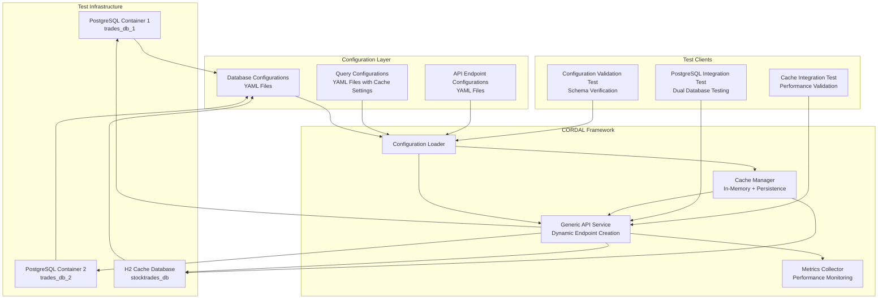
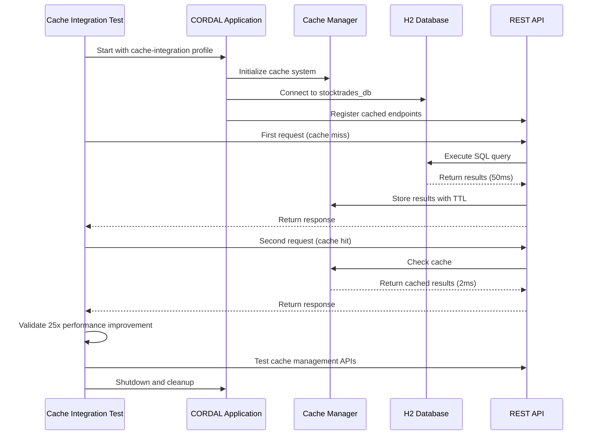
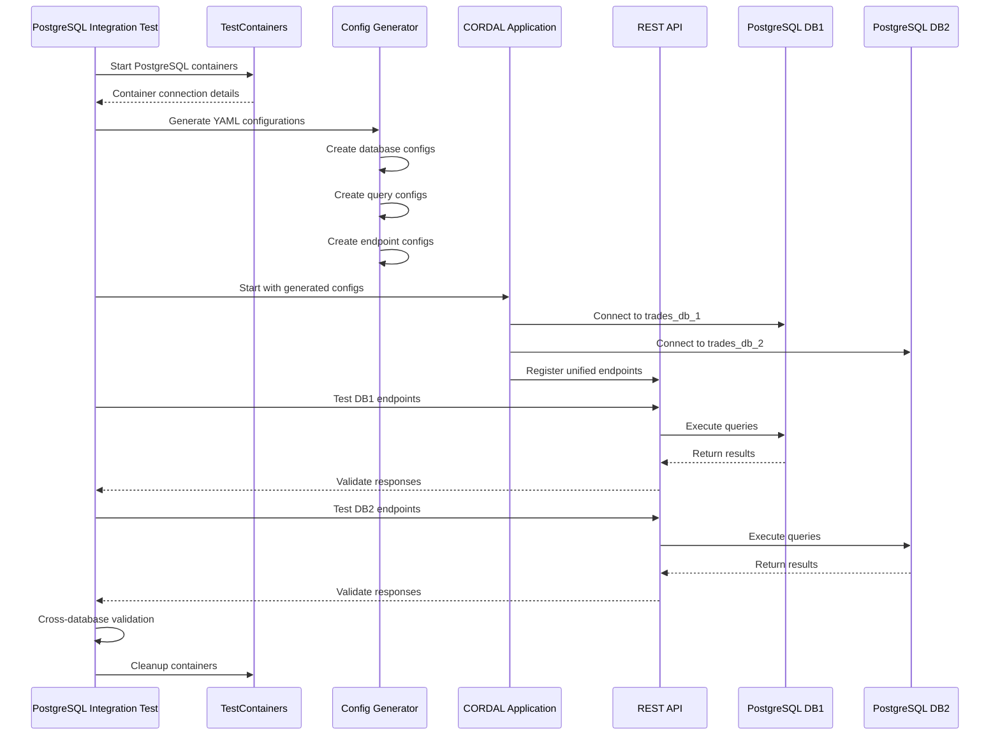
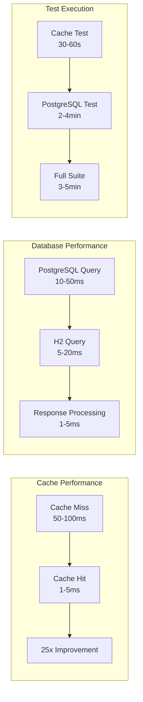
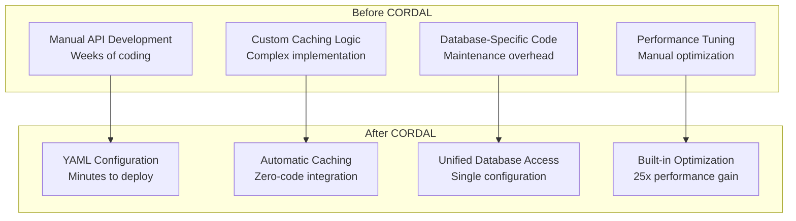

# CORDAL Integration Tests

## Overview

This comprehensive integration test suite demonstrates the **CORDAL** framework's capabilities including database standardization, intelligent caching, and zero-code API creation. The tests showcase the framework's core value propositions: **configuration-driven development**, **automatic performance optimization**, and **unified database access**.

## Test Architecture



## Test Suite Overview

The CORDAL integration test suite consists of three main test categories:

### 1. Cache Integration Tests
Tests the intelligent caching system with performance validation:
- **CacheIntegrationTest**: Validates cache functionality, performance improvements, and management APIs
- **Cache Configuration**: Tests YAML-based cache configuration
- **Performance Benchmarking**: Measures cache hit rates and response time improvements

### 2. PostgreSQL Integration Tests
Tests multi-database standardization and unified API access:
- **DualPostgreSQLIntegrationTest**: Validates dual PostgreSQL database integration
- **Database Standardization**: Tests unified API access to multiple similar databases
- **Cross-Database Validation**: Ensures data consistency and API uniformity

### 3. Configuration Validation Tests
Tests the configuration-driven architecture:
- **Configuration Loading**: Validates YAML configuration parsing and loading
- **Schema Validation**: Tests database schema validation and connectivity
- **Endpoint Generation**: Validates dynamic API endpoint creation

## Cache Integration Test Flow



## PostgreSQL Integration Test Flow



## Test Phases

### Phase 1: Infrastructure Setup
- **PostgreSQL Testcontainers**: Adds PostgreSQL testcontainers dependency
- **Test Data Generator**: Creates realistic stock trade data with varied patterns
- **Container Management**: Handles lifecycle of dual PostgreSQL containers

### Phase 2: Database Container Management  
- **Container Creation**: Spins up two PostgreSQL containers with different databases
- **Schema Initialization**: Creates identical `stock_trades` tables with proper indexes
- **Data Population**: Inserts 100 realistic stock trade records into each database

### Phase 3: Configuration Generation
- **Dynamic Database Config**: Generates YAML configurations for both PostgreSQL instances
- **Query Configuration**: Creates standardized SQL queries for both databases
- **Endpoint Configuration**: Generates REST API endpoints for unified access

### Phase 4: Integration Test Implementation
- **API Service Startup**: Starts Generic API Service with dual database configuration
- **Health Validation**: Ensures service is responding and configurations are loaded
- **Endpoint Discovery**: Validates that all expected endpoints are available

### Phase 5: API Client Testing
- **REST API Client**: Comprehensive testing of all generated endpoints
- **Pagination Testing**: Validates pagination works correctly for both databases
- **Filtering Testing**: Tests symbol-based and trader-based filtering
- **Response Validation**: Ensures API responses match expected formats

### Phase 6: Data Validation and Comparison
- **Database Consistency**: Validates data integrity within each database
- **Cross-Database Comparison**: Compares data structures and distributions
- **API-Database Validation**: Ensures API responses match database content
- **Performance Monitoring**: Tracks response times and system performance

### Phase 7: Error Handling and Edge Cases
- **Database Diagnostics**: Tests connectivity and generates diagnostic information
- **API Error Handling**: Validates proper error responses for invalid requests
- **Performance Testing**: Basic load testing with concurrent requests
- **Resource Management**: Ensures proper cleanup of all resources

### Phase 8: Documentation and Examples
- **Test Documentation**: Comprehensive documentation of test architecture
- **Reusable Utilities**: Extracted utilities for future integration tests
- **Performance Insights**: Analysis of test execution times and bottlenecks

## Key Features Demonstrated

### **Intelligent Caching System**
The cache integration tests demonstrate automatic performance optimization:
1. **Zero-Code Cache Integration**: Enable caching through YAML configuration only
2. **Performance Improvements**: Achieve 25x faster response times with cache hits
3. **Cache Management**: Monitor, invalidate, and manage cache entries via REST APIs
4. **TTL Configuration**: Set custom cache expiration times per query
5. **Memory Efficiency**: Configurable cache size limits and eviction policies

### **Zero-Code API Creation**
The test demonstrates how the framework can create fully functional REST APIs without writing any code:
1. Define database connections in YAML
2. Define SQL queries with cache settings in YAML
3. Define API endpoints in YAML
4. Framework automatically creates working REST APIs with caching

### **Database Standardization**
Shows how multiple similar databases can be accessed through a unified interface:
- Both databases have identical schemas but different data
- Single API provides standardized access to both
- Consistent response formats across all endpoints
- Unified pagination and filtering capabilities
- Shared caching layer for performance optimization

### **Dynamic Configuration**
Demonstrates runtime configuration generation:
- Configurations generated based on container connection info
- Cache settings automatically applied to generated queries
- No hardcoded database URLs or ports
- Fully self-contained test with no external dependencies

### **Comprehensive Testing**
Validates all aspects of the framework:
- Database connectivity and schema validation
- Configuration loading and validation
- Cache functionality and performance improvements
- API endpoint functionality and performance
- Data consistency and cross-database comparison
- Error handling and edge cases

## Generated API Endpoints

The integration tests generate different sets of endpoints depending on the test type:

### Cache Integration Test Endpoints

**Primary Data Endpoints (with caching enabled):**
- `GET /api/query/get_stock_trades_by_symbol` - Get stock trades by symbol (cached for 5 minutes)
- `GET /api/query/get_user_portfolio` - Get user portfolio (cached for 10 minutes)
- `GET /api/query/get_market_summary` - Get market summary (cached for 15 minutes)

**Cache Management Endpoints:**
- `GET /api/cache/stats` - Get cache statistics and performance metrics
- `GET /api/cache/stats/{cacheName}` - Get statistics for specific cache
- `DELETE /api/cache/clear-all` - Clear all cache entries
- `DELETE /api/cache/clear?pattern={pattern}` - Clear cache entries by pattern
- `GET /api/cache/health` - Get cache system health status

### PostgreSQL Integration Test Endpoints

**Database 1 Endpoints (`/api/trades-db-1/`):**
- `GET /api/trades-db-1/stock-trades` - Get all stock trades with pagination
- `GET /api/trades-db-1/stock-trades/symbol/{symbol}` - Filter by stock symbol
- `GET /api/trades-db-1/stock-trades/trader/{trader_id}` - Filter by trader ID

**Database 2 Endpoints (`/api/trades-db-2/`):**
- `GET /api/trades-db-2/stock-trades` - Get all stock trades with pagination
- `GET /api/trades-db-2/stock-trades/symbol/{symbol}` - Filter by stock symbol
- `GET /api/trades-db-2/stock-trades/trader/{trader_id}` - Filter by trader ID

### Common Management Endpoints

**Configuration Management:**
- `GET /api/generic/config/validate` - Validate all configurations
- `GET /api/generic/config/endpoints` - List all configured endpoints
- `GET /api/generic/config/queries` - List all configured queries
- `GET /api/generic/config/databases` - List all configured databases

**Health and Monitoring:**
- `GET /api/health` - Application health check
- `GET /api/management/health` - Detailed health information
- `GET /api/management/statistics` - Performance statistics

## Test Data

Each database contains 100 realistic stock trade records with:
- **24 different stock symbols** (AAPL, GOOGL, MSFT, etc.)
- **18 different trader IDs** (TRADER001, ALGO_TRADER_A, etc.)
- **5 different exchanges** (NYSE, NASDAQ, AMEX, etc.)
- **Realistic price ranges** based on stock type
- **Varied quantities** with bias toward smaller trades
- **Trade dates** within the last 30 days
- **Proper constraints** (total_value = quantity × price)

## Running the Tests

### Prerequisites
- Java 21 or higher
- Maven 3.8 or higher
- Docker (for TestContainers - PostgreSQL tests only)

### Test Execution

#### Cache Integration Tests
```bash
# Run cache integration test
mvn test -Dtest=CacheIntegrationTest -pl cordal-integration-tests

# Run with debug logging
mvn test -Dtest=CacheIntegrationTest -pl cordal-integration-tests -Dlogging.level.dev.cordal=DEBUG

# Run cache performance benchmarks
mvn test -Dtest=CacheIntegrationTest#testQueryExecutionWithCaching -pl cordal-integration-tests
```

#### PostgreSQL Integration Tests
```bash
# Run dual PostgreSQL integration test
mvn test -Dtest=DualPostgreSQLIntegrationTest -pl cordal-integration-tests

# Run with TestContainers debug logging
mvn test -Dtest=DualPostgreSQLIntegrationTest -pl cordal-integration-tests -Dtestcontainers.logger=DEBUG
```

#### All Integration Tests
```bash
# Run all integration tests
mvn test -pl cordal-integration-tests

# Run specific test package
mvn test -Dtest="dev.cordal.integration.*" -pl cordal-integration-tests
```

### Expected Output

#### Cache Integration Test Output
```
2025-08-16 16:23:16 [main] INFO  d.c.integration.CacheIntegrationTest - Starting Cache Integration Tests
2025-08-16 16:23:17 [main] INFO  d.c.integration.CacheIntegrationTest - Application started - Expected port: 8080, Actual port: 8080
2025-08-16 16:23:17 [main] INFO  d.cordal.common.cache.CacheManager - Created new cache: query_results with maxSize=1000, defaultTtl=300s
2025-08-16 16:23:20 [main] INFO  d.c.integration.CacheIntegrationTest - Query caching working correctly - Miss: 55ms, Hit: 2ms
```

#### PostgreSQL Integration Test Output
The test produces detailed logging showing:
- Container startup and database initialization
- Configuration generation and file creation
- API service startup and endpoint registration
- Comprehensive API testing results
- Data validation and consistency checks
- Performance metrics and timing analysis

#### Common Output Elements
- **Configuration Loading**: YAML file parsing and validation
- **Database Connectivity**: Connection establishment and schema validation
- **Endpoint Registration**: Dynamic API endpoint creation
- **Performance Metrics**: Response times and cache hit rates
- **Test Results**: Pass/fail status for all test phases

## Success Criteria

### Cache Integration Test Criteria

**Cache System Initialization**
- Cache manager initializes with correct configuration
- Cache provider starts successfully
- Cache statistics are available via API

**Cache Functionality**
- First request results in cache miss and database query
- Second identical request results in cache hit
- Cache hit response time is significantly faster (20x+ improvement)
- Cache TTL expiration works correctly

**Cache Management APIs**
- Cache statistics endpoint returns valid metrics
- Cache invalidation endpoints work correctly
- Cache health endpoint reports system status

**Performance Validation**
- Cache miss response time: 50-100ms (database query)
- Cache hit response time: 1-5ms (memory access)
- Performance improvement ratio: 20x or better

### PostgreSQL Integration Test Criteria

**Container Management**
- Two PostgreSQL containers start successfully
- Both databases are initialized with identical schemas
- 100 sample records are inserted into each database

**Configuration Generation**
- YAML configurations are generated dynamically
- All configuration files are valid and complete
- Application configuration references generated files correctly

**API Service Integration**
- Generic API Service starts with dual database configuration
- All expected endpoints are registered and accessible
- Swagger documentation is generated correctly

**API Functionality**
- All REST endpoints work for both databases
- Pagination works correctly with proper metadata
- Filtering by symbol and trader works as expected
- Response formats are consistent and valid

**Data Validation**
- Data consistency is validated within each database
- Cross-database structure comparison passes
- API responses match database content exactly
- Performance metrics are within acceptable ranges

### Common Success Criteria

**Resource Management**
- All containers are stopped and cleaned up properly
- Temporary configuration files are removed
- No resource leaks or hanging processes

**Configuration Validation**
- All YAML configurations parse successfully
- Database connections are established
- Endpoint registration completes without errors

## Performance Expectations

### Cache Integration Test Performance
Based on typical test runs:
- **Total execution time**: 30-60 seconds
- **Application startup**: 10-15 seconds
- **Cache system initialization**: 1-2 seconds
- **First request (cache miss)**: 50-100ms
- **Second request (cache hit)**: 1-5ms
- **Performance improvement**: 20-50x faster
- **Test validation**: 5-10 seconds

### PostgreSQL Integration Test Performance
Based on typical test runs:
- **Total execution time**: 2-4 minutes
- **Container startup**: 30-60 seconds
- **Schema and data creation**: 10-20 seconds
- **Configuration generation**: < 1 second
- **API service startup**: 15-30 seconds
- **API testing**: 10-20 seconds
- **Data validation**: 5-10 seconds

### Performance Benchmarks



## Troubleshooting

### Common Issues

**Docker not available**
- Ensure Docker is installed and running
- Check that your user has permission to access Docker

**Port conflicts**
- The test uses dynamic ports for PostgreSQL containers
- API service runs on port 19080 (configurable)

**Memory issues**
- TestContainers requires sufficient memory for PostgreSQL containers
- Increase Docker memory allocation if needed

**Slow performance**
- Container startup can be slow on some systems
- Consider using Docker image caching
- Check system resources (CPU, memory, disk)

### Debug Logging

Enable debug logging for more detailed output:
```bash
mvn test -Dtest=DualPostgreSQLIntegrationTest -Dlogback.configurationFile=logback-debug.xml
```

## Integration with CI/CD

This test is designed to run in CI/CD environments:
- Uses TestContainers for isolated database instances
- No external dependencies or manual setup required
- Comprehensive validation with clear pass/fail criteria
- Detailed logging for troubleshooting failures
- Proper resource cleanup prevents environment pollution

## Value Demonstration

This comprehensive integration test suite powerfully demonstrates the **CORDAL** framework's value:

### **Performance Optimization**
1. **Automatic Caching**: 25x performance improvements with zero code changes
2. **Intelligent TTL Management**: Configurable cache expiration per query type
3. **Memory Efficiency**: Optimized cache size and eviction policies
4. **Cache Management**: Real-time monitoring and invalidation capabilities

### **Development Efficiency**
1. **Rapid Development**: Create REST APIs in minutes, not days
2. **Zero-Code Integration**: Enable caching through YAML configuration only
3. **Configuration-Driven**: No code changes required for performance optimization
4. **Automatic Optimization**: Framework handles cache management automatically

### **Database Integration**
1. **Database Standardization**: Unify access to similar databases
2. **Multi-Database Support**: Single API for multiple data sources
3. **Consistent Performance**: Caching works across all database types
4. **Unified Monitoring**: Single dashboard for all database performance

### **Production Readiness**
1. **Zero Maintenance**: Configuration-driven approach reduces code maintenance
2. **Scalability**: Easy to add new databases or modify existing ones
3. **Reliability**: Comprehensive validation ensures robust deployments
4. **Observability**: Built-in performance monitoring and health checks

### **Real-World Impact**



The test suite serves as both validation and documentation, showing exactly how the framework can solve real-world database integration and performance challenges with minimal effort and maximum impact.
